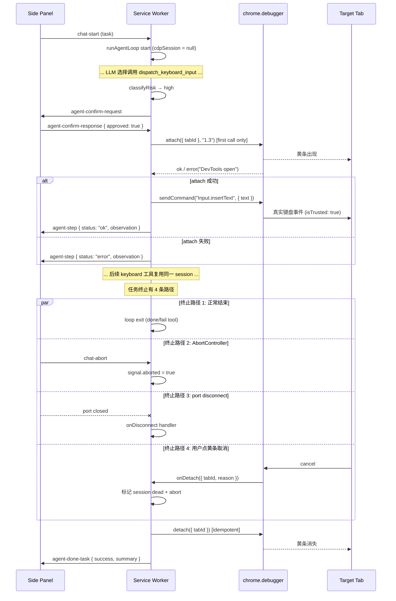

# feat: Phase 2.5 — CDP keyboard simulation for canvas editors

## Overview

在 Phase 2 Agent 之上引入 Chrome DevTools Protocol（CDP）的键盘模拟通道，让 Agent 能够在飞书 Docs / Google Docs / Notion 这类把内容画到 `<canvas>` 的编辑器中输入文字。新增两个独立工具 `dispatch_keyboard_input` 与 `press_key`，使用 `chrome.debugger` + `Input.insertText` / `Input.dispatchKeyEvent`，发送 `isTrusted: true` 的真实键盘事件穿透 canvas 编辑器对合成事件的过滤。

权限 + 浏览器黄色调试条引入显著的安全和 UX 成本，所以默认关闭，由用户在 Settings 显式开启；每个 Agent 任务在首次调用键盘工具时按需 attach、任务结束（含 abort/disconnect/yellow-bar-cancel）必须 detach。

## Problem Frame

Phase 2 的 `type` 工具走 DOM 路径（`execCommand` / native value setter / InputEvent），对常见富文本编辑器（Slate / Quill / ProseMirror / Lexical）有效，但**对 canvas-rendered 编辑器完全失效**：飞书新版 Docx / Google Docs Kix / Notion 部分编辑面只接受 `isTrusted: true` 的键盘 / composition 事件，合成事件被丢弃。

commit `219069b` 已经让 Agent 在识别到这种隐藏 IME buffer 时优雅失败，避免假 success；但用户在飞书 / Google Docs 让 Agent 打字的场景目前完全不可用。Phase 2.5 通过 CDP 真键盘事件填上这个缺口。

详见 origin 文档：`docs/brainstorms/2026-04-17-phase2.5-cdp-keyboard-simulation-requirements.md`。

## Requirements Trace

承接 origin 文档的 R1–R18，按主题分组（**deepening 2026-04-28 引入 1 条 R19，源自 plan 内部决策而非 origin**）：

### Tool 定义
- R1, R9 → Unit 3：`dispatch_keyboard_input(text, after_element_index?)`
- R2, R10 → Unit 3：`press_key(key)` + 白名单 keycode 表
- R3 → Unit 3：可选 `after_element_index` 在 CDP 调用前先走 `clickByIndex` 保证 focus
- R11 → Unit 3 + Unit 4：保留现有 `type` 不变，仅新增独立工具

### Lifecycle 与权限
- R5 → Unit 1：`manifest.json` 加 `"debugger"` 权限
- R4, R15, R18 → Unit 2 + Unit 5：每任务 attach、任务结束（含 abort）必 detach；finally + abortSignal listener + port.onDisconnect 间接 + onDetach + storage kill switch **5** 条路径汇聚到 idempotent `detach`
- R16 → Unit 2：用户已开 DevTools 时 `attach` 失败 → 工具返回明确错误

### UI / UX 与可视性
- R6, R7 → Unit 1：Settings 二元开关 + 琥珀色警告条（用户已选「二元开关」）
- R8 → Unit 4：开关关闭时 keyboard 工具不进 tools 列表，type 失败 observation 提示用户去 Settings 启用
- R13 → Unit 5：用户已选「仅依赖浏览器黄条」，**不**新增 Side Panel banner / 状态消息（仅保留 `agent-step` 自带工具名展示）
- R17 → 设计前提，无可绕过

### 安全 / 风险闸门
- R12 → Unit 4：两个新工具在 `risk.ts` 总是返回 `level: "high"`
- R14 → Unit 5：`chrome.debugger.onDetach` 监听用户取消 → 中止任务并发 `agent-done-task { success: false, summary: "用户取消了调试授权" }`
- **R19 (planning deepening 2026-04-28)** → Unit 1 + Unit 5：mid-task toggle OFF 立即生效（kill switch）。源自 deepening 期间发现的"用户切 OFF 心智 = 立刻撤销授权"产品决策，不在 origin 文档

成功标准（origin 文档 Success Criteria）：

- 飞书 Docs / Google Docs / Notion 真实文档里 Agent 输入文字可见
- 开关默认关闭时用户无感；开启后每次任务 attach/detach 干净
- 黄条只在实际 keyboard 工具执行期间出现
- 用户点黄条取消 → Agent 立即中止并通知 Panel

## Scope Boundaries

承接 origin 文档显式声明的非目标，**不变**：

- 不包含鼠标事件模拟（`Input.dispatchMouseEvent`）
- 不包含复制 / 粘贴（`Ctrl+V` / clipboard 路径）
- 不包含跨 tab 键盘输入
- 不包含 `Input.insertText` 以外的 CDP 能力
- 不包含 chrome.debugger 5-min idle keep-alive
- 不包含 SW 重启 crash recovery（依赖 Chrome 自动 detach）

本 plan 进一步收窄：

- 不引入新 `PortMessageToPanel` 类型（用户选择「仅黄条」，复用现有 `agent-step` / `agent-done-task` 通道）
- 不引入"每次询问"开关三态（用户已选二元开关）
- 不在 Settings 里展示 attach 状态（黄条即唯一可见标识）
- 不修改现有 `type` 工具行为（continued co-existence，互不替代）

## Context & Research

### Relevant Code and Patterns

- `src/lib/agent/loop.ts:240-243` — Tool 收集点：`getEnabledSkillTools()` await + concat `BUILT_IN_TOOLS`，每轮一次性产出 `toolDefinitions` 传给 `streamChat()`。Phase 2.5 的条件性 keyboard 工具在此处接入。
- `src/lib/agent/loop.ts:319-391` — Tool 调度循环：handler 接 `{ tabId, snapshot }` 上下文。Phase 2.5 的两个新 handler 维持同样签名（不扩展 `ToolHandlerContext`，避免污染所有 DOM 工具）。
- `src/lib/agent/loop.ts:358-386` — High-risk 确认流：`sendConfirmRequest(confirmationId, ...)` 阻塞 + 等 Panel 响应。Phase 2.5 的两个新工具走完全相同的流程，无新代码路径。
- `src/lib/agent/risk.ts:57-125` — `classifyRisk(toolName, args, snapshot)` 当前对未识别 tool 默认 `low`。Phase 2.5 显式增加 `dispatch_keyboard_input` / `press_key` 分支返回 `high`。
- `src/lib/agent/tools.ts:27-190` — `BUILT_IN_TOOLS` 数组 + `Tool` 数据结构。Phase 2.5 将 keyboard 工具从此集合中分离（条件注册），不污染默认列表。
- `src/lib/dom-actions/type.ts:288-320` — IME buffer heuristic 当前返回 `success: false`。observation 文案在 Unit 4 中追加"启用键盘模拟可解锁此场景"。
- `src/sidepanel/components/Settings.tsx:208-212` — 现成的琥珀色警告条 pattern（`Browser was restarted...`），Phase 2.5 复用同样的 `border-amber-700 / bg-amber-950/50` 视觉。
- `src/sidepanel/components/SkillsList.tsx:75-88` — 现成的 toggle/switch UI pattern（绝对定位 span 指示器），Phase 2.5 复用相同样式。
- `src/lib/storage.ts:10-12` — 存储键命名约定 `provider_${id}` / `active_provider` / `enabled_skills`；Phase 2.5 沿用同样的 flat key 风格 `keyboard_simulation_enabled`。
- `src/background/index.ts:256-264` — `port.onDisconnect` 已在做 `abortController.abort()` + 拒绝 pending confirmations。Phase 2.5 在此追加 `cdpSession?.detach()`。
- `src/types/messages.ts:64-88` — 现有 `agent-step` / `agent-done-task` 已能承载所需 UI 信息，无须新 message 类型。

### Institutional Learnings

- 项目无 `docs/solutions/`（首次为 chrome.debugger 路径建立沉淀）。
- `CLAUDE.md` 关键约束保留：注入函数必须自包含、Risk 分级用结构化升级、prompt injection 防御不污染 system role。Phase 2.5 工具不走 `executeScript` 注入路径（直接在 SW 调 `chrome.debugger.sendCommand`），因此自包含约束不适用，但仍须确保 args 在 SW 内 sanitize 后才传给 CDP。

### External References

略——chrome.debugger / CDP `Input.insertText` 是 Chrome 稳定 API，Phase 2 已建立的 SW + port 模式足以承载，无须外部研究。Phase 1.2 决策不跑外部 research agents 的理由记录于此。

## Key Technical Decisions

- **两个独立工具而非合并为单个 `type_via_cdp`**：`Input.insertText` 适合一段文字（CDP 内部按 IME composition 处理），`Input.dispatchKeyEvent` 适合控制键（Enter/Tab/Escape/方向键），两者语义和参数完全不同。拆分让 LLM tool calling 的 schema 自描述，避免一个工具内部分支。Origin 文档 R9/R10 已分述。

- **每任务一次 attach + idempotent detach**：避免每个 keyboard 工具调用都 attach（~100-300ms 开销 × N 调用）；也避免全局常驻 attach（黄条会一直显示，违反 R17/R18 的可见性原则）。具体语义是：第一次 keyboard 工具调用时 lazy attach；任务结束（success/fail/abort/disconnect）时 detach；同一任务内多次调用复用同一 session。

- **Detach 路径汇聚**：finally + `port.onDisconnect` + `AbortSignal` + `chrome.debugger.onDetach` 四条独立终止信号都调同一个 idempotent `cdpSession.detach()`。这避免了"哪条路径漏写就 leak 黄条"的脆弱性。CDP 协议本身允许重复 detach（已 detached 时 reject，但我们捕获并视为成功）。

- **不在 SW 全局保留 active session 引用，而是按任务持有**：`runAgentLoop` 的本地变量 `cdpSession: CdpSession | null`，task 结束时局部作用域结束。下一任务从 null 起步，避免跨任务串味。多任务串行（Phase 2 现状本就是单任务）天然不会并发 attach。

- **不为 keyboard 工具引入新 `ToolHandlerContext` 字段**：保持 handler 签名稳定 `(args, ctx) => Promise<ActionResult>`。CDP session 通过模块级 task-scoped factory（`getOrAttachCdpSessionForTask(tabId, abortSignal)`）取得，而不是通过 ctx 注入。理由：DOM 工具不应被迫携带 CDP 概念。

- **Risk 总是 `high`**：CDP 事件绕过所有 DOM 可见性 / readonly / disabled 校验，Agent 任意键盘事件都可能触发后果未知的快捷键。保守策略——每次调用走 high-risk 确认卡（origin 文档 R12）。这复用现有 `sendConfirmRequest` 路径，无新代码。

- **Side Panel 不展示 attach 状态（仅黄条）**：用户已选"仅依赖浏览器黄条"。Chrome 的黄色调试条是浏览器级、不可绕过的安全信号；额外 banner 视觉冗余且需要新 message 类型。`agent-step` 已暴露 `tool: "dispatch_keyboard_input"` 名称，对 Agent 步骤上下文足够。

- **保留 `type` 工具不变（不做 fallback）**：origin 文档 R11。`type` 路径轻量快、覆盖大多数富文本，不应让所有用户为少数 canvas 场景常驻 debugger 权限。Agent 通过 system prompt 的指引在 `type` 失败 observation 包含"hidden IME / keyboard capture buffer"时显式 retry `dispatch_keyboard_input`（前提：开关开启）。

- **`debugger` 权限必须声明在 manifest，非可选权限**：Chrome MV3 不允许 runtime request `debugger`；声明后用户首次加载扩展会看到"该扩展可访问网页"+"该扩展可以使用调试器"的合并提示。这是 baseline 安装成本，开关开/关都不影响。

- **Per-CDP-call origin & active-tab re-check（关键安全决策）**：Phase 2 现有的 `pinnedOrigin` 校验在 `loop.ts:155-187` 每轮开头执行，在 LLM streaming 之前。但 high-risk 确认卡可能让 user latency 达到秒至分钟级，期间页面可能被 JS 重定向到不同 origin（也包括用户切到不同活动 tab）。CDP `Input.insertText` 不依赖 DOM 索引，**没有 DOM 层的安全失败**——无校验则键盘事件可能落到完全不同的 origin（例如：从 `feishu.cn` 重定向到 `bank.com` 后 Agent 的输入打到 bank.com）。本 plan 强制：在**每一次** `session.send("Input.insertText" | "Input.dispatchKeyEvent", ...)` 之前重新 `chrome.tabs.get(pinnedTabId)` 校验 `origin === pinnedOrigin` **且** active tab id === pinnedTabId；任一不匹配 → 立即 `session.detach()` + abort + emit `agent-done-task { success: false, summary: "页面 origin 或活动标签页变化，已中止键盘输入" }`。这是 CDP 路径对 `loop.ts:155-187` 不变量的等价补丁。

- **Session 代际 ID 防 onDetach 跨任务串味**：onDetach 是异步事件，可能在新任务 attach 之后才送达旧任务的 detach。仅靠 `tabId` 比对会错把旧 detach 路由到新任务，导致新任务被错误 abort。CdpSession 携带单调递增 `generationId`（模块级 counter）。全局 onDetach listener **必须**做双重比对：(a) `sessionMap.get(tabId)` 存在 + (b) 该 session 的 generationId === detach IPC 回调时捕获到的 generation 上下文。**generationId 比对从原 plan 的"实测兜底"升级为 Unit 2 必做实现**——理由：Chrome 的 onDetach event delivery 时序与 sessionMap.delete 的执行顺序无公开契约保证，单靠 sessionMap.delete 作为代际边界是未验证的时序断言。Unit 2 spike verification 中加一项"手工触发 detach + 立刻同步 attach 同 tabId，观察 onDetach 是否会错路由"作为该假设的现场测试。

- **CDP 操作的并发模型 = 任务 owner-token guard**：Phase 2 的 `chrome.runtime.onConnect` 是 per-port，每个 Side Panel（Chrome MV3 = per-window）独立 connect 一个 port，各自跑 `runAgentLoop`，**没有跨 port 的串行锁**。多 Chrome 窗口下用户可同时跑两个 Agent 任务。本 plan 的 sessionMap 单键 `Map<tabId, CdpSession>` 在双任务命中同 tabId 时会让第二个任务复用第一个的 session（对应不同 abortController），任意一方结束都会 collateral kill 另一方。**MVP 接受简化模型**：sessionMap 改为 `Map<tabId, CdpSession>` 但 acquire 时若该 tabId 已存在 session 且 owner 不同（通过 ownerToken 区分）→ 第二个 acquire **fail-fast**（返回 `success: false, observation: "Another agent task already controls this tab via debugger; close that Side Panel first"`），不复用、不跨 owner attach。Unit 2 实现 ownerToken（per-runAgentLoop 唯一 string，传进 acquireCdpSession）。这避免了"双 Side Panel 静默串味"，代价是双窗口同时让 Agent 用键盘工具进同一 tab 时第二个 fail——可接受的边角场景。

- **Args redaction 在事前 / 事后通道作不同处理（关键安全决策）**：SW → Panel 有两条独立通道，redaction 策略**不同**：
  - **`agent-step`（事后步骤展示）→ redact**：emit 前把 `args.text` 替换为 `{ length, redacted: true }`，Panel 的 AgentStepBubble 显示"(N chars, redacted)"。理由：步骤面板可能被截图、复制、长期可见，避免敏感输入沉淀在 chat history。
  - **`agent-confirm-request`（事前授权请求）→ NOT redact，必须显示完整原文**：confirm 卡片是用户做最终安全决策的载体，**用户必须看到 LLM 实际想输入的完整 text 才能做 informed approve**。redact confirm 卡片 = 用户在 blank check 上签名，违反 high-risk gate 的核心目的。AgentConfirmCard UI 要预备处理长 text（最多 5000 字符）的 wrap 与 length 提示。
  - LLM 的 AgentMessage 历史**相对于 SW ↔ Panel 通道**不是新泄露面（LLM 自己写的）；**相对于 SW ↔ 模型 provider 通道**与现有 chat 流量同基线（BYOK 已接受），不主动 redact LLM history 是这条基线的延续，不是新引入的风险。如果未来 type 工具升级为对所有敏感 text 做 LLM-history-side redaction，dispatch_keyboard_input 应联动评估。
  - Test scenarios 必须包含两条独立断言：(a) confirm-request emit 时 args.text 字符 byte-equal 于原文；(b) agent-step emit 时 args.text 被替换为 redacted 形式。

- **Runtime.evaluate 强约束（preempt）**：若 spike 显示 `Input.insertText` 必须先 `Runtime.evaluate` 调 focus，唯一允许的 expression 是**硬编码字面量** `"document.activeElement?.focus()"`。**禁止** LLM-supplied input、字符串拼接、snapshot 数据插入。任何新字面量需独立 plan 条目 + 安全评审。`Runtime.evaluate` 调用同样走 per-call origin re-check。这一约束在 spike 前先写入 plan，避免 spike 实施时静默放宽。

## Open Questions

### Resolved During Planning

- 开关形态 = 二元（关 / 开）。用户在产品决策环节确认，避免引入第三态 UI。
- 执行期视觉标识 = 仅依赖浏览器黄条。用户在产品决策环节确认，无需新增 Panel banner / 状态消息。
- `Input.insertText` vs `Input.dispatchKeyEvent` 的选择 = 拆分两个工具，前者负责文本，后者负责控制键。理由见 Key Technical Decisions。
- 是否扩展 `ToolHandlerContext` = 否。改用模块级 task-scoped factory，保持 DOM 工具签名干净。
- 是否新增 PortMessageToPanel 类型 = 否。复用 `agent-step` + `agent-done-task`。
- SW 重启时残留 attach 处理 = 不做。Chrome 行为本身保证 SW 重启时 debugger 自动 detach；如未来发现假设不成立再补 `chrome.runtime.onInstalled` 时的清理。
- **Mid-task toggle OFF 行为 = 立即 kill switch**：在 SW 监听 `chrome.storage.onChanged`，当 `keyboard_simulation_enabled` 变 false 且当前任务持有 cdpSession 时，立即 `session.detach()` + emit 一条 `agent-step { status: "error", observation: "Keyboard simulation disabled mid-task — yellow bar removed; further keyboard tool calls will fail" }`。LLM 仍会拿到错误反馈，可以选择降级或终止。理由：用户切到 OFF 的心智是"立刻撤销授权"，让黄条留到任务结束严重违反预期。Unit 5 实现该 listener。
- **Confirm "remember decision" / 批量 approve 不适用于 keyboard 工具**：若 Phase 2 confirm UI 未来引入"approve all in task"shortcut，keyboard 工具按名字排除。每次调用必须独立人工 click。Unit 4 在 risk classifier 旁加注释固化该约束。
- **`text` 字符类校验（修订）**：原方案"拒绝整个 `Cf` 类"会误伤合法 emoji ZWJ 序列（家庭 emoji 含 U+200D）。修订为更细粒度黑名单：
  - 拒绝：`Cc` 类（控制字符，除 `\n` `\t`）+ < 0x20 code point（除 `\n` `\t`）
  - 拒绝：bidi controls **only**（U+200E / U+200F / U+202A-U+202E / U+2066-U+2069），不拦整个 `Cf` 类
  - 接受：U+200D ZWJ（emoji 组合）、U+200B-U+200C 零宽空格 / 非接 joiner（虽然有钓鱼风险但用于合法 typesetting）
  - **不防御**：同形字（cyrillic а vs latin a）+ Variation Selectors（U+FE0E/U+FE0F + U+E0100-E01EF），它们属于 `Mn`/`Lo` 类，不在校验范围。**显式接受此残余风险**：依靠 confirm 卡片的原文展示让用户在批准时识别（用户看到 `аpple` 与 `apple` 的差异需要警觉性，confirm UI 不做 normalization 干扰用户判断）。Risks 表已记录该残余。
  - reject 时返回 `success: false`，observation 列出违规字符的具体类别名（"bidi control U+202E" 而非泛指）。
- **Active tab 校验**：每次 CDP send 前同时校验 active tab === pinnedTabId（与 origin 校验合并），不匹配即中止。理由：plan 把"黄条 = 用户感知"作为唯一执行期可见性，用户切到别的 tab 时黄条不可见，必须中止才能保住该假设。

### Deferred to Implementation

- **`Input.insertText` 在飞书 Docs / Google Docs 上的实际行为是否需要先 `Runtime.evaluate` 调 `element.focus()`**：origin 文档 Deferred 项。Unit 2 内含一次必做的 spike——若仅靠先 click 不足以让 IME buffer 拿到 focus，则 Unit 2 内引入 `Runtime.evaluate({ expression: "document.activeElement.focus()" })`。**spike 不通过则中止 Unit 3+**。
- **`press_key` 控制键的 keycode / windowsVirtualKeyCode 完整映射**：Unit 3 仅覆盖 Enter / Tab / Escape / Backspace / Arrow{Up,Down,Left,Right} / Home / End 八到十个键的最小集合。其它键到实现期再扩展，按需求驱动而非穷举。
- **DevTools 已打开的检测方式**：先尝试 attach，捕获 `chrome.runtime.lastError.message` 含 "Another debugger is already attached" 即降级返回 `ActionResult.success: false`。是否有更早的预检 API 暂不深入；attempt-and-recover 已足够。
- **chrome.debugger 5 分钟 idle 自动 detach 是否会在长任务里被触发**：实际任务通常远短于 5 分钟（snapshot + tool 调用各几百 ms），命中概率很低。Unit 5 的 onDetach 监听已经能 graceful 处理 idle detach（统一视作"用户取消"路径），无须主动 keep-alive。如未来出现长任务真的撞 idle，再考虑 Unit 6 引入心跳。
- **Spike 失败时的回退路径**：如果 Unit 2 spike 显示 `Input.insertText` 在飞书完全不可用（即使加 focus 也不行），需要 Codex 升级方案——或拆 `Input.dispatchKeyEvent` 逐字符发送，或暂停 Phase 2.5 进入 Phase 2.6 鼠标事件。决策点不在本 plan 内。Hard gate 已规定 spike 失败时整支 feature branch 废弃，不留孤儿权限声明。
- **Clipboard + paste 替代路径未做 baseline 验证**：plan 选择 chrome.debugger 路径基于 origin 文档对"isTrusted"的诊断，但未跑 30 分钟 spike 验证 `navigator.clipboard.writeText + execCommand('paste')` 在飞书 Docs 是否可工作（paste event 是 isTrusted）。如果 paste 路径可用，可以拆出 Phase 2.5a（paste-only，无 debugger 权限）+ Phase 2.5b（CDP press_key，后置）显著降低首版 risk surface（Web Store 审核 + 黄条 UX）。**Unit 2 spike 的 scope 应包含一次 paste 路径对照实验**——若 paste 在飞书可工作 → 暂停本 plan，回 brainstorm 拆分 phase。

## High-Level Technical Design

> *本节展示设计意图，是评审用的方向性引导，不是实现规范。实施 agent 应将其视为上下文，而非待复现的代码。*

### CDP session lifecycle (sequence diagram)



### Tool 注册条件性流程（pseudo-code，directional）

```text
runAgentLoop(task, port, signal):
  pinnedTabId = ...
  cdpSession = null      # 任务作用域，lazy 创建

  for each loop iteration:
    skillTools = await getEnabledSkillTools()
    keyboardTools = (await isKeyboardSimulationEnabled())
                    ? buildKeyboardTools({ getOrAttach: () => acquireCdpSession(pinnedTabId, signal, ref(cdpSession)) })
                    : []
    allTools = [...BUILT_IN_TOOLS, ...skillTools, ...keyboardTools]
    ...

  finally:
    cdpSession?.detach()   # idempotent
```

`acquireCdpSession` 的语义：第一次调用做 `chrome.debugger.attach`；后续返回已存在 session；同时把 `chrome.debugger.onDetach` 路由到 `signal.abort()`。

## Implementation Units

> **Hard gate**：Unit 3 不允许在 Unit 2 spike 通过前开始。spike 通过的判据 = `docs/solutions/2026-04-XX-cdp-input-insert-text-on-canvas-editors.md` 已 commit、且**至少在飞书 Docs 上**验证 `Input.insertText` 文字可见（Google Docs / Notion 可作为 stretch 验证，单 Feishu 通过即可解锁本 plan；但 stretch 失败需在 solutions 文档中记录哪些站点不工作，作为后续 phase 输入）。spike 失败（即使加 `Runtime.evaluate("document.activeElement?.focus()")`）= 本 plan 失效，回到 brainstorm 重新评估方案，**不要**在 Unit 3 内即兴扩展 CDP 调用范围。
>
> **Spike 失败时 Unit 1 的回滚责任**：Unit 1 与 Unit 2 spike 在**同一 feature branch** 累积（`feat/phase2.5-cdp-keyboard`），spike 通过前**任何 Unit 都不向 main 合并**；spike 失败 → 整支 feature branch 废弃（含 manifest debugger 权限 + Settings toggle UI + storage helper），不留下"声明了但用不到"的 debugger 权限触发用户安装犹豫或 Web Store 审核疑问。这避免了"Unit 1 已 merged 但 Phase 2.5 失败"的孤儿状态。
>
> **Hard gate 的本质是社会规约**（无 CI/PR template 强制），项目当前规模下接受此约束；如未来项目有更多协作者，再考虑加 PR template 或 CI 校验 `docs/solutions/*cdp-input-insert-text*.md` 存在性作为 Unit 3 PR 合并前置。

- [ ] **Unit 1: Manifest 权限 + 存储 flag + Settings UI 开关**

**Goal:** 为 Phase 2.5 的所有后续单元提供"是否启用"的源头：声明 `debugger` 权限、加 `keyboard_simulation_enabled` 存储键、Settings 加二元开关 + 警告条。本单元不接入 Agent，开关状态目前还没有任何调用方。

**Requirements:** R5, R6, R7

**Dependencies:** None

**Files:**
- Modify: `manifest.json` — `permissions` 数组追加 `"debugger"`
- Create: `src/lib/keyboard-simulation.ts` — 导出 `isKeyboardSimulationEnabled(): Promise<boolean>` / `setKeyboardSimulationEnabled(value: boolean): Promise<void>`，使用 chrome.storage.local key `keyboard_simulation_enabled`
- Modify: `src/sidepanel/components/Settings.tsx` — 在 Skills section 之上新增"键盘模拟（实验）"section：toggle + 当 toggle === true 时显示琥珀色警告条「Chrome 会在 Agent 调用键盘工具时显示黄色调试条；扩展在该任务期间通过 CDP 控制当前标签页」

**Approach:**
- `keyboard-simulation.ts` 是纯存储 helper，不依赖任何 lazy import，方便 Settings UI 和 SW 都能调用
- Toggle 立即写存储（不等保存按钮）。这是开关的标准 UX，与 Skills 一致
- 警告条样式：复用 `Settings.tsx:208-212` 的琥珀色 banner pattern（`border-amber-700 bg-amber-950/50 text-amber-300 rounded-lg px-4 py-3`）

**Patterns to follow:**
- `src/sidepanel/components/SkillsList.tsx:75-88` — toggle 视觉
- `src/sidepanel/components/Settings.tsx:208-212` — 警告条视觉
- `src/lib/storage.ts:10-12` — flat key 命名

**Test scenarios:**
- Happy path：默认 `isKeyboardSimulationEnabled()` 返回 `false`（首次安装、键不存在）
- Happy path：在 Settings 切到 ON → reload SW → `isKeyboardSimulationEnabled()` 返回 `true`
- Happy path：警告条仅在 toggle ON 时渲染；OFF 时不渲染
- Edge case：手动 `chrome.storage.local.clear()` 后下一次读 → 安全回落 `false`，不抛错
- Edge case：写入非 boolean 值（人为污染）→ `isKeyboardSimulationEnabled()` 用 `!!` 强制布尔化，不抛错
- UX：扩展首次加载 → Chrome 弹出权限确认对话框包含"使用调试器"项目（manifest 改动生效的可观测信号）

**Verification:**
- 重新 `pnpm build` 后加载扩展，权限提示包含 debugger 项
- Settings 顶部出现 keyboard simulation toggle，默认 OFF
- 切到 ON 后关闭 / 重开 Side Panel，状态保留

---

- [ ] **Unit 2: CDP session lifecycle manager**

**Goal:** 把 `chrome.debugger.attach` / `sendCommand` / `detach` 封装成一个 task-scoped session 对象。隔离 idempotency、onDetach 路由、错误归一化，让 Unit 3 的 tool handler 不需要直接接触 chrome.debugger。

**Requirements:** R4, R14, R15, R16, R17, R18

**Dependencies:** None（不依赖 Unit 1，本单元仅是 SW-side 工具库）

**Files:**
- Create: `src/background/cdp-session.ts` — 导出 `acquireCdpSession(tabId: number, signal: AbortSignal): Promise<CdpSession>`，session 接口暴露 `send(method, params)` / `detach()` / `isAlive: boolean`
- Modify: `src/background/index.ts` — 注册全局 `chrome.debugger.onDetach` 监听器（必须在 SW 顶层注册一次，不能在 runAgentLoop 内）

**Execution note:** 本单元含一个**必做 spike**，spike 通过前不要进入 Unit 3：在 SW 控制台手工 `chrome.debugger.attach` + `Input.insertText` 在 (a) 飞书 Docs (b) Google Docs (c) Notion 真实文档上验证文字可见。若 (a)(b) 都失败即使先 click → 重新评估方案（可能需要 `Runtime.evaluate` 显式 focus，或 fallback 到 `Input.dispatchKeyEvent` 逐字）。spike 结果记录到 commit message 或 `docs/solutions/2026-04-XX-cdp-input-insert-text-on-canvas-editors.md`。

**Approach:**
- session 内部维护 `attached: boolean` + `tabId: number` + `aborted: boolean` + `generationId: number`（模块级 monotonic counter，每次 attach 成功 +1）+ `detachedReason?: "user-cancelled-via-yellow-bar" | "abort-signal" | "tab-closed" | "explicit-detach" | "kill-switch"`
- **Attach race guard（critical）**：`chrome.debugger.attach({ tabId }, "1.3")` 成功**之后**立即检查 `signal.aborted`。若 true：直接调 `chrome.debugger.detach({ tabId })` 清理（不构造 session、不注册 abort listener、不写入全局 sessionMap），reject 出 `CdpAttachAbortedError`。这覆盖了 "abort 信号在 attach roundtrip 期间到达" 的窗口（roundtrip ~100-300ms 足以让 AbortController 提前 abort）
- 第一次 `acquire(tabId, signal)`：attach 成功 → 通过 race guard → 构造 session → 注册 `signal.addEventListener("abort", () => session.detach())` → 写入模块级 `Map<number, CdpSession>`（key = tabId）→ 返回 session
- 同一 tabId 第二次 acquire：返回 sessionMap 已有 session（不双 attach）
- `chrome.debugger.onDetach` 全局监听器在 SW 顶层注册一次。事件到达时 `const s = sessionMap.get(detached.tabId); if (!s) return;`——只有当前活跃 session 被处理。listener **必须**在闭包外比对 generationId 才能防跨任务串味（旧任务的 stale onDetach 可能在新任务 attach 后才送达）：listener 实现策略是直接读 `sessionMap.get(tabId)` 而不是闭包持有 session 引用，这样旧任务结束时 `sessionMap.delete(tabId)` 即可让 stale event 走 `if (!s) return` 分支
- attach 失败时 message 含 "Another debugger is already attached" → wrap 成 `CdpAttachConflictError`（让 handler 提示"请先关闭 DevTools"）
- `detach()` idempotent：已 detached / session.aborted === true → 直接 resolve；正常情况调 `chrome.debugger.detach({ tabId })`、`sessionMap.delete(tabId)`、捕获 lastError 视为 success
- `send(method, params)` 在 `aborted === true` 时立即 reject，不发包

**Patterns to follow:**
- `src/background/index.ts:256-264` — port.onDisconnect 的清理风格（同时清多个资源）
- `src/lib/agent/loop.ts:153-154` — signal.aborted 检查模式
- 不需要 `executeScript` 自包含约束——本文件只在 SW 上下文运行

**Test scenarios:**
- Happy path：acquire(tabId, signal) → send("Input.insertText", { text: "hi" }) → tab 内可见 "hi"
- Happy path：同任务内连续两次 acquire(tabId, signal) → 第二次返回同一 session 实例（attach 只发生一次）
- Edge case：acquire 时该 tab 已开 DevTools → attach 抛错，error message 包含 "Another debugger is already attached"，session 不被创建，handler 可拿到错误
- Edge case：acquire 后 tab 被关闭 → 下一次 send 抛错，session.isAlive === false
- Error path：用户点黄条"取消" → onDetach 触发 → signal 被 abort → 任何待发的 send 立即 reject → loop.ts 检测 signal.aborted 走 abort 路径
- Idempotent：detach() 调 5 次只真正发一次 chrome.debugger.detach，其余 resolve
- Lifecycle：abortSignal.abort() 在外部触发 → session.detach() 自动执行（不要求 caller 显式调）
- Edge case：SW 异常重启（手动在 chrome://extensions 点重新加载）→ 下一次 acquire 干净启动；旧 session 引用已无意义（SW global 状态丢失，与预期一致）
- **Race**：在 `await chrome.debugger.attach(...)` resolve 之前 `signal.abort()` → race guard 触发 → 立即 chrome.debugger.detach + reject 出 CdpAttachAbortedError → 调用方收到 abort 错误且**无黄条残留**（手工验证：在 attach 调用前先 `setTimeout(() => abortController.abort(), 50)`）
- **Stale onDetach**：手工模拟 task A attach → detach → task B attach 同 tabId → 把 task A 旧 generation 的 detach event 重放到 listener → task B 不受影响（sessionMap 已 delete，新 entry 是 B 的，listener 查 map 拿到 B 时不应误 abort——验证靠 sessionMap 的 delete 时序）

**Verification:**
- spike 在 (a)(b)(c) 三个站点至少 (a) 飞书通过
- session detach 后黄条在 1 秒内消失
- 用户点黄条取消 → SW 控制台能看到 onDetach log + signal.abort 触发
- **Spike 结果文档**：`docs/solutions/2026-04-XX-cdp-input-insert-text-on-canvas-editors.md` 已 commit，记录 (a) 飞书 (b) Google Docs (c) Notion 三站点的 verdict + 是否需要 `Runtime.evaluate("document.activeElement?.focus()")` + 任何 quirks。**该文档是 Unit 3 PR 开启的硬前置**

---

- [ ] **Unit 3: `dispatch_keyboard_input` + `press_key` tool handlers**

**Goal:** 实现两个新工具的 handler。两者都使用 Unit 2 的 CdpSession，复用 Phase 2 现有 ActionResult 形状，与 BUILT_IN_TOOLS 互不耦合。

**Requirements:** R1, R2, R3, R9, R10

**Dependencies:** Unit 2

**Files:**
- Create: `src/lib/agent/tools/keyboard.ts` — 导出 `buildKeyboardTools(deps: { acquireSession: (tabId, signal) => Promise<CdpSession> }): Tool[]`，返回两个 Tool 定义；参数 schema 严格定义；handler 闭包持有 `acquireSession`
- Modify: `src/lib/agent/tools.ts` — 暴露 `getKeyboardTools(deps): Tool[]` 转发 `buildKeyboardTools`，便于 loop.ts 单点 import
- Modify: `src/lib/dom-actions/index.ts` — 暴露给 keyboard.ts 复用 `clickByIndex`（用于 `after_element_index` 的 focus 保证）

**Approach:**
- `dispatch_keyboard_input(text, after_element_index?)` handler：
  1. 入参 sanitization（在任何 CDP 调用之前）：
     - text.length > 5000 → reject schema 错误
     - text 字符类校验：扫描 text，若包含 `Cc` 类（除 `\n` `\t`）/ `Cf` 类 / `< 0x20` 字符（除 `\n` `\t`）→ 返回 `{ success: false, observation: "Rejected: text contains forbidden characters (categories: Cc/Cf bidi controls). See plan section Resolved During Planning." }`
  2. 若 `after_element_index !== undefined`：先 `chrome.scripting.executeScript({ target: { tabId }, func: clickByIndex, args: [after_element_index] })`，失败即返回 `{ success: false, observation: "Failed to focus target before keyboard input: <err>" }`，不 attach debugger
  3. **Per-call origin & active-tab re-check**：`const tab = await chrome.tabs.get(pinnedTabId)`，比对 `safeParseOrigin(tab.url) === pinnedOrigin` **且** `tab.active === true`（或同时跑 `chrome.tabs.query({ active: true, currentWindow: true })` 比对 id）；不匹配 → 返回 `{ success: false, observation: "Origin or active tab changed before keyboard input — aborted for safety" }` + 不 attach + 同时 emit signal.abort（让 loop 走 abort 路径，不再尝试后续 tool）。**这一检查必须在每次 send 前**重复（任务期间多次 keyboard 调用，每次都重新校验），不仅是首次 attach 前
  4. `session = await acquireSession(tabId, signal)`，attach 失败 → 返回 `{ success: false, observation: "..." }`，包含"请确认未在该 tab 打开 DevTools"提示
  5. `await session.send("Input.insertText", { text })`
  6. 返回 `{ success: true, observation: \`Typed ${text.length} chars via keyboard simulation (value redacted)\` }`，**绝不在 observation 回显 text 内容**（与 type 工具的 sensitive field 行为一致）
- `press_key(key)` handler：
  1. 验证 key ∈ KEY_MAP 白名单（见下）
  2. **同样的 per-call origin & active-tab re-check**（步骤 3 同上）
  3. acquireSession
  4. `await session.send("Input.dispatchKeyEvent", { type: "keyDown", key, code, windowsVirtualKeyCode, ... })`
  5. `await session.send("Input.dispatchKeyEvent", { type: "keyUp", ... })`
  6. 返回 `{ success: true, observation: \`Pressed ${key}\` }`
- KEY_MAP（最小集合）：
  ```
  Enter        → { code: "Enter",       windowsVirtualKeyCode: 13 }
  Tab          → { code: "Tab",         windowsVirtualKeyCode: 9 }
  Escape       → { code: "Escape",      windowsVirtualKeyCode: 27 }
  Backspace    → { code: "Backspace",   windowsVirtualKeyCode: 8 }
  ArrowUp      → { code: "ArrowUp",     windowsVirtualKeyCode: 38 }
  ArrowDown    → { code: "ArrowDown",   windowsVirtualKeyCode: 40 }
  ArrowLeft    → { code: "ArrowLeft",   windowsVirtualKeyCode: 37 }
  ArrowRight   → { code: "ArrowRight",  windowsVirtualKeyCode: 39 }
  Home         → { code: "Home",        windowsVirtualKeyCode: 36 }
  End          → { code: "End",         windowsVirtualKeyCode: 35 }
  ```
- Tool 参数 JSON schema：
  - `dispatch_keyboard_input`: `{ text: string (required, maxLength: 5000), after_element_index?: integer (>= 0) }`
  - `press_key`: `{ key: enum of KEY_MAP keys (required) }`
- handler 永远不接触 `chrome.debugger`，只通过 session 抽象。这让未来切换 CDP backend 可控

**Patterns to follow:**
- `src/lib/agent/tools.ts` 现有 BUILT_IN_TOOLS 的 Tool 定义 shape
- `src/lib/dom-actions/type.ts` 的 sensitive 字段 redaction（`"value redacted"`）

**Test scenarios:**
- Happy path：在飞书 Docs 文档区域 click（Phase 2 自动）→ Agent 调用 `dispatch_keyboard_input("hello")` → 文档可见 "hello"
- Happy path：`dispatch_keyboard_input("hi", after_element_index: 5)` → 先点击 index 5 的元素 → 再插入 "hi" → 文档可见
- Happy path：`press_key("Enter")` 在飞书 Docs 行末 → 产生新行
- Edge case：text === "" → handler 不调 CDP，直接返回 success（避免空 attach）
- Edge case：text 含 newline (`"line1\nline2"`) → `Input.insertText` 原生处理；spike 中验证表现
- Edge case：`after_element_index` 越界 → click 失败 → 不 attach、返回错误
- Error path：DevTools 打开 → `acquireSession` 抛 → handler 返回 `{ success: false, observation: "..." }`
- Error path：`press_key("F1")` → 不在白名单 → 返回 `{ success: false, observation: "Unsupported key 'F1'. Allowed keys: Enter, Tab, ..." }`
- Error path：text 长度 > 5000 → schema 校验拒绝 → LLM 收到错误
- Security：observation 字符串永远只包含 length，不包含 text 内容（用 grep 在测试中校验）
- **Security**：text 含 `‮` (RIGHT-TO-LEFT OVERRIDE) → 字符类校验拒绝 → observation 提到 "Cf" 类别名 + 不 attach
- **Security**：text 含 `` 或 `` → 拒绝 + observation 提到 "Cc" 类别 + 不 attach
- **Security**：mock `chrome.tabs.get` 返回不同 origin → handler 立即返回 success: false + 不 attach + signal.abort 被调用
- **Security**：mock active tab 不是 pinnedTabId → 同上 abort 路径
- **Security**：args.text 在 sendAgentStep 时被替换为 `{ length, redacted: true }` —— grep panel-side received 消息无任何 text 字面内容
- Integration：连续两次 dispatch_keyboard_input 在同一任务 → 只 attach 一次（验证 acquireSession 的 idempotency 与 handler 的协作）

**Verification:**
- 飞书 Docs 真实文档完成"打开新文档 → Agent 输入一段文字 → 内容可见"
- press_key("Enter") 在飞书 Docs 表格中 produces 新行（CDP 真键盘的可观测信号）

---

- [ ] **Unit 4: Risk classifier + 条件 tool 注册 + Prompt 指引**

**Goal:** 让 Agent 在开关启用时正确暴露键盘工具、所有调用走 high-risk 确认、type 工具失败 observation 中提示用户启用键盘模拟。

**Requirements:** R8, R11, R12

**Dependencies:** Unit 1, Unit 3

**Files:**
- Modify: `src/lib/agent/risk.ts` — `classifyRisk` 增加 case：`tool === "dispatch_keyboard_input" || tool === "press_key"` → `{ level: "high", reason: "Keyboard simulation via CDP bypasses DOM safety checks" }`
- Modify: `src/lib/agent/loop.ts:240-243` — tool 收集时 `if (await isKeyboardSimulationEnabled()) allTools.push(...getKeyboardTools({ acquireSession }))`；`acquireSession` 是 runAgentLoop 顶部定义的 task-scoped factory（curry pinnedTabId + signal）
- Modify: `src/lib/agent/prompt.ts` — `buildAgentSystemPrompt(task, hasKeyboardTools: boolean)` 当 `hasKeyboardTools === true` 时 append 一段：「If the regular `type` tool's observation reports the target looks like a hidden IME / keyboard capture buffer (typical for Feishu Docs / Google Docs / Notion), retry the same input via `dispatch_keyboard_input`.」；`hasKeyboardTools === false` 时无变化
- Modify: `src/lib/dom-actions/type.ts:288-320` — IME buffer heuristic 的 observation 文案 append `(In Settings, enabling 'Keyboard simulation' unlocks this case via CDP.)`，但只有当当前没启用键盘模拟时才显示这段提示。判断方式：把 `isKeyboardSimulationEnabled()` 的结果作为 args 传给 `clickByIndex`/`typeByIndex` 是不可行的（注入函数不能闭包外部 promise），所以这个提示由 SW 在 type 失败后包装 observation——见 Approach。

**Approach:**
- 把"如果 IME buffer 错误且键盘模拟未启用，则 append 提示"的逻辑放在 SW 处理 type 工具结果的位置（loop.ts 的 tool handler 调用后，结果包装阶段），而不是 type.ts 注入函数内：
  - `loop.ts` tool 调用拿到 `result.observation`，如果包含 "hidden IME / keyboard capture buffer" 子串且 `await isKeyboardSimulationEnabled() === false` → wrap observation
  - 这避免了把 chrome.storage 调用注入到 page context 的不可能任务
- 条件 tool 注册：每轮 loop 重新读 `isKeyboardSimulationEnabled()`（mid-task ON → 下一轮可用；mid-task OFF → kill switch listener 立即 detach 当前 session，下一轮不再含 keyboard 工具）
- **`acquireSession` 闭包必须在 `runAgentLoop` 顶部、`while` 循环之外定义**，让所有轮次的 `buildKeyboardTools` 调用拿到的 handler 都闭包到同一个外层 `cdpSession` 变量。任何把 factory 移入 `while` 循环的重构都会让每轮 handler 闭包到新 local，破坏"任务内 attach 一次"不变量（每次调用都会重新 attach → 黄条闪烁、debugger client leak）。在 factory 定义点加 inline comment 标注此不变量
- **Risk classifier 注释**：在 risk.ts 新增 case 旁加注释 `// keyboard tools must opt out of any future "approve all in task" shortcut in confirm UI; each invocation requires independent user click`
- **First-attach 增强警告**：当 `acquireSession` 即将做"首次 attach"（cdpSession 尚为 null）时，走的 confirm-request payload 应在 `riskReason` 文案前置 "首次启用键盘模拟会激活 Chrome 调试器（黄条），任务期间持续生效到任务结束 / 你关闭 Settings 开关 / 点黄条取消" 的明确披露。Phase 2 现有 `riskReason` 字段为字符串，可直接 prepend 这段文案；不需要新增 message 字段。subsequent 调用走标准 risk reason（黄条已亮，UI 已可见，无需重复警告）。判断"是否首次"：检查 `cdpSession === null`
- Prompt 改动控制最小 footprint：只追加单段，不调整现有结构（避免 Phase 2 已稳定的 prompt 行为回归）

**Patterns to follow:**
- `src/lib/agent/risk.ts:57-125` 的 case 添加风格（一个 if 分支）
- `src/lib/agent/loop.ts:240-243` 的 allTools 合并风格

**Test scenarios:**
- Happy path：开关 ON → loop 第一轮 allTools 含 keyboard 工具，prompt 含追加段
- Happy path：开关 OFF → allTools 不含 keyboard 工具，prompt 无追加段
- Risk：dispatch_keyboard_input 调用必然 emit `agent-confirm-request` 走 high-risk 流
- Risk：press_key 调用必然 emit `agent-confirm-request`
- Risk：10 次连续 press_key("Enter") 在一个任务里 → 10 次独立 confirm 提示（验证不被任何"批量 approve"shortcut 旁路）
- Risk：首次 keyboard tool 调用的 confirm-request payload 中 `riskReason` 含 "首次启用键盘模拟" 披露文案；第二次调用 `riskReason` 不含此披露（仅含基础 high-risk 文案）
- Edge case：开关 ON 但用户拒绝确认 → handler 不被调，session 不 attach（黄条不出现）—— 这是 origin 文档安全意图的关键体现
- Edge case：type 工具返回 IME buffer 错误且开关 OFF → observation 含"In Settings, enabling..."提示
- Edge case：type 工具返回 IME buffer 错误且开关 ON → observation 不加提示（避免重复提示）
- Edge case：开关 mid-task ON → OFF：kill switch 触发，session 立即 detach + emit error agent-step；下一轮 allTools 不含 keyboard 工具
- Closure：在 loop 跑了 5 轮后审查 `acquireSession` 闭包：仍指向同一 `cdpSession` 外层变量（不是每轮 fresh local）

**Verification:**
- 在 Anthropic provider 抓一个 Agent 任务流的请求 body，验证 tools 数组按开关条件性出现
- Agent 在飞书 type 失败后，下一步 LLM 选择 `dispatch_keyboard_input`（行为可由 prompt + observation 触发）

---

- [ ] **Unit 5: Lifecycle 整合到 background**

**Goal:** 把 Unit 2 的 CdpSession 接入 runAgentLoop 的实际任务生命周期。保证 detach 在 4 条终止路径上都执行，并在用户点黄条取消时 emit 正确的 agent-done-task summary。

**Requirements:** R4, R14, R15, R18

**Dependencies:** Unit 2, Unit 3, Unit 4

**Files:**
- Modify: `src/lib/agent/loop.ts` — `runAgentLoop` **结构重构**：
  - 顶部声明 `let cdpSession: CdpSession | null = null` + `let doneEmitted = false`（防止 finally / catch 与早期 return 重复 emit `agent-done-task`）
  - 顶部定义 `acquireSessionForTask = (tabId, signal, ownerToken) => acquireCdpSession(tabId, signal, ownerToken).then(s => (cdpSession ??= s, s))`（**必须在 while 循环外**，见 Unit 4 闭包不变量）；`ownerToken` 是 runAgentLoop 启动时生成的 UUID，用于 sessionMap 多 owner guard
  - 把 `sendAgentDone` 包成内部 helper：emit 之前查 `if (doneEmitted) return; doneEmitted = true;`，然后调原 sendAgentDone。**所有现有调用点**改走该 helper（不再直接 sendAgentDone）。这让 finally 路径和 onDetach abort 路径都安全
  - **关键重构 — try/catch/finally 三段**：把整个 body（从 pinnedTabId 取得到 `while (stepIndex < MAX_STEPS)` 退出）包裹在：
    ```
    try {
      ... // 所有现有逻辑
    } catch (err) {
      // onDetach + storage kill switch 触发 abort 后会走到这里（如果实现成 throw）；
      // 现有 Phase 2 不抛 error 出 loop，所以 catch 主要服务新增的 abort-with-summary 路径
      if (!doneEmitted) sendAgentDoneOnce({ success: false, summary: <根据 cdpSession?.detachedReason 区分>, stepCount });
    } finally {
      await cdpSession?.detach();
      cdpSession = null;
    }
    ```
  - **审计 6 个早期 `return` 路径**——origin check 失败（约 L117/L127/L138）、空历史 return（约 L186）、signal.aborted 检查（约 L153/L254）、error event 退出（约 L289）——确保：
    - 全部位于 try block 内（finally 执行）
    - 全部走 `sendAgentDoneOnce` 而不是裸 `sendAgentDone`（doneEmitted 守门）
    - 关键变化：`signal.aborted` 检查（L153/L254）目前是 silent return（无 sendAgentDone）；本单元改为 `sendAgentDoneOnce({ success: false, summary: <按 reason>, stepCount })` + return。这让 onDetach 触发的 abort 能 emit "用户取消了调试授权"
  - 区分 abort summary（按 `cdpSession?.detachedReason`）：
    - `"user-cancelled-via-yellow-bar"` → "用户取消了调试授权"
    - `"kill-switch"` → "用户在 Settings 关闭了键盘模拟"
    - 其他 abort（chat-abort / port disconnect / 普通 abort signal）→ 沿用 Phase 2 现有"任务已取消"
  - Phase 2 当前没有顶层 try-finally + 多个 return 各自 emit done，本单元是**结构性新增 + Phase 2 silent-abort 行为变更**，PR 描述中需明确说明此回归不变量变化
- Modify: `src/background/index.ts:256-264` — `port.onDisconnect` 不直接调 detach（Unit 2 的 signal listener 自动处理）；保持现状不动
- Modify: `src/background/index.ts` 顶层 — 注册全局 `chrome.debugger.onDetach` 监听器，使用**模块级 `Map<number, CdpSession>`**（key = tabId）路由：`const s = sessionMap.get(detached.tabId); if (!s) return; s.markDetached("user-cancelled-via-yellow-bar"); s.signalAbort();`。**用 Map 而非单变量**理由：(a) 不预先把"单任务"假设固化在路由层，Phase 3 tab 管理时易扩展；(b) 任务结束的 `sessionMap.delete(tabId)` 让 stale onDetach 自动落入 `if (!s) return`，无需 generation 比对（Map 删除 = 隐式代际边界）。WeakMap 不适用因为 key 是 primitive number
- Modify: `src/background/index.ts` 顶层 — 注册 `chrome.storage.onChanged` 监听器：当 `keyboard_simulation_enabled` 变 `false` 时，遍历 `sessionMap`，对每个活 session 调 `session.detach("kill-switch")` + 让 owning task 的 abortController.abort()。这是 Mid-task toggle OFF 立即生效的实现路径

**Approach:**
- "任务终止"路径的 summary 由 `cdpSession?.detachedReason` 选择：
  - `"user-cancelled-via-yellow-bar"`（onDetach 触发的 signal abort）→ "用户取消了调试授权"
  - `"kill-switch"`（Settings 关闭 keyboard simulation）→ "用户在 Settings 关闭了键盘模拟"
  - `"abort-signal"` / `"tab-closed"` / 其他 → "任务已取消"（Phase 2 现状）
- onDetach 监听器查 `sessionMap.get(detached.tabId)`：找到则路由，没找到（旧 task 的 stale event）直接 return（隐式代际边界）
- **agent-step.args redaction（关键）**：`sendAgentStep` 在 emit 之前对 args 做最后过滤：若 `tool === "dispatch_keyboard_input"`，把 args.text 替换为 `{ length: args.text.length, redacted: true }`。AgentStepBubble UI 看到 `redacted` 标志可以渲染"(N chars, redacted)"。**LLM 历史的 AgentMessage 中保留原始 text**（LLM 自己写的 args，不是新泄露面）；Panel-facing channel 一律 redact
- 不引入 `KeyboardSimulationStateMessage`（用户已选仅黄条），所以本单元零新 message 类型

**Patterns to follow:**
- `src/lib/agent/loop.ts:435-441` — sendAgentDone 调用风格
- `src/background/index.ts:256-264` — port.onDisconnect 的资源清理

**Test scenarios:**
- Happy path：任务全程 ok，最后一行 `done` tool → finally 调 detach → 黄条消失 → emit `agent-done-task { success: true }`
- Happy path：任务连续 5 次 dispatch_keyboard_input → attach 1 次、detach 1 次（不重复）
- Happy path：任务全程不调用 keyboard 工具 → cdpSession 始终为 null → finally 的 `?.detach()` 是 no-op → 不 attach 不 detach（无黄条）
- Abort：用户点 Side Panel "停止" → chat-abort → abort signal → session.detach via signal listener → finally 再调一次（idempotent）→ 黄条消失
- Abort：用户关闭 Side Panel → port.onDisconnect → abortController.abort → session.detach → 黄条消失
- Abort：用户点黄条"取消" → onDetach fires → sessionMap.get 找到 session → markDetached("user-cancelled-via-yellow-bar") + abort → loop catch → emit `agent-done-task { success: false, summary: "用户取消了调试授权" }`
- **Abort**：任务执行中用户在 Settings 切 OFF → storage.onChanged listener 触发 → session.detach("kill-switch") + abort → emit `agent-done-task { success: false, summary: "用户在 Settings 关闭了键盘模拟" }`
- **Try/finally coverage**：分别触发 6 个 early return 路径（origin mismatch、空历史、signal.aborted at L153/L254、error event at L289、max-steps）后**手工** verify finally 都执行了（控制台 log "detach finally entered"）。这是结构重构的核心验证
- Edge case：onDetach 在 attach 前 emit（理论上不应该）→ 全局 listener 检查 sessionMap 为空 → 忽略
- Edge case：SW 异常重启 → Chrome 自动 detach（外部行为）→ 下一次任务从 null 起步、行为干净
- Integration：先 attach、再 chat-abort、再立即开新 task → 第二个 task 能成功 attach（验证 session 状态被清理）
- Integration：**Stale onDetach**：task A 完成 detach、sessionMap.delete(tabId) → task B 立即 attach 同 tabId（写入新 entry）→ task A 的 stale onDetach event 到达 → listener 查 sessionMap 拿到 task B 的 session（generationId 不同） → ⚠️ 此处需补 generation 比对！或确认 sessionMap.delete 在 Chrome 实际 detach 前发生（detach 时序 race）。实测如发现误 abort task B → 在 markDetached 中加 generationId 比对作为兜底
- Integration：onDetach 触发后任务 catch 路径 emit `agent-done-task` 一次，不会因为 abort + detach 双重而 double-emit
- **Origin race**：模拟用户 confirm 期间 tab 导航：mock confirm Promise resolve 前 mock chrome.tabs.get 返回不同 origin → handler 在 confirm 后立即 origin re-check 失败 → 不 attach + abort（验证 F1 修复）

**Verification:**
- 真实使用：飞书 Docs 中 Agent 输入一段文字 → 中途点黄条取消 → 1 秒内 Side Panel 出现"用户取消了调试授权"的任务结束消息
- Chrome DevTools → chrome://extensions 服务工人面板 → 任务结束后无 stuck attach（没有黄条残留 5 秒以上的情况）
- Lighthouse-style：连跑 10 个含 keyboard 工具的任务，每个任务 attach 1 次 detach 1 次，不积累 leaked debugger client

---

## System-Wide Impact

- **Interaction graph:**
  - 新工具被 Agent Loop 的 tool 调度循环（`loop.ts:319-391`）以与 BUILT_IN_TOOLS 完全相同的方式调用，无需新调度路径
  - `chrome.debugger.onDetach` 是新引入的全局事件源，路由到当前任务的 abortController
  - `port.onDisconnect`（已有）通过 abortController 间接触发 session detach
- **Error propagation:**
  - CdpSession.send 的 reject → handler 包装为 `ActionResult.success: false` → loop 把 observation 传回 LLM（与 DOM action 失败的传播路径一致）
  - attach 失败（DevTools 占用）→ handler 返回 success: false，**不**抛错出 loop（保留任务继续能力）
  - onDetach → abortController → loop catch → emit `agent-done-task false`（与 Phase 2 abort 一致，仅 summary 文案不同）
- **State lifecycle risks:**
  - 黄条残留：被 finally + abortSignal listener + onDetach 路由 + storage kill switch 5 条路径覆盖（Risk 表见下）
  - 跨任务串味：CdpSession 是 runAgentLoop 局部变量 + 模块级 sessionMap 在任务结束时 delete；onDetach listener 通过 sessionMap.get 隐式代际隔离
  - SW 重启：Chrome 自动 detach（外部行为保证），下一任务干净启动
  - **Origin race**：confirm 期间页面跳转 → 每次 CDP send 前的 origin & active-tab re-check 防御
  - **Attach race**：abort 在 attach 中途 → race guard 在 attach resolve 后立即检查 signal.aborted
- **API surface parity:**
  - `dispatch_keyboard_input` 与 `type` 都接受可选元素索引（`after_element_index` vs `elementIndex`），但语义不同（前者是 focus 提示，后者是定位 + 操作目标）。Schema 命名不同避免 LLM 混淆
  - `press_key` 是新原语，无对应 DOM 工具
- **Integration coverage:**
  - 单元测试无法覆盖真实 CDP 行为（CDP 需要真实 Chrome），所有 Test scenarios 中的 "Happy path: 在飞书 Docs..." 都是手工 / 半手工 integration 测试
  - 必须在飞书 Docs / Google Docs 至少一站点完整跑通端到端任务才算 Unit 5 Verification 通过
- **Unchanged invariants:**
  - 现有 `type` 工具行为零变化（R11）
  - Phase 2 risk 分级、prompt builder 结构、port 协议（除 prompt 中追加单段、type observation 中追加单句外）不修改
  - Settings 现有 provider / skill section 视觉与逻辑不动
  - `<all_urls>` host_permission、`scripting` 权限等不变

## Risks & Dependencies

| 风险 | 缓解 |
|------|------|
| **Origin / active-tab race（critical）**：confirm 期间页面被 JS 重定向或用户切 tab，CDP 键盘事件落到错误 origin / 错误 tab | Per-CDP-call origin & active-tab re-check（在每次 send 前重读 chrome.tabs.get + 比对 pinnedOrigin + active id），不匹配立即 abort + detach。Key Technical Decisions 已显式列出。性能优化：`chrome.tabs.get(pinnedTabId)` 已包含 `active` 与 `url`，单次 IPC 即可（不再额外发 chrome.tabs.query）；press_key 的 keyDown+keyUp 共享一次 re-check（两事件 <1ms 间隔，origin 不会变） |
| **Multi-Side-Panel / 多 window 并发 attach 同 tabId** | sessionMap 改为 owner-token guard：第二个 owner acquire 同 tabId 时 fail-fast，不复用、不串味（Key Technical Decisions 已固化） |
| **confirm 卡片若被 redact，用户对内容 blank-check approve** | redaction 二分通道策略：`agent-step` redact，`agent-confirm-request` 必须显示完整原文。Test scenarios 含 byte-equal 断言（Key Technical Decisions 已固化） |
| **黄条作为唯一可见性信号在多显示器 / 最小化窗口 / 后台 tab 失效** | (a) Settings 警告条文案补充："窗口被最小化或在另一显示器时你将看不到调试条；任务期间扩展正在通过 CDP 控制目标 tab"；(b) Unit 5 加 `chrome.windows.onFocusChanged` 监听：若 pinnedTabId 所在 window 失焦超过 30s → auto-detach + abort（保守路径，与产品决策"仅黄条"互补） |
| **MV3 SW 异常重启使模块级 sessionMap / cdpSession 局部变量丢失** | port 关联的 abortController 在 SW 重启时也会丢失，Phase 2 现状本就接受"SW 重启 = 任务失败"。Phase 2.5 不引入新行为，但 plan 显式记录：SW 重启时 (a) Chrome 自动 detach debugger（黄条消失），(b) port disconnect 触发 Panel 显示连接错误，(c) 任何 storage.onChanged kill-switch / onDetach listener 在新 SW 实例上重新注册但旧任务的 abort 已无 receiver（任务已死）。可接受 |
| **runAgentLoop 现无顶层 try/finally，新增 finally 是结构重构** | Unit 5 Files 显式列出 6 个早期 return 路径需要全部纳入 try block；Test scenarios 含逐路径手工验证 |
| **Mid-task toggle OFF 静默不生效** | Unit 5 Files 加 `chrome.storage.onChanged` listener，OFF 立即 detach 当前 session + abort 任务，emit kill-switch summary |
| **Attach roundtrip 与 abort signal race**：abort 在 attach 中途到达，listener 注册前 attach 已 resolve | Unit 2 Approach 强制 race guard：attach resolve 后立即查 signal.aborted，true 则直接 detach + reject，**不**构造 session、不注册 listener、不写 sessionMap |
| **onDetach 跨任务 stale event** | 全局 listener 通过 `sessionMap.get(tabId)` 路由，任务结束时 sessionMap.delete 形成隐式代际边界。如实测 Chrome detach 时序晚于 sessionMap.delete → 兜底加 generationId 比对（Test scenarios 中已提示） |
| **首次 attach 隐藏在 tool call 里，confirm 卡片不披露 debugger 激活** | Unit 4 Approach：首次 attach 的 confirm-request `riskReason` 前置披露文案"首次启用键盘模拟会激活 Chrome 调试器（黄条），任务期间持续生效"。subsequent 调用不重复 |
| **agent-step.args 通道泄露用户原文（Phase 2 现存通道）** | Unit 5 Approach：`sendAgentStep` emit 前对 dispatch_keyboard_input 的 args.text 替换为 `{ length, redacted: true }`。LLM AgentMessage 历史保留原 text（不是新泄露面） |
| **`text` 含 bidi override / 不可见 Unicode 用于钓鱼** | Unit 3 Approach 字符类校验：拒绝 `Cc`（除 \n\t）/ `Cf` / < 0x20，observation 列出违规类别 |
| **Runtime.evaluate 若 spike 后被引入，可能扩展为任意 JS 执行面** | Key Technical Decisions 已固化：唯一允许字面量 `"document.activeElement?.focus()"`，禁止 LLM-supplied 输入；新字面量需独立 plan + 安全评审 |
| **批量 approve / "remember decision" UI shortcut 可能让 high-risk 闸门失效** | Unit 4 Approach 在 risk classifier 旁加注释 + Test scenarios 验证 10 次 press_key 产生 10 次独立确认 |
| Spike 未做：`Input.insertText` 单独是否在飞书 Docs 工作未验证 | Unit 2 显式包含必做 spike + Implementation Units 顶部 hard gate；spike 失败回 brainstorm 而非继续 |
| 黄条残留 leaking debugger client | 5 条 detach 路径（finally + abortSignal listener + port.onDisconnect 间接 + onDetach + storage kill switch）+ idempotent detach |
| 用户已开 DevTools → attach 失败 | Unit 3 handler 优雅返回 success: false 含明确指引"请关闭 DevTools" |
| chrome.debugger 5-min idle 自动 detach 在长任务中触发，被当作"用户取消" | 现状任务远短于 5 分钟，命中概率极低；onDetach 路径已能 graceful 处理。Deferred Question 中显式接受这个简化 |
| `debugger` 权限增加用户安装犹豫 / 上架审核难度 | 默认关闭 + Settings 警告条 + manifest description 中说明"用于在飞书 / Google Docs 等画布编辑器中模拟键盘输入"。这是产品决策成本，不是技术风险 |
| Agent 滥用 keyboard 工具批量输入危险内容 | 每次调用走 high-risk 确认 + 用户必须手动 approve；R12 即此约束；plus character-class 校验 |
| Anthropic / OpenAI 两个 provider 在 Phase 2.5 行为差异 | 不涉及——tool definition 是模型无关的 JSON schema；仅 system prompt 追加文案 |
| SW 重启时 chrome.debugger 行为是否真的自动 detach 未验证 | Deferred Question 中接受"假设 Chrome 行为成立"；如未来观察到残留，加 `chrome.runtime.onInstalled` 内的清理 |

依赖：

- Phase 2 已合入（Agent Loop / port 协议 / Risk 分级 / Confirm 流）
- Chrome MV3 `chrome.debugger` 在 Chrome 118+ 可用（项目已运行环境）
- 用户接受黄条 UX——产品决策

## Documentation / Operational Notes

- 更新 `CLAUDE.md` 的 Phase 2.5 状态从 "PLANNED" 到 "COMPLETED"（在 Unit 5 收尾时）
- 在 `manifest.json` 的扩展描述中考虑追加一句关于 keyboard simulation 的提示（避免审核疑问）
- **`docs/solutions/2026-04-XX-cdp-keyboard-simulation-on-canvas-editors.md` 是必交付物**（Hard gate 的 verification 物证），记录 spike 结果：(a) 飞书 Docs / (b) Google Docs / (c) Notion 三站点的 verdict（pass/fail）+ 是否需要 `Runtime.evaluate("document.activeElement?.focus()")` + 特殊键 quirks + onDetach 时序观察（验证 sessionMap.delete vs onDetach delivery 顺序）。Unit 3 PR 开启硬前置该文件已 commit
- Settings UI 警告条文案需用户在 PR review 阶段最终敲定（中英双语？只中文？）——本 plan 暂用中文占位
- 发布前 manual smoke test 必跑：飞书 Docs 输入文字 + Google Docs 输入文字 + 中途点黄条取消的恢复路径

## Sources & References

- **Origin document:** [docs/brainstorms/2026-04-17-phase2.5-cdp-keyboard-simulation-requirements.md](../brainstorms/2026-04-17-phase2.5-cdp-keyboard-simulation-requirements.md)
- Phase 2 plan: [docs/plans/2026-04-17-001-feat-phase2-agent-capabilities-plan.md](./2026-04-17-001-feat-phase2-agent-capabilities-plan.md)
- 现有相关代码：
  - `src/lib/agent/loop.ts:240-391` — tool 收集与调度
  - `src/lib/agent/risk.ts:57-125` — risk 分级
  - `src/lib/agent/tools.ts:27-190` — BUILT_IN_TOOLS 注册
  - `src/lib/dom-actions/type.ts:288-320` — IME buffer heuristic
  - `src/sidepanel/components/Settings.tsx:208-212` — 警告条 pattern
  - `src/sidepanel/components/SkillsList.tsx:75-88` — toggle pattern
  - `src/background/index.ts:238-264` — handleChatStream + onDisconnect
  - `src/types/messages.ts:64-111` — port 协议
  - `manifest.json` — 现有 permissions
- 相关 commit：
  - `219069b` — IME buffer heuristic（Phase 2.5 触发动机）
  - `c1b371c` — type 工具 multi-strategy（Phase 2.5 之前的 DOM 路径终点）
- External：chrome.debugger / CDP `Input.insertText` / `Input.dispatchKeyEvent` 是 Chrome 稳定 API，无外部 reference 链接
