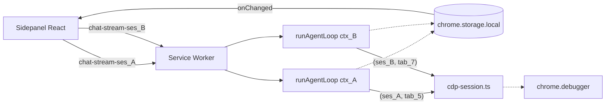
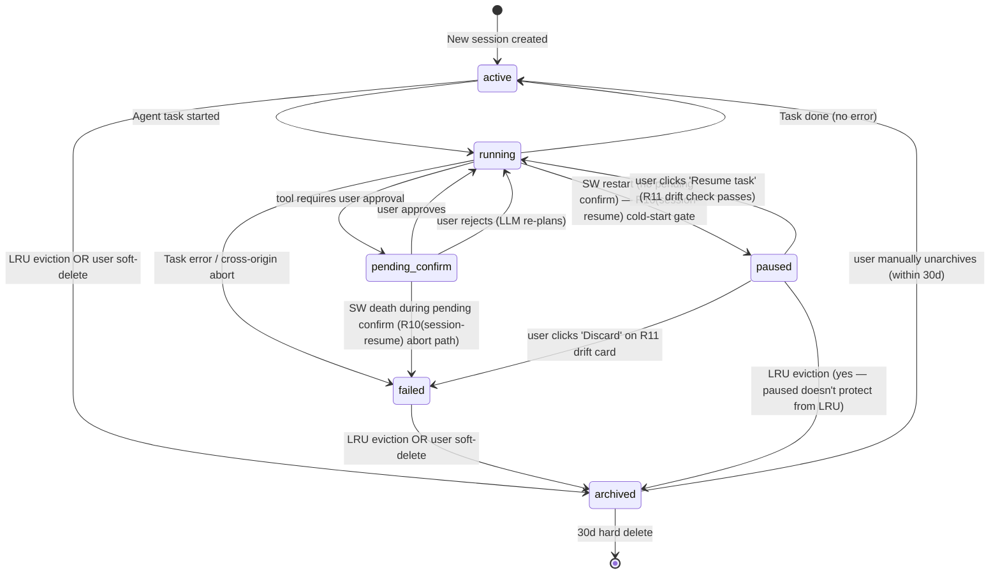

> **Status note (2026-05-04)**: All three milestones shipped. M1 (units U1-U5) via PR #8 — single-session persistent layer + SW restart recovery + R11 drift card. **M2-U1 via PR #9** — multi-session schema + state machine + skillExecutionScopeStack (76 → 106 tests). **M2-U2 via PR #10** — multi-session sidepanel UI + ce:review pass-2 fix sweep + manual-acceptance fix sweep (106 → 143 tests). **M2-U3 + M2-U4 完成** — LLM async 标题 + `untrusted_user_message` wrapper + LRU archive + 30-day hard delete + storage indicator (143 → 172 tests). **M3 (U1-U5) shipped via PR #13** — per-session port routing + per-session pinned tab/origin + CDP ownerToken `{sessionId, tabId}` + R7 cross-session lock + invariant trace doc; ce:review autofix sweep closed shared-pin deadlock (adversarial) + TOCTOU registry refresh + handleResumeRequest silent-hang + pinned pair contract (TS) + ADV-9 race test realistic chrome.debugger mock (172 → 215+ tests; main now at 228). **Post-ship dogfood follow-ups (commits `ef08e65` + `23a1162`)**: agent system prompt now carries `<pinned_tab>` block so the LLM doesn't fire unnecessary list_tabs for "summarize this page"-style tasks (collapses 2 round-trips + 1 confirm card → direct get_tab_content; also fixed downstream phantom TAB_ID_NONE=-1 crash); and M3-U2 pin-lock timing revised per user report — empty session (`messages.length === 0`) follows live active tab, lock fires on first message send (not at session creation/activation), preventing PINNED-drifts-between-tasks confusion. See `m3_learnings` for the R24/R25/R26 acceptance gate trace.

# feat: Session as First-Class Persistent Layer

## Overview

把 Chrome AI Agent 的会话状态从"寄生在 React component state + Service Worker 内存里"升级为 **first-class persistent layer**：所有 chat messages / agent task / pinned context / pending confirm 绑定到 session，session 持久化到 `chrome.storage.local`，多 session 共存且独立资源沙箱（K1）。

按 origin 锁定的 v1 ship order 拆为三个独立可 ship 的 milestone：**M1 (单 session 持久化, 解三大用户症状) → M2 (多 session UI + 同时仅 1 active task) → M3 (真多 thread sandbox)**。每 milestone 都能独立 merge + ship 测试，前一个未完成不开始下一个。

## Problem Frame

当前会话状态没有专属持久层（详见 origin: `docs/brainstorms/2026-05-02-checkpoint-resume-requirements.md` Problem Frame）。三大症状：
- **高频** — 用户切 sub-view（chat ↔ settings）触发 `App.tsx:80-91` 的 `<Chat>` unmount，11 个 React useState 全丢（`Chat.tsx:106-121`）
- **中频** — SW idle 30s 终止，in-flight agent task 直接消失（`background/index.ts:268-316` AbortController + 25s keep-alive，无任何持久化）
- **中频** — confirm 卡 pending 期间 SW 死，pending Promise resolver 在 SW 内存里，全失活

升级 framing 后的根因：会话寄生在临时 runtime 上。M1 解决 80% 用户痛感，M2/M3 完成 ChatGPT-like 多 session 能力。

## Requirements Trace

来源: `docs/brainstorms/2026-05-02-checkpoint-resume-requirements.md` 的 R1–R29 + K1–K9。本计划逐 unit 反向 trace。

**M1 覆盖**: R1 (session 字段) · R2 (chat 切 sub-view 不丢) · R3 (per-step snapshot) · R4 (in-memory pending confirm 恢复) · R10 (cold start paused) · R11 (drift informed-approval 卡, 单 button) · R12 (resume re-plan, pending-confirm carve out) · R28 (redaction preservation, C4 inheritance)

**M2 覆盖**: R1 续 (lastAccessedAt, status enum 含 paused) · R5 续 (logical isolation 部分: confirm queue 独立) · R13 (active session 内 confirm + badge) · R14 (无全局通知中心) · R15 (LRU archive trigger getBytesInUse 总) · R16 (Show archived) · R17 (30-day hard delete) · R18 (软删) · R19 (≥2MB 非-session 余量) · R20 (左侧抽屉 + 顶部 N pending badge) · R21 (3 处 New Session 入口) · R22 (LLM 标题) · R23 (slash skill 触发自动建新 session) · R27 (a11y baseline) · R29 (LLM 标题 sanitize)

**M3 覆盖**: R5 续 (真多 thread, per-session abort/pinned/CDP) · R6 (CDP owner-token (sessionId, tabId)) · R7 (读写分流) · R24 (Phase 2.5 5-path detach 多 session) · R25 (Phase 2.6 invariants) · R26 (Phase 3 P3 invariants per-session)

**全 phase 共享**: R8 (firstRunConfirmedAt 跨 session — ✓ 现有 Phase 2.6 storage shape 自然成立, 无 implementation; D10 显式 documented acceptance) · R14 (无全局 confirm 通知中心 — ✓ K3 active-session-only + 顶栏 'N pending' badge 路径已守住; 不引入 chrome.notifications) · K9 (session 边界非 trust boundary)

## Scope Boundaries

继承 origin 全部 Out of scope（见 origin Scope Boundaries 段），其中本计划重点强调：
- 主动 Pause 按钮（K4 — SW death 隐式 paused 不算主动 Pause）
- LLM stream 5min 超时续传（属"长任务分段调度" milestone）
- chrome.storage.sync 跨设备同步
- IndexedDB 分层存储（v1 全 chrome.storage.local）
- 定时工作流 alarm-driven（schema-first 间接铺地）
- 全局 confirm 通知中心 / Chrome notifications
- Per-session 独立 provider 配置
- Storage at-rest 加密（v1 不加密 message 体, 与 Phase 1 选择一致, 见 K9 + Dependencies）
- R11 "在新 tab 重启" / "在指定 tab 续跑" 分支（v1 仅 "丢弃任务"）
- R15 LRU 触发的 chrome.alarms 周期（cleanup opportunistic on sidepanel mount，不与 alarm-driven scheduled resume 混）

## Context & Research

### Relevant Code and Patterns

**Chat 状态归集点（M1-U2）**:
- `src/sidepanel/components/Chat.tsx:106-121` — 11 个 `useState` 字段（messages, input, streaming, streamingText, error, hasConfig, pageChanged, enabledSkills, popoverSelected, dismissedInput, portRef）
- `src/sidepanel/App.tsx:79-92` — 当前 conditional render 引发 `<Chat>` unmount；`chatPrefill / handleRunSkill` (line 18-23) 已在 App 层，是 cross-tab 通信范式

**Storage CRUD 范式**:
- `src/lib/storage.ts:10` — `provider_${provider}` key 命名；`active_provider` (line 60) singleton
- `src/lib/skills/storage.ts:4` — `skill_${id}` key；`enabled_skills` 用 `"id"`/`"!id"` whitelist/blacklist 标记
- `src/lib/skills/storage.ts:58-67` — `getSkillStorageBytes()`：`get(null)` + `JSON.stringify(value).length + key.length` 累加（现有 quota 近似）
- `src/lib/skills/storage.ts:83-91` — `listUserSkills()`：`get(null)` + 按 prefix 过滤
- `src/lib/crypto.ts` — AES-GCM API key 加密；session 体不复用此 path（K9 / R28 由 redaction 兜底）

**SW 端 port 闭包模式（M3-U1）**:
- `src/background/index.ts:265-324` — `onConnect` 创建 4 个 stack-allocated per-port 资源 (abortController / pendingConfirmations Map / keepAliveInterval / port itself)；`port.name === "chat-stream"` (line 266) 守卫
- `src/background/index.ts:231-243` — `sendConfirmRequest(id, payload)` 范式：Promise + `pendingConfirmations.set(id, resolve)`

**Agent loop hook 点（M1-U3, M3-U2）**:
- `src/lib/agent/loop.ts:59` — `AgentLoopContext` interface；`sessionId` + `onStepSnapshot` 注入点
- `src/lib/agent/loop.ts:381` — `runAgentLoop(ctx)` 入口
- `src/lib/agent/loop.ts:402` — 当前 `ownerToken = crypto.randomUUID()`（M3-U3 升级为 `(sessionId, tabId)`）
- `src/lib/agent/loop.ts:419-451` — pinned tab/origin anchor block；M3-U2 改为接受 ctx 注入而不是 active-tab 重查
- `src/lib/agent/loop.ts:514` — 步循环；snapshot hook 在 `:1153-1154` `history.push` 之后、`shouldTerminate` 之前
- `src/lib/agent/loop.ts:367-378` — `redactArgsForPanel()` 是 R28 redacted form 来源
- `src/lib/agent/loop.ts:601` — `applySlidingWindow()` 不持久化，resume 时从全 history 重算
- `src/lib/agent/loop.ts:912` — `sendConfirmRequest` 调用点；R4 持久化前 await
- `src/lib/agent/loop.ts:1042-1051` — K-8 confirmedTabTargets；M3-U5 必须 per-session 化

**CDP 现状（M3-U3）**:
- `src/background/cdp-session.ts:67` — `sessionMap = Map<number, InternalSession>` 按 tabId 键
- `src/background/cdp-session.ts:159` — `existing.ownerToken !== ownerToken` 冲突检查；M3-U3 改为 `(sessionId, tabId)` 对比
- 5-path detach 路径: explicit (`:211`) / abort signal listener (`:221`) / `onDetach` (`:288`) / kill-switch (`:301`) / loop finally (`loop.ts:1181`)

**Confirm protocol（M1-U4）**:
- `src/types/messages.ts:130-162` — `AgentConfirmRequestMessage` 强制要求 `tool / args / confirmationId / resolvedElement`
- `src/types/messages.ts:180-192` — `PortMessageToPanel` discriminated union，是新 variant 的注入点
- `src/sidepanel/components/AgentConfirmCard.tsx` — 按 tool name 分支渲染；新增 session 卡走独立子组件

**Wrapper / sanitize（M2-U3）**:
- `src/lib/agent/untrusted-wrappers.ts` — `escapeUntrustedWrappers()` 是 R29 / P3-O 共享 helper；幂等
- `src/lib/agent/untrusted-wrappers.ts` — `UNTRUSTED_WRAPPER_TAGS` 数组（M2-U3 必须加 `untrusted_user_message` 同时更新 inline regex —— wrapper-tag-escape solution 的"BOTH lists in lock-step"规则）

**Storage change 监听范式（M2-U2 session list）**:
- `src/sidepanel/components/Chat.tsx:136-148` — `chrome.storage.local.onChanged` listener pattern；session list 用同样 pattern 在 background snapshot write 时实时刷新

### Institutional Learnings

- `docs/solutions/2026-04-28-cdp-keyboard-simulation-on-canvas-editors.md` — owner-token 多 session 升级范式 + 5-path detach 在 multi-session 下的 sessionId 携带要求 + redaction binary channel C4 是 R28 的权威来源 + sessionMap.delete vs onDetach delivery 时序在 multi-session 下风险升级（M3-U3 验证清单项）
- `docs/solutions/2026-05-01-llm-capability-grant-invariants.md` — I-8 的"写时配额检查"范式应用到 R3 per-step snapshot（M1-U3 加 pre-write size guard）；I-3/I-4 区分 skill definition (global) vs skill execution scope (per-session)，避免 R10 名字撞车（用 R10(session-resume) 区分 session-resume gate vs skill first-run gate）
- `docs/solutions/2026-05-02-cross-tab-trust-model.md` — P3-H `verifyConfirmedOrigin` 必须 session-scoped 不能共享 ctx（M3-U5）；P3-J `close_tabs` deny "any active session pinned" 需要 cross-session 共享 pinned 注册表（M3-U4）；P3-U `preFetchedContent` 不持久化的边界（M1-U4 R4 carve out）
- `docs/solutions/security-issues/2026-05-02-wrapper-tag-escape-attack-families.md` — 新 wrapper tag 必须**同时**加到 `UNTRUSTED_WRAPPER_TAGS` 数组与 `snapshot.ts` 的 inline regex（M2-U3 R29）；`escapeUntrustedWrappers` 幂等性是 resume 时再处理 agentMessages 的安全保证；wrapper-emit-site grep discipline 在新 data flow 全程适用

### External References

不调用外部研究（codebase 局部模式充分，brainstorm 与 2 个研究 agent 已覆盖）。chrome.storage.local API 与 MV3 SW lifecycle 的关键约束（10MB quota、30s idle、5min single fetch、`getBytesInUse(null)` API）已在 brainstorm Dependencies 段固化。

## Key Technical Decisions

继承 origin K1–K9，在 plan 阶段补具体落点决策：

- **K1 真多 thread + 资源沙箱化（logical isolation, shared lifecycle）**: per-session abort signal / pinned tab / pinned origin / CDP context / confirm queue **独立**；keep-alive 是 SW 单层共享，任一 active session port 维持 SW alive。Plan 落点：M3 全部 unit
- **K2 Pinned tab 读写分流**: read 并发, write 互斥；落到 BUILT_IN_TOOLS 元数据 `class: 'read' | 'write'` (M3-U4)
- **K3 Confirm 卡 active-session 内 + badge**: 守 informed-approval 不变量；落到 sidepanel 顶部 'N pending' 总 badge (M2-U2) 跨 sub-view 可见
- **K4 不做主动 Pause + SW death 隐式 paused**: status enum 加 `paused` (M2-U1)；R10(session-resume) cold-start gate (M1-U5) 不与 Phase 2.6 R10 first-run gate 混名
- **K5 Pinned tab 漂移 informed-approval 而非 silent abort**: v1 仅 "丢弃任务" 单 button (M1-U5 / R11)
- **K6 LRU archive 而非 unlimitedStorage**: 不加 manifest 权限 (M2-U4)
- **K7 LLM 后台总结标题**: 异步, 不阻塞首消息发送 (M2-U3)
- **K8 首次自动建 'New Session'**: 3 处入口 (M2-U2)
- **K9 Session 边界不是 trust boundary**: 接受 SEC-3 风险, 依赖 Phase 3 high-risk confirm 兜底；read 全跨 session, write 互斥 (M3-U4)。两条额外 documented residual leakage path (security-lens SEC-PLAN-007 fix): (a) M2-U3 LLM 标题生成 — 用户主动把 session B 内容粘贴到 session A 首条 message 时, LLM 标题调用泄露 B 内容（用户 own paste 行为, 接受）；(b) M3-U4 read tools 跨 session — confirm 卡 UX 文案显式说"this tab is also pinned by session Y (created at Z)"

**新 Plan 阶段决策**:

- **D1 Session id 与 storage key 命名**: id 是裸 UUID (`crypto.randomUUID()`) 不带 prefix；storage key 形如 `session_${id}_meta` / `session_${id}_agent` / 单独的 `session_index` 持有有序 id 列表 + lastAccessedAt + pinnedTabId 摘要（避免 list 时 `get(null)` 全扫）。**M1 不再 hardcode `id='default'`** — 见 PRD-3 反向 fix：M1-U1 直接用 UUID 即便单 session, 消除 M2-U1 migration 路径
- **D2 AgentMessage IR 与 DisplayMessage 分开存**: AgentMessage IR 是 SW-internal type (string | ContentBlock[])，DisplayMessage 是 panel 渲染 type (string-only)。同一 session 拆 `session_${id}_meta` (含 DisplayMessage[] + 元信息) 与 `session_${id}_agent` (含 AgentMessage IR + step state) 两 key，避免大 session 单 key 写入抖动
- **D3 Snapshot hook 注入而非内嵌**: 在 `AgentLoopContext` (loop.ts:59) 增 `sessionId: string` + `onStepSnapshot: (snapshot) => Promise<void>` 回调；SW caller 注入持久化逻辑；loop body 不直接调 chrome.storage（沿 `sendConfirmRequest` 现有注入范式）
- **D4 Snapshot 必须深克隆**: `loop.ts:582-598` 与 `:1153-1154` 都 mutate `history` in-place；snapshot 前 `JSON.parse(JSON.stringify(history))` 或等价深 clone，否则 storage 持的是 mutable reference
- **D5 SessionConfirmRequestMessage 走 PortMessageToPanel 新 variant**: 不复用 `AgentConfirmRequestMessage`（避免污染 tool-call confirm channel）；新 `type: "session-confirm-request" + kind: "pinned-tab-drift" | "paused-resume"` discriminated union 项 (`messages.ts:180-192`)；AgentConfirmCard 按 type 分支渲染独立子组件
- **D6 Per-session quota pre-write guard (analogous to Phase 2.6 I-8)**: 每次 R3 snapshot write 前估算 `currentTotal + estimateSnapshotBytes`；超 8MB 触发 LRU archive 路径，archived 后再写；M2-U4 实现
- **D7 Storage at-rest 不加密 + Sensitive-Field Inventory (security-lens SEC-PLAN-001 fix)**: 与 Phase 1 选择一致。**Inventory of fields persisted across SW lifetime**:
  - `SessionMeta.title`: 用户 typed first message 派生 (R29 sanitize 后), **接受明文** — chat content 信任面与 Phase 1 API key 同等
  - `SessionMeta.messages` (DisplayMessage[]): 用户 typed chat content, **接受明文**
  - `SessionAgentState.agentMessages` (AgentMessage[]): 含 tool_use args + tool_result observation
    - **全部接受明文 at-rest** (P0-A v2): R28 重新解读为"panel-display redaction 不变量"; storage 持 raw 是为了 LLM resume 顺畅；信任面与 chat content 等同 (K9)
    - panel display 路径仍走 redactArgsForPanel (loop.ts:367-378) — UI 不 shoulder-surf-leak
    - tool_result content (extract_structured_data, get_tab_content) → 明文 — 这是用户 informed-approve read 的页面内容
  - `SessionAgentState.pendingConfirm` (R4): raw confirm payload (含未 redact args.text)，**只在 SW alive 期间存在**, resolve 后立即 scrub, R10(session-resume) startup-precondition unconditional cleanup 兜底
  - get_tab_content `preFetchedContent` (P3-U): **不写 storage**，仅 contentPreview (≤200 chars sanitized) 入 confirm payload
  - 任何含 API key, OTP, payment token 的字段 → 严禁写 storage (R28 扩张点 — 写 plan 阶段 audit redactArgsForPanel field list)
- **D8 Cold-start gate 命名**: 用 `R10(session-resume)` (Session Resume gate) vs Phase 2.6 `R10` (skill first-run gate) 在代码与 prose 区分；都来自相同的 informed-approval 范式
- **D9 close_tabs cross-session pinned 注册表 = `session_index` 衍生**: 不新增独立 key；`session_index` 已含每条 active session 的 pinnedTabId（meta-only），`close_tabs` handler 读它即可。**Atomicity commit (security-lens SEC-PLAN-006 + adversarial ADV-2 fix)**: createSession 与 lastAccessedAt-with-pinnedTabId-change 必须用 single-call `chrome.storage.local.set({[metaKey]: ..., [indexKey]: ...})` 原子写入 meta + index；getActivePinnedTabs 优先读 session_index, fallback 时 prefix-scan session_${id}_meta keys 兜底 (SW-内 in-memory cache 选项留 plan-time 评估, 但兜底 prefix-scan 是 minimum)
- **D10 firstRunConfirmedAt 全局复用 = 接受决策**（security-lens SEC-PLAN-008 fix）：高风险场景下不加 per-session re-confirm。理由：用户在 session A 已 informed-approve 一个 agent-authored skill, 该决策跨 session 复用是 Phase 2.6 storage shape 的自然语义。Per-session re-confirm 留 v2.x 评估 — 当多 session 间真出现"低风险 session 自动放行 high-stakes session"用户报告时再加

## Open Questions

### Resolved During Planning

- **Snapshot 频率**: 每 step 边界写（每 `history.push` 后、`shouldTerminate` 前），不节流。理由：MV3 SW 死亡时机不可预测，节流窗口内死 = 数据丢；chrome.storage.local 写入无文档化 per-second cap，单 step ≈ <50KB；每 step 写是简单且正确的语义
- **Snapshot 模式 = full vs delta**: M1 用 full snapshot（`history` 完整深 clone）。理由：implementation 最简、resume 路径无需"按 delta 顺序回放"。Delta 模式（仅写新 step 增量）作为 M3 之后 v1.1 性能优化保留 (origin Deferred 项)
- **chrome.storage.local key 拆分**: meta + agent 双 key（D2）—— 大 session 单 key 写入抖动是 measurable 问题；2 key 的 transactionality 由 `chrome.storage.local.set({...})` 单调用 atomic 保证（同一 set 多 key 一致提交）
- **Resume 检测时机**: SW startup（`chrome.runtime.onStartup` + `onInstalled`）+ sidepanel mount 双触发，靠 `session.status` + 持久化的 `recoverGuard` flag 防重复 resume
- **Confirm protocol 新 variant 选 D5 (Option A)**: 不污染 AgentConfirmRequestMessage 现有契约；与 PortMessageToPanel discriminated union 范式一致

### Deferred to Implementation

- **每 milestone 内的具体测试 file 命名 / mock 边界**: M1/M2/M3 各 unit 自决（沿现有 vitest pattern）
- **LLM 标题 prompt 模板的具体语句 + 失败重试次数**: M2-U3 实现，初版"以下是用户首条消息，给会话起一个不超过 10 字的中文短标题: <untrusted_user_message>...</untrusted_user_message>"
- **Session list a11y 实现细节**: M2-U2 实现 (`role="list"` + arrow key navigation 等)
- **30-day hard delete 触发的具体执行点**: M2-U4 实现 (opportunistic on sidepanel mount)
- **R3 snapshot 大字段（agentMessages）的 storage 实际占用监控**: M1 ship 后实测，超出预期再议 delta 模式
- **CDP `sessionMap.delete` vs `onDetach` delivery timing 在 multi-session 的实际竞态**: M3-U3 实现期通过日志观察确认；如出现，可能需序列化 detach 队列
- **Cross-phase invariant trace 表**: M3-U5 deliverable —— 每条 (Phase 2 K-1/K-8, Phase 2.5 5-path detach, Phase 2.6 R10/R3/P0-A...P1-H, Phase 3 P3-A...V) × multi-session 下是否仍成立 / 怎么改的全量 audit 表，sign-off 后才允许 M3 merge

## High-Level Technical Design

> *本节用以阐释整体形状，是 directional guidance for review，不是 implementation specification。Implementing agent 应作为 context 而非 code-to-reproduce。*

### Storage 形状（M1 后）

```
chrome.storage.local
├── session_index                       (single key, 顺序 id 列表 + lastAccessedAt + pinnedTabId 摘要)
├── session_<id>_meta                   (per session: DisplayMessage[], title, createdAt, lastAccessedAt, status, pinnedTabId, pinnedOrigin, archivedAt?)
├── session_<id>_agent                  (per session: AgentMessage[] (full), stepIndex, skillExecutionScopeStack, pendingConfirm? — only while SW alive carve out)
├── provider_<name>                     (existing, unchanged)
├── skill_<id>                          (existing, unchanged)
├── encryption_key                      (existing, unchanged)
└── enabled_skills                      (existing, unchanged)
```

### Sidepanel UI 形状（M2 后）

```
┌──────────────────────────────────────────┐
│ Chrome AI Agent  [provider · model]  3🔔│  <- 顶栏 (sub-view 不变；'N pending' badge K3)
├────────────┬─────────────────────────────┤
│ ◀          │                             │
│  S         │                             │
│  e         │   Active session content    │
│  s         │   (Chat / Settings)         │
│  s         │                             │
│  i         │                             │
│  o         │                             │
│  n         │                             │
│  s         │                             │
│  ▼         │                             │
│  (drawer)  │                             │
├────────────┴─────────────────────────────┤
│        chat        │       settings      │  <- bottom nav (废弃 agent / tabs)
└──────────────────────────────────────────┘
```

抽屉展开后：

```
┌─────────────────────┐
│ + New Session       │
├─────────────────────┤
│ ● 飞书写小作文       │  <- active, running
│   2 min ago         │
├─────────────────────┤
│ 🔔 整理今日 PR      │  <- pending confirm
│   5 min ago         │
├─────────────────────┤
│ ⏸  Resume task     │  <- paused (cold-start gate, R10(session-resume))
│   yesterday         │
├─────────────────────┤
│ ✓  写邮件给老板     │  <- done
│   1 hour ago        │
├─────────────────────┤
│ Show archived (3) ▾ │
└─────────────────────┘
```

### Multi-session sandbox（M3 后）



每 port 闭包独占 (sessionId, abortController, pendingConfirmations, keepAliveInterval) 四元组；CDP `sessionMap` key 仍是 tabId 但 `ownerToken` 升级为 `(sessionId, tabId)`；storage 写入触发 panel session list 实时刷新。

### State Machine（M2 后；Plan-阶段补全 origin Deferred 项）



`done` 状态省略 — done 任务保留在 session 内作为历史，session status 仍是 `active`（done 是 task-level 概念，session-level 状态机里 done = active 含已完成 task 历史）。**M2-U1 status enum 仅含 `active | paused | failed | archived` 4 项**（coherence F8 fix）。

## Implementation Units

按 **M1 → M2 → M3** 顺序，前一个 milestone 全部 unit merge + verify 后才开始下一个。每 milestone 独立可 ship。

---

### M1 — 单 session 持久化（解三大用户症状，可独立 ship）

- [x] **Unit M1-U1: Session 数据层 + storage CRUD** ✅ shipped (commit `1aa7216`)

**Goal:** 建立 session 数据契约 + storage 读写原子操作 + listing。M1 后只支持单 session（id 固定 'default'），M2-U1 升级为多 session。

**Requirements:** R1 (session 字段) · D1 (key 命名) · D2 (meta + agent 双 key)

**Dependencies:** None

**Files:**
- Create: `src/lib/sessions/types.ts` (SessionMeta, SessionAgentState, SessionIndexEntry types)
- Create: `src/lib/sessions/storage.ts` (CRUD: createSession, getSessionMeta, setSessionMeta, getSessionAgent, setSessionAgent, listSessionIndex, removeSession, getTotalBytes)
- Create: `src/lib/sessions/storage.test.ts`
- Modify: 无（仅新增）

**Approach:**
- SessionMeta 含 `id, createdAt, lastAccessedAt, status, title?, pinnedTabId?, pinnedOrigin?, archivedAt?`；DisplayMessage[] 也存这里（panel 渲染用）
- SessionAgentState 含 `agentMessages: AgentMessage[], stepIndex, skillExecutionScopeStack, pendingConfirm?`
- `setSessionMeta` 与 `setSessionAgent` 各自 atomic，不需要 cross-key transaction（panel 与 SW 不会同时写同一 key）
- `listSessionIndex` 读 single `session_index` key（避免 `get(null)` 全扫），entries 按 lastAccessedAt 倒序
- `getTotalBytes` 调 `chrome.storage.local.getBytesInUse(null)` 得真实总占用（不是 skill 那种 JSON.stringify 近似）
- M1-U1 直接用 `crypto.randomUUID()` 生成 id（即便 M1 阶段 UI 只暴露当前 session, list 中也只有 1 entry）；这样 M2-U1 无需任何 migration 代码 —— PRD-3 修复

**Patterns to follow:**
- `src/lib/skills/storage.ts` — CRUD + listUserSkills + getSkillStorageBytes
- `src/lib/storage.ts` — provider key 命名

**Test scenarios:**
- Happy path: createSession 写入 meta + agent + index → list 返回该条 → getSessionMeta/getSessionAgent 读回一致
- Edge case: meta 与 agent 分开 set 后再 set meta → agent 不变（验证 D2 双 key 独立）
- Edge case: setSessionMeta 写入 status='archived' → listSessionIndex 返回该条但 archivedAt 字段就位
- Error path: getSessionMeta 不存在 id → 返回 null（不抛）
- Integration: removeSession → meta + agent + index entry 三处都消失

**Verification:**
- vitest 全过；`pnpm dev` 后 chrome devtools 看 chrome.storage.local 含 `session_index / session_default_meta / session_default_agent` 三 key

---

- [x] **Unit M1-U2: Lift Chat 状态到 App 层 + persist messages** ✅ shipped (commit `34d5683`)

**Goal:** 解 root-cause #1（切 sub-view 丢消息）。把 `Chat.tsx:106-121` 11 个 useState 中持久数据迁出到 sessions storage layer，让 `<Chat>` unmount 不丢数据。

**Requirements:** R2 (chat 切 sub-view 不丢) · R1 (messages 字段) · D2 (DisplayMessage[] 存 meta key)

**Dependencies:** M1-U1

**Files:**
- Modify: `src/sidepanel/components/Chat.tsx` (rename component to ChatView, accept messages + handlers as props from App, remove messages useState; keep ephemeral state local: input, streaming, streamingText, error, popoverSelected, dismissedInput, portRef)
- Modify: `src/sidepanel/App.tsx` (load default session messages on mount via storage hook, pass to ChatView; on chat-done message, persist to storage; subscribe to onChanged for cross-tab refresh)
- Create: `src/sidepanel/hooks/useSession.ts` (hook: returns active session meta + messages + handlers; subscribes to storage onChanged)
- Modify: `src/sidepanel/components/Chat.test.tsx` (split state ownership; assert messages survive prop swap)
- Test: `src/sidepanel/hooks/useSession.test.ts`

**Approach:**
- `useSession()` hook 是单 session 形式（M2-U1 改为 multi-session）
- 持久数据：messages, hasConfig, enabledSkills；瞬态保留 Chat 内：input draft, streaming text, error toast, popover state
- App 监听 chrome.storage.local.onChanged 上 `session_default_meta` 变化，触发 useSession refresh — 这样 SW 写入 messages 后 panel 自动刷新
- portRef 跨 sub-view 切换时**不能**丢；M1 阶段把 portRef 提到 App 层（即便切 settings，port 仍在）；M3-U1 将其升级为 per-session
- 注意 messages 不在 streaming 中段持久化（避免抖动），仅在 'chat-done' 时持久化全 messages 数组

**Patterns to follow:**
- `Chat.tsx:136-148` — chrome.storage.local.onChanged listener cleanup
- App.tsx 现有 chatPrefill 已是 cross-tab state lift 范式

**Test scenarios:**
- Happy path: 用户发消息 → 收完整 → 切到 settings → 切回 chat → messages 完整保留
- Happy path: chrome devtools 强 reload 整个 sidepanel → messages 从 storage 恢复
- Edge case: 流式中途切到 settings → 切回时 streamingText 已丢（接受），但 final messages 未受影响
- Error path: storage onChanged listener 在 unmount 时清理（无 memory leak）
- Integration: SW 完成 chat-done 后写 storage → panel onChanged 触发 → ChatView 重渲染

**Verification:**
- 浏览器 manual: pnpm dev → load extension → 发消息 → 切 settings → 切回 → messages 在
- 浏览器 manual: 关 sidepanel → 重开 → messages 在

---

- [x] **Unit M1-U3: Agent loop snapshot 集成 + R28 redaction preservation** ✅ shipped (commit `428d1fb` + P0 patch `f4bb1d0` 用户 reported tombstone gap)

**Goal:** 解 root-cause #2（SW restart 丢 task）的写入端。Agent loop 每 step 边界 snapshot 到 storage，redacted 字段保持 redacted。

**Requirements:** R3 (per-step snapshot) · R28 (redaction preservation, C4 inheritance) · D3 (snapshot hook 注入) · D4 (deep clone) · D6 (pre-write quota guard)

**Dependencies:** M1-U1

**Files:**
- Modify: `src/lib/agent/loop.ts` (extend `AgentLoopContext` interface line 59 with `sessionId: string` + `onStepSnapshot?: (snapshot: SessionAgentSnapshot) => Promise<void>`; insert deep-clone + onStepSnapshot call between line 1154 (history.push) and line 1156 (shouldTerminate check))
- Modify: `src/background/index.ts` (in handleChatStream, inject onStepSnapshot callback that calls `setSessionAgent(sessionId, snapshot)` from M1-U1)
- Modify: `src/lib/agent/loop.ts` redact note (verify line 367-378 redactArgsForPanel only affects panel display; the agentMessages history retains raw — confirm comment + add explicit assertion that snapshot path uses agentMessages AS-IS)

**Approach (修订 v2 — P0-A R28 范式重审 fix)**:
- **R28 重新解读**: Phase 2.5 binary channel 原意 = panel 显 redacted (防 shoulder-surf) + LLM 看 raw (需要 semantic context 规划下一步)。本 plan 之前误把 R28 解读为"storage 也 redact"会导致 LLM resume 后失忆。**正确语义**: storage 持 raw agentMessages（与 chat content 同等 K9 storage trust face）, panel-display 路径仍 redact。Brainstorm R28 文案需回头修订为 "panel-display redaction 不变量持久于 storage" 而非 "storage 字段 redact"
- Snapshot pipeline: `deepClone(history)` → `onStepSnapshot(rawClone)` （无中间 redact pass）
- 副本 deep clone 防止 mutate-after-snapshot
- Pre-write size guard (D6): 计算 `currentTotal + estimatedNewBytes`，超 8MB 走 LRU archive 路径（M2-U4 实现；M1 阶段可仅日志告警 + 跳 snapshot 不阻塞 loop）
- Resume 路径（M1-U5 实现）从 raw snapshot 重建 agentMessages → LLM 看到完整自己 typed 的内容，可顺畅规划下一步
- Panel display 仍走 `redactArgsForPanel` (现有 loop.ts:367-378), 不改

**Patterns to follow:**
- `sendConfirmRequest` 注入范式（loop 不直接调 chrome.storage）
- `redactArgsForPanel` 是字段清单单一来源

**Test scenarios:**
- Happy path: 模拟 5-step task → onStepSnapshot 被调 5 次, 每次 history 长度 +2 (assistant + tool_result)
- Edge case: history mutate in-place after push (line 582-598) → snapshot 持有的副本不受后续 mutate 影响（验证 D4 deep clone）
- Edge case: CDP keyboard tool_use 含 args.text="password123" → snapshot 中 args.text 仍是 raw "password123"（**P0-A v2**: storage 持 raw, panel display 才 redact）；assert panel render 走 redactArgsForPanel 显示 [redacted]; storage 内 raw
- Error path: onStepSnapshot 抛 quota error → loop 捕获 + 日志 + 继续（不阻塞 task；M2-U4 后改为触发 LRU）
- Integration: SW restart 后 getSessionAgent 读出 snapshot, AgentMessage[] shape 与 redact 状态都正确

**Verification:**
- vitest 跑 loop.test.ts 新增的 snapshot 用例
- 手动: 用 CDP keyboard 跑一个 task, devtools 看 chrome.storage.local 中 session_default_agent.agentMessages 内 args.text 不是明文

**Execution note:** Test-first — R28 是安全不变量，先写 redaction 测试再实现 redactSnapshotForStorage

---

- [x] **Unit M1-U4: SessionConfirmRequestMessage 协议 + R4 in-memory pending confirm 恢复** ✅ shipped (commit `d7d6b2c`)

**Goal:** 引入 non-tool confirm 协议（为 M1-U5 的 R11 drift 卡 + 后续 R10(session-resume) paused-resume 卡铺路），并实现 R4 ：SW 未死场景下 panel 重连后能恢复显示 pending confirm 卡。

**Requirements:** R4 (pending confirm 重连恢复) · D5 (新协议 variant)

**Dependencies:** M1-U1, M1-U3 (pendingConfirm 持久化路径依赖 snapshot infra)

**Files:**
- Modify: `src/types/messages.ts` (add `SessionConfirmRequestMessage` discriminated union variant: `type: "session-confirm-request" + confirmationId + kind: "pinned-tab-drift" | "paused-resume" + payload`; add to PortMessageToPanel union line 180-192)
- Modify: `src/sidepanel/components/AgentConfirmCard.tsx` (split: existing tool-call confirm 走原 component; 新 `SessionConfirmCard` 子组件按 kind 分支渲染)
- Modify: `src/background/index.ts` (extend sendConfirmRequest range to handle session-confirm-request type; pendingConfirmations Map key by confirmationId 已是 string 不变)
- Modify: `src/sidepanel/components/Chat.tsx` (handle 'session-confirm-request' message branch alongside existing 'agent-confirm-request')
- Modify: `src/lib/agent/loop.ts` (when sendConfirmRequest invoked, write pending payload to session storage `pendingConfirm` field BEFORE await; clean on resolve via finally)

**Approach:**
- pendingConfirm 持久化的 payload 含: confirmationId, kind ('agent-tool' | 'pinned-tab-drift' | 'paused-resume'), tool? (for agent-tool kind), args? (already redacted by R28? **NO** — confirm 卡需 raw 才能 informed approval, 这是 Phase 2.5 binary channel; raw 写 storage 直到 resolve 后立即删除 = R28 第二条款), tabTargets?, metaSkillPreview?, contentPreview?
- Panel 重连（同一 SW 进程内, port disconnect 后重 open）→ App.tsx 检查 storage 里 session.pendingConfirm 有值 + 对应 SW pendingConfirmations.has(id) 仍 true → re-render 卡
- pendingConfirm 在 storage 中只在 SW alive 期间有效；SW restart 路径不读 pendingConfirm 字段而走 R10(session-resume) abort（M1-U5）— 因此 storage 里残留的 pendingConfirm 在 SW restart 后由 R10 检测到时直接清理 + mark task=failed
- preFetchedContent (P3-U) 不写 storage，仅写 contentPreview 字符串（cross-tab-trust-model insight D）

**Patterns to follow:**
- `messages.ts:180-192` discriminated union 范式
- `background/index.ts:231-243` sendConfirmRequest Promise 范式
- `AgentConfirmCard.tsx` 按 tool name 分支的现有 split

**Test scenarios:**
- Happy path: agent-tool confirm 流程不变（regression test pass）
- Happy path: SW alive, panel 关再开 → pendingConfirm 在 storage → 卡重新渲染
- Edge case: pendingConfirm 在 storage 但 SW pendingConfirmations 没了（SW restart 后未及清理） → 卡不显示 + storage pendingConfirm 被 R10(session-resume) 路径清理
- Edge case: confirm 卡含 raw args.text (CDP keyboard) → 用户 reject → pendingConfirm 立刻从 storage 删（R28 第二条）
- Integration: session-confirm-request 消息走通 panel ↔ SW ↔ pendingConfirmations 路径

**Verification:**
- vitest 协议层
- 手动: 触发 high-risk tool → confirm 卡显示 → 关 sidepanel → 重开 → 卡仍在

---

- [x] **Unit M1-U5: SW restart cold detection + R10(session-resume) paused state + R11 drift informed-approval 卡** ✅ shipped (commit `cb8b73d`)

**Goal:** 解 root-cause #2（SW restart 丢 task）的恢复端。SW restart 后检测未完成 task → 转 paused 状态 + 用户手动 Resume → R11 drift 检测 → 续跑或丢弃。

**Requirements:** R10 (R10(session-resume) cold-start gate) · R11 (drift informed-approval, 单 button "丢弃任务") · R12 (resume re-plan, pending-confirm carve out) · K4 (隐式 paused) · K5 (informed-approval 而非 silent abort) · K8 (区分 R10(session-resume) vs Phase 2.6 R10)

**Dependencies:** M1-U1, M1-U3, M1-U4

**Files:**
- Create: `src/background/session-recovery.ts` (detectAndMarkPaused: 在 chrome.runtime.onStartup + onInstalled 触发；遍历 session_index 找 status='active' + 有 in-flight task；含 pendingConfirm record → mark failed；否则 → mark paused + 写 recoverGuard 防重)
- Modify: `src/background/index.ts` (调用 detectAndMarkPaused on startup + sidepanel-mounted message handler)
- Modify: `src/lib/sessions/storage.ts` (add markPaused, markFailed helpers + recoverGuard field to meta)
- Modify: `src/sidepanel/App.tsx` (检测 session.status='paused' → 在 active session 视图顶部显示 'Resume task' button，点击触发 startResume(sessionId) message)
- Modify: `src/background/index.ts` (handleResumeMessage: 收到 startResume → 检查 pinned tab 是否仍存在 + origin 是否未变 → 是则 reload session_agent + restart runAgentLoop；否则 send SessionConfirmRequestMessage with kind='pinned-tab-drift' kind 单 action 'discard')
- Modify: `src/sidepanel/components/AgentConfirmCard.tsx` SessionConfirmCard 子组件 (实现 kind='pinned-tab-drift' 渲染：原 pinned tab title + origin + 最后 step 摘要 + tokens-since-start + 单 'Discard task' button)
- **R11 drift card 用户 click 'Discard task' 后 (M1-U5 design-lens F3 + security SEC-PLAN-005 fix)**: (a) 立即 scrub session_${id}_agent.pendingConfirm 字段 + redact agentMessages tool_use 的所有 raw arg 字段；(b) 在 chat 视图保留 1 条系统 message "Task discarded — original goal: <task>. Last step: <step summary>. Last pinned tab: <title>." 作为 recovery context (用户输入新 prompt 时 LLM 可看历史)；(c) input field 不预填 (用户决定是否复用 goal)
- Create: `src/background/session-recovery.test.ts`
- Modify: `src/lib/agent/loop.ts` (resume 入口接受 `resumedFromStep: number` + `agentMessages: AgentMessage[]` 参数；R12 carve out: 若 ctx.pendingConfirmAtRestart=true 则不 enter 而是直接 abort+failed —— 实际 detectAndMarkPaused 已挡住所以 loop 不会被这种 case 调用，但 defensive double-check)
- Test: `src/lib/agent/loop.test.ts` (新增 resume integration cases; 复用现有 mock 模式)

**Approach:**
- recoverGuard: timestamp，防 SW startup + sidepanel mount 双触发；窗口 30s
- **R10(session-resume)-precondition unconditional cleanup (security-lens SEC-PLAN-002 fix)**: SW startup **第一步** 在 detectAndMarkPaused 跑前先 unconditional scan-and-clear 所有 `session_${id}_agent.pendingConfirm` 字段（pendingConfirm 跨 SW restart 必然失效 — resolver 不在了；orphan 不应残留）。此 scrub 优先于 detectAndMarkPaused 的 mark logic, 避免极端 case (SW 在第二轮还没跑就再死) 导致 raw payload 长期残留
- 'Resume task' button **统一在 paused session 行内显示**（design-lens F1 fix）；M1 阶段没有 session list UI 但 portRef 仍 connected，paused 状态时在 chat 视图顶部 sticky bar 显示等价 button —— **M2-U2 上线后 sticky bar 移除**, 由 in-row button 单独承担
- Drift 卡 kind='pinned-tab-drift' 仅 1 个 'Discard task' button — 不复杂；origin 显示与 Phase 3 OriginSummaryRow 复用同样 sanitization (escapeUntrustedWrappers)
- R12 carve out 已在 detectAndMarkPaused 里 enforce（pendingConfirm 路径直接 mark failed 不进 paused）；resume 路径仅处理"无 pending confirm" 场景

**Patterns to follow:**
- `loop.ts:419-451` pinned tab anchor — resume 时改为 ctx 注入 (M3-U2 完整版；M1 临时复用 anchor block)
- Phase 2.6 R10 first-run gate 范式（只是不混名字）
- Phase 3 P3-V `role='dialog' + aria-labelledby` a11y（drift 卡复用）

**Test scenarios:**
- Happy path: SW restart → status='active' + 无 pending confirm → 转 paused → 'Resume task' 按钮出现
- Happy path: 用户 Resume → pinned tab + origin 不变 → 静默续跑, agentMessages 从 snapshot 重建
- Happy path: R10(session-resume) 触发后 detect 到 status='paused' → 不重复 mark
- Edge case: SW restart → 检测到 pendingConfirm 字段 → mark failed (不进 paused), pendingConfirm 字段清理
- Edge case: 用户 Resume → pinned tab 已关 → 弹 drift 卡 "Discard task" → 用户 click → status=failed, session 仍可用输入新 prompt
- Edge case: 用户 Resume → pinned tab 还在但 origin 已变 → 同上 drift 卡
- Edge case: SW startup + sidepanel mount 在 30s 内双触发 → recoverGuard 防重，仅一次 mark
- Error path: SW startup 时 chrome.storage.local 读失败 → 日志 + 不阻塞其他 session
- Integration: full flow — task 跑到第 3 步 → kill SW → reopen → paused → click Resume → tab 还在 → 续跑到第 4 步 → 完成

**Verification:**
- vitest 跑 session-recovery.test.ts
- 手动: 用 chrome devtools "Update on reload" 强 SW restart 复现

**Execution note:** Test-first — R10(session-resume) 是 BYOK informed-spending 不变量, 先写 cold-start gate 测试

---

### M2 — 多 session UI（在 M1 单 session 持久化基础上加 list / 命名 / 归档；同时仅 1 active task）

- [x] **Unit M2-U1: Multi-session schema + state machine enumeration + skillExecutionScopeStack** ✅ shipped (commits `1494eaa` + `0363f29` + `ce9a2f6` + `1862895`, PR feat/session-m2-u1)

**Goal:** 把 M1 hardcoded id='default' 升级为 multi-session；status enum 含 paused；定义完整 state machine（实现 origin Deferred 项 design-lens state machine）。

**Requirements:** R1 续 (lastAccessedAt 三种 trigger; status enum) · R5 部分 (per-session skillExecutionScopeStack)

**Dependencies:** M1-U1, M1-U3

**Files:**
- Modify: `src/lib/sessions/types.ts` (status enum 含 active/paused/failed/archived — **`done` 不入 enum**, 因为 task done = session 仍 active 含历史；M2-U1 status 仅 session-level 状态机；`done` 是 task-internal metadata 见 SessionAgentState; **移除 default id concept**: M1-U1 已直接用 UUID, 此处无 migration; SessionAgentState 加 skillExecutionScopeStack)
- Create: `src/lib/sessions/migration.ts` (idempotent migration: M1 早期可能写入的任意 id 默认值清理；M1-U1 已用 UUID 应无 stale 'default' key, 但 defensive 启动 scan 一次)
- Test: `src/lib/sessions/migration.test.ts` (idempotency: 跑两次无副作用)
- Modify: `src/lib/sessions/storage.ts` (createSession 用 crypto.randomUUID(); listSessionIndex 增分页/过滤; updateLastAccessed helper)
- Modify: `src/lib/agent/loop.ts` (currentSkillScope 升级为 stack + 通过 ctx 传入 + snapshot 时持久化 — **plan-as-written 错误地把 `currentSkillScope` 描述为 module-level (line 407)，实际它已经是 `runAgentLoop` 函数内 local var (loop.ts:511 的 `let` 在函数体内)。本 unit 是纯 shape 升级 (scalar→stack) + 持久化 (snapshot 携带 stack, resume 还原)，不是 race fix。**)
- Create: `src/lib/sessions/state-machine.ts` (state machine 验证 helper: canTransition(from, to): boolean; allTransitions: list 文档化转移)
- Create: `src/lib/sessions/state-machine.test.ts`

**Approach:**
- 完整 state machine 见 plan 顶部 Mermaid 图
- skillExecutionScopeStack 是 SkillScope[]（栈）；M1 单 session 时间复用同一份 ctx；M2 多 session 每 session 独立栈
- lastAccessedAt 三种 trigger（用户切到该 session / 收到新 message / agent step 推进）在 setSessionMeta + setSessionAgent 各自调用点 inline 更新；step 推进侧采用 `stepIndex % 5 === 0` 节流防 meta 写抖动 (tombstone `stepIndex=0` 也命中, task done 自然 bump)
- canTransition 是为防御性编码（任何 status 变更走 helper 而非直接赋值）

**Shipped notes:**
- Migration 在 SW startup 通过 module-level `recoveryReady` promise 串行化, 保证 `migration → detectAndMarkPaused` 严格顺序 (cold-start 路径不能按旧 'default' id 处理)
- `buildSessionAgentSnapshot` 加可选 3rd arg (默认 `[]` 保持 9 个现有测试 backward compat); `AgentLoopContext.resumedSkillScopeStack?` 由 `handleResumeRequest` 注入
- 多并发 `runAgentLoop` 的 stack 隔离作为 regression guard test 而非 fix (function-local 已天然隔离)
- 测试: 76 → 106 (+30: state-machine 19, migration 5, loop stack 6)

**Test scenarios:**
- Happy path: createSession 返回唯一 id（多次调用不撞）
- Happy path: state transitions 全部合法路径都允许
- Edge case: 非法转移（如 archived → running）被 canTransition 拒绝
- Edge case: lastAccessedAt 在三种 trigger 下都更新
- Integration: skillExecutionScopeStack 在 snapshot/resume 来回是同一栈

**Verification:** vitest 全过

---

- [x] **Unit M2-U2: Sidepanel 左侧抽屉 + session list UI + 'New Session' + 顶部 'N pending' badge + R27 a11y** ✅ shipped (commits `4baef1b` PortMessageToPanel sessionId routing + `a815da2` P0-1 createAndActivate guard + `dabf1f5` P0-2 resumeTask streaming + `51537b2` P1-4 resolver sessionId verify + `179e0b5` P1-3+P1-8 handleSelect/Resume + `2d5dae5` P1-5 onClose useCallback + `40ffb73` P1-6 metaKey listener echo guard + `292861f` P1-7 SessionRow keyboard a11y + `4c2db49` P1-9 flood-reject vs K-10 + `cdb03bf` P1-10 drift-card cascade fix; impl commits `dea793e..f6e9a50` 8 commits; PR #10)

**Shipped notes:**
- 顶栏布局最终落地为 `[≡●] [+] {sessionTitle 纯文本} ─── [☼]` (列表按钮在最左, 新建按钮居中, title 纯文本不再 click target — 用户在 paper 设计阶段反馈调整)
- ce:review pass-2 surface 2 P0 (createAndActivate / resumeTask 缺 streaming guard → cross-session message contamination → K-1 informed-approval bypass) + 9 P1, 全部 fix
- **关键 wire-format upgrade**: 给 8 个 PortMessageToPanel variant (chat-chunk / chat-done / chat-error / agent-step / agent-confirm-request / agent-done-task / session-toast / session-confirm-request) 加 `sessionId: string` 必填字段 + handlePortMessage filter, 防止旧 session 的 agent-confirm-request 被路由到新 session 的 UI 让用户在错误 context 下 approve
- `sendConfirmRequest` 返回类型升级 `Promise<boolean>` → `Promise<{approved, reason?: 'flood-limit'|'user-reject'}>`, loop 据 reason 决定是否累计 K-10 confirmRejections (避免 SEC-PLAN-009 flood-reject 错误触发 "User repeatedly rejected" 自动终止)
- `getPendingConfirmCount` 改为仅 count `pendingConfirm.kind === 'agent-tool'` (drift-card pendingConfirm 不入 flood 计数, 防止永久 flood-DoS cascade)
- `useSession.metaKey` listener echo guard 改: streaming 时不 adopt messages, 不 streaming 时 content-equality (避免 SW updateLastAccessed 每 5 步 mid-stream clobber 用户消息)
- `SessionDrawer` focus trap: onClose 在 App.tsx useCallback 包装 + FOCUSABLE_SELECTORS 含 `[role='listitem']` + SessionRow tabIndex+Enter/Space + Show Archived as `<button aria-disabled>`
- "Show Archived" 仍为 stub (M2-U4 才真正 toggle), 现以 disabled button 语义渲染
- 测试: 106 → 135 (+29: drawer 17 / SEC-PLAN-009 boundary 8 / loop flood vs reject 4)

**Post-acceptance fixes (manual sidepanel-load verification, commits `96bfdff` + `9d8d728` + `6527ce8`):**
- **Bug-fix-A** (`96bfdff`): 用户消息发出后立刻消失 — 根因 `streamingRef` 通过 useEffect 异步同步，SW `handleChatStream` 在 `chat-start` 时 fire-and-forget `updateLastAccessed` 把磁盘上 panel 之前持久化的 stale `messages` round-trip 写回 storage → metaKey listener 在 `streamingRef === false` 的 micro-tick 窗口里 adopt newMeta.messages → 用户消息被覆盖。修复：所有 `setStreaming` 调用点同步覆写 `streamingRef.current`，不依赖 useEffect。
- **Bug-fix-B** (`96bfdff`): 模型回复在工具调用卡片出现后被抹掉 — 同 Bug-A race，agent-step handler 内 `messagesRef` 没和 setMessages 同步。修复：agent-step / chat-done / chat-error / agent-done-task / disconnect 5 个 handler 都把 messagesRef 与 setMessages 同步赋值；metaKey listener 加 strict-prefix 防御 (`remote.length < local.length` 且 `remote` 是 `local` 的 element-wise prefix → 视为 stale write-back 丢弃)。
- **Bug-fix-C** (`96bfdff`): session 标题永远显示 "New Session" — M2-U3 LLM async title 还没做。短期 fallback：panel 端 `deriveTitleFromMessages` 取 first user message 前 40 字符 (whitespace-collapsed + ellipsis)，在 persistMessages 路径写入 `meta.title`；setSessionMeta 原子更新 `session_index` (D9) → App 顶栏 + drawer 立刻 refresh。M2-U3 实现 LLM 标题后会在首次返回前 overwrite 这个 fallback (race 防御已在 M2-U3 spec 中)。
- **Bug-fix-PINNED** (`9d8d728`): 在 tab A 打开 sidepanel 后切到 tab B (不动 url) 发送任务，UI 顶部 PINNED 还显示 tab A 的 origin，但 SW 实际 pin 到 tab B → UI 与实际不符。根因 `Chat.tsx` 只监听 `chrome.tabs.onUpdated` (url 变化 fire)，没监听 `onActivated` / `windows.onFocusChanged`。修复：unified `refreshActiveOrigin()` + 三个事件 listener (onActivated / onUpdated url-change / onFocusChanged with WINDOW_ID_NONE filter)；streaming-aware：streaming=true 时 early-return（pin 锁住 task 启动时刻的 origin），streaming → false 时 effect 重跑回到 active-tab preview 模式。
- **Bug-fix-E** (`6527ce8`): session 任务进行中关 sidepanel 后再打开，任务死了但 status 仍为 'active'，没有 PAUSED 横条 + RESUME TASK 按钮 — 用户无法感知/恢复任务。根因 `port.onDisconnect` 只 abort + drain pendingConfirmations，没把 in-flight session 的 status 转 paused (emitDone 在 abort 路径不跑，所以 agent state 仍 stepIndex>0 无 tombstone)。`detectAndMarkPaused` 只在 SW cold-start 跑，panel 关闭时 SW 还活着。修复：每 port 维护 `inFlightSessionIds: Set<string>` (chat-start + resume-task add)，`onDisconnect` 调新 helper `transitionPortInFlightSessionsToPaused` 走 detectAndMarkPaused 同款 step-1/step-2 (pendingConfirm → markFailed+scrub；stepIndex>0 → markPaused) 但**仅扫此 port 的 session ids** (多 sidepanel 隔离不变量 — 镜像 Phase 2.5 CDP owner-token 模式)。
- **Bug-fix-D** (`6527ce8`, advisor 在 fix-E review 时 surface): K-10 confirmRejections 计数被 abort-drain 污染 — 之前 abort drain 调 `resolve(false)`，sendConfirmRequest wrap 成 `{approved:false, reason:'user-reject'}`，loop 把"关 panel 中断 confirm"算作"用户拒绝"，3 次后下次 resume 触发 "User repeatedly rejected X" 自动终止 (factually wrong)。修复：升级 pendingConfirmations resolver 为结构化 `(result: {approved, reason?: 'user-reject' | 'aborted'}) => void`，abort drain (signal listener + onDisconnect) 用 `reason='aborted'`，user response 保持 `'user-reject'`，loop K-10 判断从 `!== 'flood-limit'` blacklist 改为 `=== 'user-reject'` whitelist (任何未来新 reason 默认不计入)。
- 测试: 135 → 143 (+8: panel-disconnect transition helper 7 / K-10 whitelist 5-case rewrite — 旧 4 测试整理为 5 cases 含 'aborted' + missing-reason whitelist 默认行为)

**Goal:** 加 ChatGPT-like 多 session UI，守住 K3 跨 sub-view confirm 可见性。

**Requirements:** R20 (左侧抽屉 + 状态图标) · R21 (3 处 New Session 入口 + 首次自动建) · R23 (slash skill on archived 自动建新) · R27 (a11y 基线)

**Dependencies:** M2-U1

**Design reference:** Paper file "Pie Frontend" — artboards `07 — Sessions · B · Drawer Collapsed · Dark` 与 `08 — Sessions · B · Drawer Open Overlay · Dark` 是定稿设计。决策方向 = **B (Top-pull overlay drawer)**, 落地时以 paper artboard 为视觉真值源。

**Files:**
- Create: `src/sidepanel/components/SessionDrawer.tsx` (296px 宽 overlay drawer + backdrop rgba(8,13,16,0.72); 内含 drawer header "Sessions · N", ACTIVE 段 + 5 行混状态 session list, SHOW ARCHIVED 折叠, 底部 STORAGE 进度条; **不含** "+ New session" 行 — 该入口移到顶栏)
- Create: `src/sidepanel/components/SessionRow.tsx` (单行: 18×18 status icon + flex-1 title (13/500 ellipsis) + 10/400 mono caption "RELATIVE_TIME · STEP_N · STATE" + 行内 action button (paused→Resume, pending_confirm→Review, 其他无); active session 加 left border 2px ice silver `#B8C8D6` + bg `#14171C`)
- Create: `src/sidepanel/components/TopBarListButton.tsx` (24×24 hairline-bordered ≡ button; 抽屉打开时 border 切 ice silver; 右上角 absolute 7px warning `#C260BE` 红点 + 1.5px bg `#080D10` 描边形成 island; **当 pending count > 5 时**新进 high-risk confirm 自动 deny + toast "too many concurrent confirms" — security-lens SEC-PLAN-009 不变量保留, 红点不显数字, 上限仍硬 enforce)
- Create: `src/sidepanel/components/TopBarNewSessionButton.tsx` (24×24 hairline-bordered + button; 紧邻 list button 右侧)
- Modify: `src/sidepanel/App.tsx` (顶栏布局 `[≡●] [+] {sessionTitle 纯文本} ─── [☼]`; 移除原 "Chrome AI Agent" 标题 + logo + ANTHROPIC SONNET 文字 + 原 PendingBadge 概念 (已折叠到 ≡ 按钮 corner dot); session title 是纯文本展示, 不再是 click target; SessionDrawer 由 ≡ 按钮 toggle, overlay 在主区上 + backdrop dim; activeSessionId state 在 App; 移除 agent/tabs 两个 placeholder bottom nav)
- Modify: `src/sidepanel/components/Chat.tsx` -> ChatView (接受 sessionId prop)
- Modify: `src/sidepanel/main.tsx` 或 App.tsx (首次启动检测 session_index 为空 → createSession + setActive)
- Modify: `src/sidepanel/components/Settings.tsx` (handleRunSkill 路径检测 active session 是否 archived → 创建新 session 后再 dispatch slash command)
- Create: `src/sidepanel/components/SessionDrawer.test.tsx`

**Approach:**
- **Drawer 形态**: 296px overlay (不是永久 rail), 默认完全收起 (chat 区域不被压缩); ≡ 按钮 toggle; backdrop rgba(8,13,16,0.72) 覆盖剩余 104px 并可点击关闭
- **顶栏 `[≡●] [+] {title}`**:
  - `≡` (24×24): drawer toggle, 含 corner pending dot — *单一红点而非数字徽章, 简化视觉负担; 实际 pending count 在 drawer 内可见*
  - `+` (24×24): "新建 session" 主入口 — 主页面级别 affordance, 不放在 drawer 内 (3 处入口要求中的"主页面"承接点)
  - title (Inter 13/500): 纯文本展示当前 session 名 (LLM 标题 / fallback first-30-chars), max-width 200 + ellipsis; 不是 button
- **Drawer 内部**: header `Sessions · N` (count) + ACTIVE 段 + N 行 SessionRow + SHOW ARCHIVED 折叠 + 底部 STORAGE bar (`X / 8.0 MB` + 视觉进度条 ice silver, M2-U4 后真实驱动); 顶部 count 与底部进度条**不重复** (count = session 数, progress = bytes 占用, 维度独立)
- **Status icon (5 种, 全 SVG, aria-hidden, paper artboard 是真值)**:
  - `active` (selected) — 8px ice silver `#B8C8D6` 实心圆 + row 整体 surface bg `#14171C` + left border 2px ice silver
  - `running` — 12×12 圆环, 1px ice silver 上 + 左 border (其余 transparent), 真实 React 实现旋转动画
  - `pending_confirm` — 12×12 1px warning `#C260BE` 圆环 + 4px 实心 dot 中心
  - `paused` — 12×12 1px text-2 `#8A929E` 圆环 (无 fill)
  - `failed` — 12×12 text-2 `#8A929E` 实心圆 + 6px X SVG path 中心 (stroke `#0E1216` 与背景对冲)
- **关键 design tokens (与 00 Foundations 一致)**: bg `#080D10`, surface `#14171C`, hairline `#22272F`, text-1 `#E5E8EC`, text-2 `#8A929E`, text-3 `#525965`, accent `#B8C8D6`, warning `#C260BE`; Inter 13/500 row title, JetBrains Mono 10/400 0.08em letter-spacing meta caption
- a11y: 抽屉 `role=dialog aria-modal=true aria-label="Sessions"`, list `role=list`, row `role=listitem` with aria-label `'${title}, ${status}, ${time}'`, ≡ 按钮 `aria-label="Open sessions list, ${N} pending"`, drift 卡继承 Phase 3 R13 dialog baseline

**Patterns to follow:**
- React 19 + Tailwind v4
- `Chat.tsx:136-148` storage onChanged listener pattern
- Phase 3 OriginSummaryRow a11y baseline

**Test scenarios:**
- Happy path: 首次 install → 自动建 'New Session' + 顶栏 title 显示该 session
- Happy path: 用户 click 顶栏 `+` → 新建 + 切换 active + drawer 不打开 (主页面级 action)
- Happy path: 用户 click 顶栏 `≡` → drawer 展开 overlay + backdrop 出现
- Happy path: SW 写 session_index → onChanged 触发 drawer + 顶栏 corner dot 刷新
- Edge case: pending confirm 在非 active session → ≡ 按钮 corner dot 出现, drawer 内该 row pending 标记 + Review 行内 action
- Edge case: pending count > 5 → 新进 high-risk confirm 自动 deny + toast (corner dot 不显数字, count 限仍 enforce)
- Edge case: active session archived → 用户输 prompt → 自动建新 session, 顶栏 title 切换
- Edge case: '/<skill>' 触发于 archived active session → 自动建 + 触发 (R23)
- Integration: 切 settings 时 ≡ 按钮 corner dot 仍 visible（K3 不变量）
- a11y: 屏幕阅读器报告每 row 完整状态文本 (vitest + @testing-library/jest-dom 验证 aria-label) + ≡ 按钮 aria-label 含 pending count

**Verification:**
- vitest 通过
- 手动 + axe-core dev console: drawer overlay / list / 按钮 / drift 卡的 a11y 0 violation
- 手动: pending confirm 在 settings 视图下 ≡ 按钮 corner dot 仍能看到
- 手动 visual regression: Paper artboards 07/08 的视觉对照 — 顶栏布局 / drawer overlay / status icon / 底部 storage bar 与 sidepanel 实际渲染一致

---

- [x] **Unit M2-U3: LLM async 标题生成 + R29 sanitize wrapper（双 list lock-step 注册）**

**Goal:** 首条 user message 后异步调 LLM 生成 5-10 字标题；完整 prompt-injection 防御。

**Requirements:** R22 (LLM 总结) · R29 (input/output sanitize, P3-O inheritance) · K7

**Dependencies:** M2-U2

**Files:**
- Modify: `src/lib/agent/untrusted-wrappers.ts` (add 'untrusted_user_message' to UNTRUSTED_WRAPPER_TAGS array — **这是 P0 prerequisite per wrapper-tag-escape solution**)
- Modify: `src/lib/agent/snapshot.ts` (update inline regex to include `untrusted_user_message` — 与 wrapper helper 双 list lock-step)
- Create: `src/lib/sessions/title-generator.ts` (generateTitle(firstMessage, modelRouter): Promise<string>; 调 modelRouter.chat 一次性 non-streaming, prompt 模板内用 escapeUntrustedWrappers 包裹 first message; 失败 fallback to 首条前 30 字 + escapeUntrustedWrappers; output 再走 escapeUntrustedWrappers + 截断到 max 30 chars + 纯文本通道)
- Create: `src/lib/sessions/title-generator.test.ts`
- Modify: `src/background/index.ts` (在 handleChatStream 检测 session 是否首条 message 且 title 为空 → 异步触发 generateTitle, 完成后 setSessionMeta(title))
- Modify: `src/sidepanel/components/SessionRow.tsx` (title 渲染走 React `{title}` JSX 文本通道，不经 markdown / dangerouslySetInnerHTML — 验证不在任何 innerHTML path 上)

**Approach:**
- 异步：generateTitle 不阻塞 chat-start path；fire-and-forget；写入失败 silent fallback 到 fallback 标题（首条前 30 字）
- LLM 调用的 modelRouter.chat 是 non-streaming 一次性（模型路由现有 chat() API）；不抢占 streaming chat path（同 provider 但独立 fetch, 无干扰 — repo-research 已验证）
- 用户在 storage 写完 fallback title 之后看到的是 fallback；LLM 返回后才覆盖（race 防御：LLM 返回前先检查 title 是否仍是 fallback default 才 overwrite）
- prompt 模板（初版）: `system: 你是会话标题生成器。输入是用户消息，输出 5-10 字中文短标题，不带标点。\nuser: <untrusted_user_message>{escapedFirstMessage}</untrusted_user_message>`

**Patterns to follow:**
- `escapeUntrustedWrappers` from `untrusted-wrappers.ts`
- `wrapper-tag-escape-attack-families.md` 双 list lock-step 规则
- Phase 3 P3-O 范式

**Test scenarios:**
- Happy path: 首条 message "帮我整理飞书任务" → title "整理飞书任务"
- Happy path: LLM 失败 → fallback 使用首条前 30 字
- Edge case: 用户首条含 `</untrusted_user_message>` literal → 闭合标签被 escape, LLM 不被注入
- Edge case: LLM 输出含 `<untrusted_user_message>` literal → escape 后 SessionRow 显纯文本
- Edge case: LLM 返回 emoji-heavy "✨我的项目✨" → strip emoji（per design-lens AI-slop 建议；可在 title-generator 内做 [\u{1F300}-\u{1FAFF}] strip）
- Edge case: LLM 返回 30+ chars → 截断
- Edge case: 用户在 LLM 返回前手动改 title → LLM 不 overwrite
- Integration: 双 list lock-step — `git grep '<untrusted_user_message'` 验证 untrusted-wrappers.ts 与 snapshot.ts 都 match

**Verification:**
- vitest 全部通过
- 手动 grep 验证 wrapper tag 双 list 一致
- **Pre-commit BOTH-list assertion (coherence F7 fix)**: 加 lint / vitest 自动断言 `untrusted-wrappers.ts` 与 `snapshot.ts` 中 wrapper tag 集合对称（`UNTRUSTED_WRAPPER_TAGS` 数组的每条目必须在 snapshot.ts inline regex 出现）；CI 失败 if asymmetric

**Execution note:** Test-first — R29 是安全 invariant, prompt-injection 试错只有靠测试 case 防住

---

- [x] **Unit M2-U4: LRU archive (getBytesInUse 总, 实际释放空间) + 30-day hard delete + Show archived + 软删**

**Goal:** Storage 生命周期完整闭环。

**Requirements:** R15 (LRU getBytesInUse 总, 实际释放) · R16 (Show archived) · R17 (30-day hard delete) · R18 (软删) · R19 (≥2MB 余量) · D6 (pre-write quota guard)

**Dependencies:** M2-U1, M2-U2, M2-U3

**Files:**
- Create: `src/lib/sessions/lifecycle.ts` (checkAndArchiveLRU, hardDeleteExpired, archiveSession, unarchiveSession, softDeleteSession; 实际 archive 操作 = 把 session_${id}_meta + session_${id}_agent 写到 session_${id}_archived 单 key 后 remove 原两 key, 实际释放 messages 大字段)
- Create: `src/lib/sessions/lifecycle.test.ts`
- Modify: `src/lib/sessions/storage.ts` (setSessionAgent / setSessionMeta 加 pre-write quota guard：调 checkAndArchiveLRU before write；超 8MB 触发 archive 最早条; 写完再返回)
- Modify: `src/sidepanel/components/SessionDrawer.tsx` (Show archived toggle 显隐 archived list; 行内 Unarchive button + Delete forever button; **Storage usage indicator** "X MB / 8 MB used" 在 drawer 底部 — design-lens F5 promote: 提升为 deliverable 而非 risks-only)
- Modify: `src/background/index.ts` 或 sidepanel App.tsx (sidepanel mount 时调 hardDeleteExpired 清 archivedAt > 30d)

**Approach:**
- archive = 真实迁移 (compress 字段 + 单 key) 而非翻 flag — 否则 archived 仍占 8MB 触发不停的 LRU 检查
- **Archive transactionality (adversarial ADV-11 fix)**: 用 single `chrome.storage.local.set({[archivedKey]: combined, [metaKey]: undefined, [agentKey]: undefined})` 原子完成 (chrome.storage.local 支持设 undefined 等价 remove)；partial-failure 时整 transaction rollback；archive 自身 idempotent (重跑无害)。**Archive-time 再 redact**: archiveSession 调 redactSnapshotForStorage 再过一遍, 让 archive 受当前最新 redaction policy 保护 (security-lens SEC-PLAN-010 fix)
- **30-day hard delete trigger language (feasibility F4 fix)**: opportunistic on sidepanel mount。Release notes 文案改为 "archived sessions are eligible for deletion after 30 days; actual deletion runs the next time you open the side panel" 不再承诺严格 30-day boundary
- archived key 仍可读（unarchive 时回写 meta + agent）
- 30 天硬删 = remove archived key + 从 session_index 摘除
- soft delete = 调 archiveSession + 标 archivedAt = now（与 LRU archive 同 30 天队列；软删 default 不显示在 Show archived; 加 hide-deleted toggle 区分）
- pre-write quota guard: D6, 在 setSessionAgent 路径调用 checkAndArchiveLRU 一次（不递归）

**Patterns to follow:**
- `chrome.storage.local.getBytesInUse(null)` 真实总占用 API

**Test scenarios:**
- Happy path: 累 8MB → setSessionAgent 自动触发 archive 最早 lastAccessedAt session → 写入成功
- Happy path: archived 30 天 → hardDeleteExpired 移除 storage key
- Happy path: 用户 unarchive 30 天内 archive → meta + agent 回写, status=active
- Edge case: archive 操作即时释放 ≥ 该 session 之前的 storage 占用
- Edge case: pre-write guard 不递归（archive 自己也是 storage write 不能反复触发 guard）
- Edge case: 用户 Delete forever → archivedAt 立即 -∞ 或加 deletedHard flag → 下次 hardDeleteExpired 立即清
- Edge case: 51 条 active session → 自动 archive 最早, count=50
- Integration: Storage onChanged 触发 SessionDrawer 重渲染 (archived 出现/消失)

**Verification:** vitest + 手动 storage fill stress test

---

### M3 — 真多 thread sandbox（M1+M2 ship + 验证后才开始）

- [x] **Unit M3-U1: Per-session port routing (one port per active session)** ✅ shipped via PR #13

**Goal:** SW 端从单 port (chat-stream) 升级到多 port (chat-stream-${sessionId})，建立 multi-session sandbox 基础。

**Requirements:** R5 (per-session abort signal + confirm queue + keep-alive interval — keep-alive 共享 SW 但 per-port closure 持自己的 interval) · D1 (port name 含 sessionId)

**Dependencies:** M1 + M2 全部 ship + verify

**Files:**
- Modify: `src/background/index.ts` (port.name === "chat-stream" → port.name.startsWith("chat-stream-"); parse sessionId; 每 onConnect 仍创建独立 abortController + pendingConfirmations + keepAliveInterval, 已自然 per-session closure)
- Modify: `src/sidepanel/App.tsx` 或 `src/sidepanel/hooks/useSession.ts` (port creation: chrome.runtime.connect({ name: `chat-stream-${activeSessionId}` }))
- Modify: `src/sidepanel/components/SessionDrawer.tsx` (active session 切换时 disconnect 老 port + connect 新 port — 或 keep 多 port, 看 trade-off)
- Modify: `src/lib/agent/loop.ts` (handleChatStream 接受 sessionId, 注入 ctx.sessionId)
- Test: `src/background/index.test.ts` (multi-port 同时连接, 各 port 独立 abort 验证)

**Approach:**
- 实际上从 M1-U2 lift portRef 到 App 时已经"port 与 component lifecycle 解耦"；M3-U1 是 per-session 化
- 多 port 同时存在: 用户切 session A → B 时, A 的 task 仍在跑（A 的 port 仍 connect, 不 disconnect 仅 active-session-tab 切换）
- 关 sidepanel 整体 → 所有 port 全断 → SW 30s 后死 → R10(session-resume) 兜底 (已实现)

**Patterns to follow:**
- `background/index.ts:265-324` 现有 onConnect closure 范式 (per-port 自然 sandbox)

**Test scenarios:**
- Happy path: 启动 session A 跑 task → 启 session B 跑 task → SW 同时维持两 port 两 abortController
- Happy path: session A done → port 自然 disconnect, session B 不受影响
- Edge case: port name 不带 sessionId → 拒绝（向后兼容: 旧 'chat-stream' 名走 default session 兼容路径——但 M1 已不应用此名）
- Edge case: 多 port 同时 keep-alive: 5 个 port × 25s interval = 5 RPC/25s, 不增 SW lifetime（验证 ADV-1 fact）
- Integration: 关闭 sidepanel → 所有 port disconnect → SW 死 → reopen → R10(session-resume) 推所有 in-flight 至 paused

**Verification:** 手动 + chrome devtools SW 调试器看 port 数量

---

- [x] **Unit M3-U2: Per-session pinned tab/origin (anchor at session creation, 不每次重查)** ✅ shipped via PR #13 (collapsed to single `pinned: {tabId, origin}` ctx field after TS review). **Post-ship revision (commit `23a1162`)**: anchor moved from session-creation → first-message-send. Empty session follows live active tab; lock fires on `messages.length===0 → 1` transition. Reason: PINNED indicator drifted between tasks (after chat-done before next chat-start), confusing users who expected "pin = whatever I'm looking at when I send". Same-task continuity preserved by streaming guard. Also commit `ef08e65` injects `<pinned_tab>` block into agent system prompt so the LLM knows its own pin id directly.

**Goal:** 解 feasibility F13 — pinned tab 应在 session 创建时 capture 用户当时 active tab，不要每次 runAgentLoop 重查 chrome.tabs.query。

**Requirements:** R5 续 (per-session pinned tab/origin 独立) · R26 K-1 升 per-session

**Dependencies:** M3-U1

**Files:**
- Modify: `src/lib/sessions/storage.ts` (createSession 接受 pinnedTabId + pinnedOrigin 参数, 写入 session meta)
- Modify: `src/sidepanel/components/SessionDrawer.tsx` (用户 click 'New Session' → 取 chrome.tabs.query active currentWindow → createSession with pinned)
- Modify: `src/lib/agent/loop.ts` (移除 line 419-451 的 active-tab anchor block; 改为从 ctx.pinnedTabId / ctx.pinnedOrigin 读取; 不存在则报错)
- Modify: `src/lib/agent/types.ts` 或 loop.ts AgentLoopContext (pinnedTabId/pinnedOrigin 必填)
- Modify: `src/background/index.ts` handleChatStream (从 session meta 读 pinned, 注入 ctx)
- Modify: `src/lib/agent/loop.ts:519-540` per-round origin 重查路径不变 (per-task task-pin 不变量保留)
- Test: `src/lib/agent/loop.test.ts` (anchor 来自 ctx, runAgentLoop 不再调 chrome.tabs.query active)

**Approach:**
- pinned 在 session 创建时一次性确定，runAgentLoop 接受参数；每 round origin 重查仍是 chrome.tabs.get(pinnedTabId) 看当前 origin == pinnedOrigin
- M1-U5 的 R11 drift 卡判定逻辑借此变得清晰: 只读 session meta 的 pinned, 不再依赖 ctx 临时变量

**Test scenarios:**
- Happy path: New Session 时 active tab 是 docs.google.com → session.pinnedTabId/Origin 持久化为该值
- Happy path: 用户在 session A 期间切到 youtube.com 然后回 session A 跑 task → loop 仍 pin 到 docs.google.com (不会被新 active tab 影响)
- Edge case: New Session 时 chrome.tabs.query 返回空 → createSession 拒绝 + 提示
- Edge case: pinned tab 被关 → R11 drift 卡逻辑接管 (M1-U5)
- Integration: M3-U1 + M3-U2 — 多 session 各 pin 各的 tab 互不干扰

**Verification:** vitest + 手动多 session 切换场景

---

- [x] **Unit M3-U3: CDP owner-token (sessionId, tabId) 升级 + 5-path detach 多 session 适配** ✅ shipped via PR #13 (per-tabId `queueTabOp` mutex closes ADV-9 attach handover race; mock now simulates Chrome's "Another debugger" failure during detach overlap)

**Goal:** Phase 2.5 owner-token 从 string 升级为 (sessionId, tabId) tuple；5-path detach 在 multi-session 下不静默 steal/cross-detach。

**Requirements:** R6 (owner-token (sessionId, tabId)) · R24 (Phase 2.5 5-path detach 多 session 仍成立)

**Dependencies:** M3-U1, M3-U2

**Files:**
- Modify: `src/background/cdp-session.ts:67` sessionMap 仍 keyed by tabId (Phase 2.5 invariant: 同 tab 仅 1 attach)；InternalSession.ownerToken 升级为 `{ sessionId: string; tabId: number }`
- Modify: `src/background/cdp-session.ts:159` 冲突检查 `existing.ownerToken.sessionId !== ownerToken.sessionId` (sessionId 比较；tabId 已是 map key 必然相等)
- Modify: `src/background/cdp-session.ts:211` (explicit detach) / `:221` (abort signal) / `:288` (onDetach) / `:301` (kill-switch) / `loop.ts:1181` (loop finally) — 5 路径全部携带 sessionId, 仅 owner sessionId 匹配才 detach
- Modify: `src/lib/agent/loop.ts:402` ownerToken = `{ sessionId: ctx.sessionId, tabId: ctx.pinnedTabId }`
- Test: `src/background/cdp-session.test.ts` (新增: multi-session 同 tab 第二者拒绝, owner sessionId 不匹配的 detach 拒绝, onDetach 反查 ownerToken.sessionId)

**Approach:**
- Phase 2.5 invariant 是"同 tab 同时仅 1 个 CDP attach" — chrome.debugger 自身约束，不能违反；R7 read concurrency 允许 read 并发是指 chrome.scripting 路径，不是 CDP
- 5-path detach 中 onDetach 是 chrome 主动通知（yellow bar / tab close），不携带 sessionId — handler 用 sessionMap.get(tabId).ownerToken.sessionId 反查；反查到 undefined（race 中 sessionMap 已 delete）→ 已无 owner 安全 no-op
- **Fail-closed model (security-lens SEC-PLAN-004 + adversarial ADV-9 fix)**: agent loop 每次 dispatch CDP-bound action 前再 verify `cdp-session.isAttached(tabId) AND ownerToken.sessionId === ctx.sessionId AND generationId 匹配`；任一不满足 → action fail-closed + abort loop。每个 snapshotted CDP action 携带 generationId, loop 复查
- **Attach handover race (ADV-9)**: session A finally-detach 与 session B attach 同 tab 在同 SW microtask 内交错时，B 看到 A's stale ownerToken 拒绝 attach。引入 SW-内 attach mutex (per tabId) 序列化 attach/detach，避免 spurious "tab busy" error

**Test scenarios:**
- Happy path: session A attach tab #5 → session B attach tab #5 → B 拒绝 + 错误"already attached by session A"
- Happy path: session A attach tab #5 → session A abort → detach 成功
- Edge case: session A attach tab #5 → session B 调 explicit detach with B's ownerToken → 拒绝（owner 不匹配）
- Edge case: chrome 弹 yellow bar 用户 cancel → onDetach with tabId #5 → handler 用 sessionMap[5].ownerToken.sessionId 反查 → 通知 session A 的 abortController
- Integration: Phase 2.5 5-path detach 全部测试 case 过 + 不变量保留

**Verification:** vitest 跑现有 cdp-session.test.ts + 新增 multi-session case 全过

**Execution note:** Test-first — Phase 2.5 5-path detach 是 hard-won invariant, 任何 regression 不接受

---

- [x] **Unit M3-U4: Read/write tool 分类 (BUILT_IN_TOOLS metadata, G-1 gate respect) + R7 conflict checker + cross-session pinned tab registry** ✅ shipped via PR #13 (TOCTOU fix: registry refreshed per dispatch via `ctx.refreshCrossSessionPinnedTabIds`; shared-pin deadlock fix: dropped pinnedTabId fold for non-tab write tools after adversarial review)

**Goal:** 实现 R7 读写分流；落地 K2；为 close_tabs 等 write 类工具加 cross-session pinned tab 检查。

**Requirements:** R7 (读写分流, write 工具列表 commit) · R26 P3-J 多 session 释义 · K2

**Dependencies:** M3-U2 (pinned tab 在 session meta)

**Files:**
- Modify: `src/lib/agent/tool-names.ts` 或 `src/lib/agent/tools.ts` (BUILT_IN_TOOLS 元数据加 `class: 'read' | 'write'`; v1 commit list 见 origin R7)
- Modify: `src/lib/agent/risk.ts` (read/write classifier 共享同 metadata; G-1 build-time check 保留 — TAB_TOOL_NAMES 全在 ALWAYS_HIGH 或 ARGS_CONDITIONAL)
- Create: `src/lib/sessions/pinned-tab-registry.ts` (getActivePinnedTabs(): {sessionId, tabId, origin}[] — 从 session_index 衍生)
- Modify: write 类 tool handlers (click / type / dispatch_keyboard / press_key / close_tabs / move_tabs / group_tabs / ungroup_tabs **不含 activate_tab — 它是 read 类**, see feasibility F2 fix) 加 R7 lock check: 调 getActivePinnedTabs → 若 args.tabId 被另一 sessionId pin → ActionResult error "tab '...' 正被会话 X 使用"
- Modify: `src/lib/agent/tools/tabs.ts` close_tabs (P3-J 释义升级: deny if pinned by ANY active session, 不仅是自身)
- Test: `src/lib/agent/risk.test.ts` 加 R7 lock + read/write 分类 case
- Test: `src/lib/agent/tools/tabs.test.ts` 加 P3-J 多 session 释义 case
- Test: `src/lib/sessions/pinned-tab-registry.test.ts`

**Approach:**
- R7 lock check 在 tool handler 执行前 (not in risk classifier — risk 是 confirm 前的 LLM 提示, lock check 是执行时 hard gate)
- pinned-tab-registry 仅读 session_index（避免大 IO）
- toast text "Tab '...' 正被会话 X 使用" — session X 名 sanitize 走 escapeUntrustedWrappers (SEC-7 信息泄露 vs 用户实用性接受为 deferred to plan，本 plan 接受 sanitize 后的名字泄露)

**Patterns to follow:**
- Phase 3 P3-A `hasCrossOriginTab` args 内省范式
- Phase 3 risk.ts G-1 build-time check 范式

**Test scenarios:**
- Happy path: read 类 (list_tabs) 跨 session 不阻塞
- Happy path: write 类 (click) on 同 tab + 另 session pin → reject + toast
- Happy path: write on own pinned tab → 通过
- Edge case: close_tabs 含 [tab pinned by session A] → reject (P3-J 多 session 释义)
- Edge case: G-1 build-time check 仍 throw if 加新 tab tool 不分类
- Integration: R7 + Phase 3 P3-A + P3-J 串成 cross-tab + cross-session 双重防护

**Verification:** vitest + build-time check 不 throw + manual cross-session race test

---

- [x] **Unit M3-U5: Verify per-session locality (mostly already correct) + Cross-phase invariant trace 表 (R24-R26 acceptance gates)** ✅ shipped via PR #13 — trace doc at `docs/solutions/2026-05-03-multi-session-invariant-trace.md`

**Goal:** 主交付 = trace 表 sign-off + 1 day 写完。次交付 = 验证 (而非重构) 几条已经正确实现的 per-session locality 不变量。**Feasibility F1 验证**：`loop.ts:625` skillDefByName 已是 per-iteration `const Map` (非 module singleton)；`loop.ts:1042-1051` confirmedTabTargets 已是 per-iteration local + 通过 ctx 传 handler；`tools/tabs.ts:36` verifyConfirmedOrigin 是 stateless helper 接 confirmedTabTargets 参数。本 unit 改为：(a) 跑 multi-session race regression test 确认上述 3 处仍 per-session-safe，(b) 编 trace 表。

**Requirements:** R24 / R25 / R26 (acceptance gates) · K9 documentation

**Dependencies:** M3-U1, M3-U2, M3-U3, M3-U4

**Files:**
- **Verify-only**: `src/lib/agent/tools/tabs.ts:36` verifyConfirmedOrigin 是 stateless helper 接 confirmedTabTargets 参数；无 module state；M3-U1/U2 注入 sessionId 后 per-session 隔离自然成立
- **Verify-only**: `src/lib/agent/loop.ts:1042-1051` confirmedTabTargets 在 step loop 内 per-iteration 构造并通过 ctx 传 handler；无 module-level state
- **Verify-only**: `src/lib/agent/loop.ts:625` skillDefByName 已是 `const Map(...)` 在 per-iteration `for` body 内 (非 module-level)；M3-U1 后每 session 独立 loop 实例，cache 自然 per-session
- Create: `docs/solutions/2026-XX-XX-multi-session-invariant-trace.md` (R24-R26 trace 表，逐条列 Phase 2 K-1/K-8, Phase 2.5 5-path detach, Phase 2.6 8 capability-grant invariants + R10 cache invalidation, Phase 3 P3-A 到 P3-V 在 multi-session 下: ✓ 已成立 / ⚠ 需修改 / ✗ 已修改, 各引用本 plan unit 编号)

**Approach:**
- trace 表是 sign-off 文档；M3 merge 前必须每条 invariant 标注 ✓ 才能 ship
- verifyConfirmedOrigin 与 K-8 是同一类 race（共享 ctx in module scope）；一并改为 per-session
- skillDefByName cache 在 loop.ts:625 — 重读源码确认；若已是 local var 则 documented 即可，否则改

**Test scenarios:**
- Happy path: session A 完成 confirm (tabTargets [tab #5]) → session B 同时尝试同 tool on tab #5 → B 走自己的 confirm 流程不复用 A 的 approval
- Edge case: skill cache 被 session A 的 meta-tool dispatch invalidate → session B 下次 iteration 看到 fresh skill (per-session cache 也得 fresh)
- Integration: trace 表完整 + audit 通过

**Verification:** trace 表 sign-off + multi-session race 集成测试全过

**Execution note:** Trace 表必须在 M3 merge 前完成 — 这是 R24-R26 acceptance gate

---

## System-Wide Impact

- **Interaction graph**: 顶级 sidepanel App 状态结构升级（add SessionDrawer + activeSessionId）；Chat → ChatView 重命名 + props refactor；AgentConfirmCard 拆 split 加 SessionConfirmCard 子组件；background SW onConnect 处理多 port name；agent loop ctx 加 sessionId + onStepSnapshot；CDP session manager owner-token shape 升级
- **Error propagation**: R10(session-resume) cold-start gate 把 in-flight task 默认转 paused（保护 BYOK 用户避免 silent burn）；R11 drift 卡仅 1 button "Discard"（safe fallback）；snapshot 失败不阻塞 loop（仅日志告警）；archive 失败不阻塞 LRU 触发链（多次重试在 sidepanel 下次 mount）；resume 失败 (pending confirm record present) 直接 mark failed
- **State lifecycle risks**: Per-step snapshot 含 mutable history 必须 deep clone (D4)；archived session 的 archivedAt 时钟不重置（recovery 不 reset）；soft delete 与 LRU archive 同 30 天队列；session_index 与 session_${id}_meta 双写需保持一致（写顺序: meta 先, index 后；index 缺失时下次 listSessionIndex 回扫一次自动修补）
- **API surface parity**: 无 public API 变化（仅 SW ↔ panel 内部协议加 SessionConfirmRequestMessage variant）；manifest 不加新权限（与 K6 / Out of scope 一致）；`PortMessageToPanel` discriminated union 加成员 — 兼容现有 message handler 通过 type discriminator 自然分支
- **Integration coverage**: M1-U5 R10(session-resume) + R11 流程；M3-U3 CDP 5-path detach × 多 session 全组合；M3-U4 R7 lock × cross-session pinned tab 全组合；M3-U5 invariant trace 表 sign-off；onChanged listener 触发 panel 刷新 (storage 端写 → panel 端读) end-to-end 链路
- **Unchanged invariants**:
  - Phase 1 API key AES-GCM 加密路径不变（K9 storage at-rest 不加密只对 session 体；API key 仍走 crypto.ts）
  - Phase 2 task 启动时 origin pin 不变量在 M3-U2 后仍成立（pin 来自 session creation 而非 runAgentLoop, 但 pin 本身不变）
  - Phase 2.5 CDP keyboard 5-path detach 范式（M3-U3 升级 owner-token shape, 路径数量不变）
  - Phase 2.6 全部 8 capability-grant invariants（M3-U5 trace 表确认）
  - Phase 3 全部 19 cross-tab invariants（M3-U5 trace 表确认；P3-J/N 释义升级是 documented change 不是降级）
  - `escapeUntrustedWrappers` 幂等性 (resume 时再处理 agentMessages 安全)

## Risks & Dependencies

| Risk | Likelihood | Impact | Mitigation |
|------|-----------|--------|------------|
| M1 ship 后用户体感巨变 (Chat behavior 改 + 持久化), 引入新 bug 阻碍 ship | 中 | 高 | M1 内部仍单 session 模式 + 'default' id 保持现有 UX 路径; M2 才引入 multi-session UI 变化 |
| R3 per-step snapshot 写入压力实测可能远超预估 (origin 假设 < 1KB/step 是 1-2 数量级低估; learnings F14) | 中 | 中 | M1 ship 后实测 storage 占用; 超出预期触发 D6 pre-write quota guard 早期 archive; 极端情况切 delta 模式 (deferred to v1.1) |
| CDP sessionMap.delete vs onDetach delivery timing 在 multi-session 出现 race (learnings 2026-04-28) | 低 | 中 | M3-U3 实现期通过日志观察确认; 出现则可能需序列化 detach 队列; 不阻塞 M3 merge 但需 trace 表标注 |
| LLM 标题生成消耗 BYOK token 用户感知 | 低 | 低 | K7 已 documented; 用户可手动 rename 覆盖; 失败 fallback 不浪费 token |
| Storage 8MB threshold 实际接近时 UI 提示不及时 → 用户感觉"突然"被 archive | 低 | 中 | M2-U4 SessionDrawer 加 storage usage indicator (类比 Phase 2.6 SkillsList "X KB / 1 MB used") |
| trace 表 sign-off 阻塞 M3 merge 时间不可控 | 中 | 低 | trace 表是 documented audit 不是新 implementation; M3 内部工作完成后 ≤ 1 day 写完 |
| M3 多 thread bug 引入跨 session 数据污染 | 低 | 高 | M3-U5 trace 表 + per-session ctx 隔离 + multi-session race integration test 集；M3 ship 前 dogfooding |
| 用户从 M1 (单 session) 升级到 M2 (多 session) 时旧 'default' session 数据迁移 | 中 | 低 | M2-U1 写 migration: 启动时检测 'default' id session → rename to crypto.randomUUID() + 标 lastAccessedAt = now |

## Documentation / Operational Notes

- **CLAUDE.md** 加段：Phase 4 — Session Persistent Layer COMPLETED（M1+M2+M3 ship 后），列关键 invariants (R10(session-resume) cold-start gate, R7 read/write split, R28 redaction preservation, K9 session not trust boundary, trace 表 docs/solutions/...)
- **`src/lib/sessions/README.md`** (new): 数据契约 + state machine 图 + 与现有 storage namespaces 关系
- **release notes**:
  - v0.5.0 (M1): "切 settings 不丢消息 / SW restart 后任务转 paused 等待用户 Resume / pending confirm SW 死场景下 task 标 failed"
  - v0.6.0 (M2): "多会话 ChatGPT-like UI / LLM 异步标题 / 50 session + 8MB LRU 自动归档 + 30 天硬删"
  - v0.7.0 (M3): "真多 thread sandbox / read 工具跨 session 并发 / write 工具同 tab 互斥 / CDP keyboard 多 session 安全升级"
- **operational**: 无 monitoring 添加（BYOK 单用户场景）；无 manifest 权限添加；无 migration 脚本（旧用户 'default' session 升级是 idempotent inline migration in M2-U1）

## Phased Delivery

### Phase M1 (1-2 周): 单 session 持久化
- 5 units (M1-U1 .. M1-U5)
- 解三大用户症状（切 sub-view / SW idle / pending confirm）
- 独立可 ship；无 multi-session UI 变化
- v0.5.0

### Phase M2 (1-2 周): 多 session UI + 同时 1 active task
- 4 units (M2-U1 .. M2-U4)
- ChatGPT-like 完整 UX
- session 数据迁移（'default' → uuid）
- v0.6.0

### Phase M3 (2-3 周): 真多 thread sandbox
- 5 units (M3-U1 .. M3-U5)
- 多 session 同时跑 task + sandbox
- trace 表 acceptance gate
- v0.7.0

## Sources & References

- **Origin document**: [docs/brainstorms/2026-05-02-checkpoint-resume-requirements.md](../brainstorms/2026-05-02-checkpoint-resume-requirements.md)
- **ROADMAP**: [docs/ROADMAP.md](../ROADMAP.md) (Section 3 — Checkpoint & Resume 推荐排序 #1)
- **Project conventions**: [CLAUDE.md](../../CLAUDE.md) (Phase 1/2/2.5/2.6/3 architecture)
- Related code:
  - `src/sidepanel/components/Chat.tsx:106-121` — 11 useState hooks
  - `src/sidepanel/App.tsx:80-91` — conditional render unmount root cause
  - `src/background/index.ts:265-324` — onConnect closure pattern
  - `src/lib/agent/loop.ts:59` — AgentLoopContext insertion point
  - `src/lib/agent/loop.ts:1153-1156` — snapshot hook point
  - `src/background/cdp-session.ts:67,159` — sessionMap + ownerToken upgrade points
  - `src/types/messages.ts:130-162,180-192` — confirm protocol + PortMessageToPanel union
  - `src/lib/agent/untrusted-wrappers.ts` — escapeUntrustedWrappers (R29)
  - `src/lib/skills/storage.ts:58-67,83-91` — quota approximation + listing patterns
- Related solutions:
  - `docs/solutions/2026-04-28-cdp-keyboard-simulation-on-canvas-editors.md` (CDP owner-token + redaction binary channel)
  - `docs/solutions/2026-05-01-llm-capability-grant-invariants.md` (8 capability-grant invariants)
  - `docs/solutions/2026-05-02-cross-tab-trust-model.md` (P3 invariants)
  - `docs/solutions/security-issues/2026-05-02-wrapper-tag-escape-attack-families.md` (BOTH lists lock-step rule)
- Future trace document: `docs/solutions/2026-XX-XX-multi-session-invariant-trace.md` (M3-U5 deliverable)
