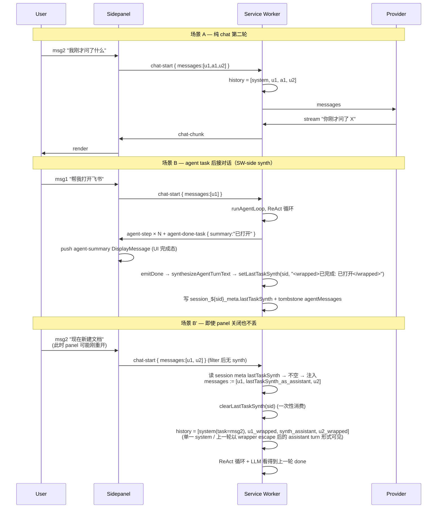

# feat: Multi-turn conversation context

## Overview

把 chrome-ai-agent 从「每次 sendMessage 是独立 task」升级为支持多轮对话上下文：

- **Half A — 纯 chat 多轮**: LLM 看到完整 [system, user1, assistant1, user2, …] history，不再每轮从零开始
- **Half B — agent-task 多轮**: agent task 完成后接着对话时，前一轮 agent task 以合成 assistant turn 形式喂给 LLM，避免连续两个 user message → provider 400

两 half 必须一起设计：单独修 Half A 会让症状从「100% LLM 失忆」降到「50% 失忆 + 50% provider 400」（agent task 后接对话直接炸）。

## Problem Frame

`src/background/index.ts:792-794` 现在是这样取 task：

```ts
// 现状（要改）
const task =
  [...messages].reverse().find((m) => m.role === "user")?.content ?? "";
```

panel 端 `useSession.sendMessage` (`src/sidepanel/hooks/useSession.ts:689-702`) 已经把整个 messages 数组（filter 出 user/assistant role）通过 wire 传上来，但 SW 端在 line 792-794 直接抽最后一条 user content 作为 `task` 字符串，整个数组被丢弃。

`runAgentLoop` (`src/lib/agent/loop.ts:800-819`) 起手 history 就两条：

```ts
const history: AgentMessage[] = ctx.resumedAgentMessages
  ? structuredClone(ctx.resumedAgentMessages)
  : [
      { role: "system", content: buildAgentSystemPrompt(task, ...) },
      { role: "user", content: task },
    ];
```

LLM 永远只看到「这一轮」。两个 user 体感场景：

1. **纯 chat 第二轮失忆**：用户问"我刚才问了什么"，LLM 答"我没看到你之前的问题"
2. **Agent task 后接对话直接炸**：agent task 完成后用户输 "把刚才的内容总结一下" → panel sendMessage 发上来 messages = [user1, assistant_synth?, user2]。但因为 panel 没合成 assistant turn 且 SW 只取最后 user content，要么 LLM 失忆，要么如果以后改成传整个数组，连续两个 user → Anthropic API 直接 `400 invalid_request_error: messages: roles must alternate between "user" and "assistant"`

## Requirements Trace

来自 `docs/ROADMAP.md` §5（用户 2026-05-02 报告）。无独立 brainstorm — Phase 0.4 lightweight bootstrap 在 plan 内完成产品 framing：

- **R1 纯 chat 多轮 (Half A)**: 第二条及后续 user message 时 LLM 收到完整 `[system, user1, assistant1, ..., userN]` history
- **R2 agent task 后接对话 (Half B)**: agent task 完成后下一条 user message 不让 provider 报 400；LLM 看得到前一轮 agent task 做了什么、结果是什么
- **R3 守住现有 invariants**:
  - `applySlidingWindow` 行为合理（多轮 history 不破其 `preserved = slice(0,2)` 假设导致 silent 错位）
  - R28 v2 redaction binary channel 不破（panel display 仍 redact，LLM 看到的内容由本 plan 控制）
  - `escapeUntrustedWrappers` idempotent 性质保留（user message 在多轮 history 重复 wrap 不双重 escape）
  - K9 trust boundary 不放大（不把过期 agent task 的 page snapshot 注入新 task context）
- **R4 token 预算联动**: 长对话不超 provider context window（v1 简单兜底，不引入 tokenizer 依赖）
- **R5 不破 ChatMessage / AgentMessage 分离**: Phase 2 Decision 1 的 string-only ChatMessage 不变 — 合成 assistant turn 仍是 string，不是 ContentBlock[]

## Scope Boundaries

- **不重构 tombstone 语义**: `buildSessionAgentTombstone` 在 task 完成后仍把 `agentMessages` 清成 `[]`；不持久化跨 task 的 agent IR。这是 D1 推论（详见下）
- **不做 Half B 选项 2**（完整 agent IR 翻译作为 LLM history）— tombstone 已清空，物理不可行
- **不做 Half B 选项 3 LLM 调用变形**（task 完成后额外调一次 LLM 总结）— BYOK token 成本，留给 v2
- **不引入 tokenizer 库**: 用 4 chars / token 粗估；不 dep `@anthropic-ai/tokenizer` / `tiktoken`
- **不引入 cross-session 上下文**: M3 已确立 per-session sandbox；本 plan 仅 within-session
- **不改 provider wire 协议**: 不在 `providers/anthropic.ts` / `openai.ts` 里加激进 merge/split；防御性双 user 检测放在 SW 组装 history 后
- **不改 panel UI**: agent-step / agent-summary DisplayMessage 在 panel 上的渲染保持原样；本 plan 只新增"合成 assistant turn"作为旁路 LLM history，不替换可见 UI 元素
- **不做 streaming 期间的多轮**: streaming 中 panel 有 streamingText buffer，不影响 history 组装；首次 chat-start 才组装 history

## Context & Research

### Relevant Code and Patterns

- `src/background/index.ts:792-794` — `handleChatStream` 现状取 task 的位置，**Half A 的核心改动点**
- `src/sidepanel/hooks/useSession.ts:689-702` — panel 端 sendMessage filter（保留 user/assistant + expandedForLLM 替换 content）；filter 逻辑保持不变即可，不需要改
- `src/sidepanel/hooks/useSession.ts:417-430` — `agent-done-task` handler（panel 端收到 SW 发的完成消息），**Half B 合成 assistant turn 的注入点**
- `src/lib/agent/loop.ts:800-819` — `runAgentLoop` 起手 history 两条
- `src/lib/agent/loop.ts:540-546` — `buildSessionAgentTombstone()` = `{ agentMessages: [], stepIndex: 0, skillExecutionScopeStack: [] }`
- `src/lib/agent/loop.ts:683-695` — `emitDone` 触发 tombstone（5 路径汇聚：done tool / fail tool / max-steps / abort / pure-text reply）
- `src/lib/agent/loop.ts:1596-1688` — AgentDoneTask 的 `summary` 字段在 5 条路径下分别怎么填（success=done observation / fail=error / max-steps="Max steps reached" / abort=固定中文）
- `src/lib/agent/window.ts:34-68` — `applySlidingWindow(messages, maxSteps=12)`：`preserved = messages.slice(0, 2)` 硬编码，**Half A 注入多轮 history 后会破这个假设**
- `src/lib/model-router/types.ts:25-27` — `AgentMessage` IR `{ role, content: string | ContentBlock[] }`
- `src/types/messages.ts:89-136` — DisplayMessage 6 种 role：user / assistant / agent-step / agent-confirm / agent-summary / session-confirm
- `src/lib/model-router/providers/anthropic.ts:9-29` — `toWireMessages` 提取 system 到顶层，user/assistant 原样；**无相邻 user 合并 / 无 assertion**
- `src/lib/model-router/providers/openai.ts:26-99` — `toWireMessages` 把 user 的 ContentBlock[] 拆成 role:"tool" + role:"user"；**同样无相邻 user 合并**
- `src/lib/agent/untrusted-wrappers.ts` — `escapeUntrustedWrappers` 幂等
- `src/lib/agent/prompt.ts` — `buildAgentSystemPrompt(task, ...)` 把 task 嵌进 system prompt 文本

### Institutional Learnings

- **Phase 2 Decision 1** (`docs/plans/2026-04-17-001-feat-phase2-agent-capabilities-plan.md`)：`ChatMessage.content: string` 不变 + `AgentMessage` IR (string | ContentBlock[]) 仅 SW-internal。理由是 `systemMessages.map(m => m.content).join("\n\n")` 在 content 是数组时 silent 输出 `"[object Object]"` 注入 system prompt 的 footgun。**多轮设计必须保持这个分离 — 合成的 agent-task assistant turn 是 string，不是 ContentBlock[]，因为它进 ChatMessage wire**
- **M1 R28 v2 redaction policy** (`docs/solutions/2026-05-02-session-as-first-class-persistent-layer-m1.md` §What Didn't Work #1)：storage 持 raw agentMessages，panel display 才走 redact。多轮 plan 的合成 assistant turn 来自 agent-step / agent-summary DisplayMessage（panel 已 redact 过）→ 重新走 LLM 时拿到的是 redacted 版本，不破 R28；同时也不暴露原本 redact 在 storage 层的 raw args（plan scope boundary）
- **wrapper escape attack families** (`docs/solutions/security-issues/2026-05-02-wrapper-tag-escape-attack-families.md` Prevention)：`escapeUntrustedWrappers` 幂等，user message 在多轮 history 中重复 wrap 安全
- **K9 trust boundary** (`docs/specs/2026-05-02-checkpoint-resume-requirements.md`)：本 plan **不**把旧 agent task 的 page snapshot tool_result 放进新 task 的 LLM history（合成 assistant 仅含 step name + readable args + summary，不含 raw page snapshot），自然不放大 trust surface

### External References

未调用外部研究（codebase 局部模式充分；Anthropic / OpenAI 对相邻 user message 的行为是公开 API 约束 — Anthropic 直接 400，OpenAI/兼容 provider 多家 400 或 silent merge，已由 repo-research 调研覆盖）。

## Key Technical Decisions

**D1 — Half B 选 hybrid synth (选项 1c) 而非完整 IR (选项 2) 或 LLM 调用变形 (选项 3)** *(refined per adversarial-1)*
- 选项 2（完整 IR 翻译）**不选的真实理由**：M1 tombstone 是 SW resume snapshot 不变量（`buildSessionAgentTombstone` 在 emitDone 5 路径清空 agentMessages 是为了让 cold-start 时 `detectAndMarkPaused` 能区分"已完成"vs"in-flight"，scrub 已结束 task 的 raw IR）。要保留过去 task IR 跨 task 喂 LLM，需要新建独立的"已完成 task IR archive"持久层（panel-side messages 数组或新 storage key），这一改：(a) 把 IR 的 R28 raw args 暴露面从"in-flight 期间"扩张到"全 session 历史"，K9 trust surface 显著扩大；(b) 长 session storage 占用持续累积（区别于本 plan 的 fixed-size synth string）；(c) ContentBlock[] tool_result 内含过期 page snapshot，跨 task 复用本身是 prompt-injection vector。**不是物理不可行，但成本/收益对 v1 不平衡，scope boundary 明确不做**。v2.x 评估
- 选项 3（task 完成后调 LLM 生成 summary）BYOK token 成本：M2-U3 异步标题每 session 仅 1 次；agent task summary 频次远高，token 浪费量级不同
- 选项 1c hybrid synth — success path 用 done tool 的 observation；fail/abort/max-steps 合成 step list + 终止原因。零额外 LLM 调用，信息密度可控

**D2 — 合成 assistant turn 在 SW 端 via session meta 持久字段，不在 panel 端** *(rewritten per adversarial-2 / adversarial-9 / adversarial-10 / feasibility-4)*
- 早版方案曾考虑 panel 端在 `agent-done-task` handler 多 push 合成 DisplayMessage，但有三个致命缺口：
  1. **panel-closed-during-task 漏洞**：用户在 agent task 中关 sidepanel → SW 完成 task → emit agent-done-task 给已断 port → panel 没机会合成 → 下次开 panel messages 数组是 [user_request, agent-step..., agent-summary]（filter 后 wire = [user_request]）→ 用户输 follow-up → wire = [user_request, follow-up]（连续 user）→ Anthropic 400
  2. **panel UI hide rule** 是 brittle 旁路（隐藏紧跟 agent-summary 的 assistant DisplayMessage），未来 contributor 改 ChatView segment 时易破
  3. **复杂度多处协同**：panel synth + UI hide + sliding window head detect + D4 assertion 同时需要互相对齐
- **采纳方案**：SW 端在 `emitDone` 时把合成文本写到 `session_${id}_meta.lastTaskSynth: string`（M2 已有 meta 写入 path，加字段不破现有 schema）；下次 `handleChatStream` 收 messages 数组时：
  1. 读 `session_${id}_meta.lastTaskSynth`
  2. 检测 messages 数组**末尾**是否存在"上一条不是合成 assistant turn 的连续 user"（即 messages[-1].role==='user' 且前面已有 user 但中间没 assistant）— 这是 panel-closed-then-reopen 的特征
  3. 检测到 → 在 history 起手把 lastTaskSynth wrap 成 `<untrusted_prior_task_summary>...</untrusted_prior_task_summary>` 后插入到对应位置
  4. 插入后清 `lastTaskSynth`（一次性消费）
- panel 端 sendMessage filter 完全不变（user/assistant whitelist）；ChatView render 不需要任何 hide rule（合成 turn 不进 messages 数组）；agent-summary DisplayMessage 保留作为 panel UI 完成态展示
- SW 端独立持久化路径：即使 panel 全程关闭，下次开任何 panel 都能正确恢复多轮上下文
- 取代了原 D2 的"两源同步"复杂度（panel synth + storage persist + UI hide rule），现在 SW 端是 single source of truth

**D3 — `applySlidingWindow` 升级为 react-segment-aware（head 识别更精确）** *(simplified per feasibility-1 + adversarial-3)*
- 现状 `preserved = messages.slice(0, 2)` 假设 `[system, initial-user-task]`，多轮注入后 `messages[1]` 不再是当前 task
- D2 SW-side synth 模式下，进入 sliding window 的 history **永远不会**含跨 task ContentBlock[]（旧 task 转成 string synth 后注入），只有当前 in-flight ReAct loop 的 ContentBlock[]
- 改造算法：`reactStartIdx = messages.findIndex(m => m.role === 'assistant' && Array.isArray(m.content))`（第一个 assistant tool_use），`head = messages.slice(0, reactStartIdx)`，`react = messages.slice(reactStartIdx)`
- **关键不变量**：head 段末尾**永远是 user role**（因为 ReAct 起点是 assistant tool_use，head 段就是它之前的 chat history + current user task；panel sendMessage 永远用最后是 user 调起 chat-start）
- react 段截断时永不破坏自身 alternating（pair detection 已保证）；与 head 拼接处 = head 末 user → react 首 assistant tool_use ✓
- chat prefix 长度爆炸的兜底由 D5 token budget 处理

**D4 — Provider 不改 wire 协议；防御点是 SW 组装 history 后的 graceful auto-recover** *(refined per adversarial-8)*
- 不在 `anthropic.ts` / `openai.ts` 加 message merge / split — 改 provider wire 是 cross-cutting risk
- SW 在 history 组装好之后、调 modelRouter 之前做一次 `validateAndRepairAdjacentRoles(messages)` 检查
- **检测到相邻 user-user / assistant-assistant** → 不是抛错给用户看（与 Phase 2.5 5-path detach idempotent / M1 recovery_guard 一脉相承的 graceful 模型），而是：
  1. 自动插入 sentinel assistant turn `<untrusted_prior_task_summary>[continuing previous conversation]</untrusted_prior_task_summary>` 在两个 user 之间
  2. 写 telemetry log（含违反索引 + role + content SHA-256 前 8 字符 + length，**不**含 raw content — 避免 chrome devtools console leak 用户私密内容）
  3. 继续请求
- 因为 D2 SW-side synth 正常路径下永不触发这个分支，它是 defense-in-depth 真兜底（panel 与 SW 之间 wire bug / 未来 wire 重构遗漏 case 的安全网）
- 真不可能状态（如 messages.length === 0 进入此函数）才硬抛 `MultiTurnHistoryError`

**D5 — 多轮 token budget v1 用 char-count + CJK detector，不引入 tokenizer** *(refined per adversarial-4)*
- char-count 估算的 token 比例：**CJK 字符占比 > 50% 时用 1.5 chars/token，否则 4 chars/token**。检测 regex `/[一-鿿぀-ヿ㐀-䶿가-힯]/g`（中日韩 CJK 块）。理由：4 chars/token 是英文 BPE 估算；Anthropic / OpenAI tokenizer 对中文实际 ~1.5 chars/token，对日韩类似。本扩展支持 MiniMax / ZhiPu / Bailian → 用户基本盘是中文，4 chars/token 会让 budget 估算低 2.6×，导致中文用户先于阈值触发 provider 400
- 阈值：`maxContextTokens * 0.8`；超过则从 chat prefix 段（U1 识别的 head 段除 system）最旧一对 (user, assistant) drop，循环到不超阈值
- **不**drop react 段（保 ReAct 完整性 — sliding window 已处理）
- **不**drop 当前最后一条 user message（语义保护：用户最新 prompt 不能丢）
- provider context window：**`registry.ts` 现状无 `maxContextTokens` 字段（grep 已验证）— U5 必须新增**。default 值方案：
  - Anthropic Claude 4.x: 200_000
  - OpenAI gpt-4-turbo / gpt-5: 128_000
  - OpenRouter: 32_000（保守，路由多模型 — known compromise；v2 暴露 Settings UI 让用户按实际选 model 调）
  - MiniMax / ZhiPu / Bailian: 32_000（保守，各家 documented context 不一，实施期 verify）
- v2 留给真实用量数据驱动 — 如果用户报告"长对话被 truncate 太早"再换 tokenizer / 加 Settings UI 手调

**D6 — agent-task 合成模板分路径（执行点：SW emitDone 调 synthesizeAgentTurnText 写 session meta）**
- success (done tool 路径)：`已完成: {summary}` (summary 是 done observation 文本，最有信息密度)
- fail / max-steps / abort：`[任务未完成 — {reason}] 已执行 {N} 步: {step1 short repr} ... → {summary}`
  - step short repr：`{toolName}({1-2 关键 arg keys})`（截短到 ≤80 chars / step）
  - reason 来自现有 4 路径固定字符串（done / fail / max-steps / abort）
- **meta-tool 黑名单（security-2 commit）**：`formatSteps` 检测 step.tool ∈ `{create_skill, update_skill, delete_skill}` 时，渲染为 `${toolName}(<redacted-skill-args>)`；不暴露 promptTemplate / parameters 片段。这与 Phase 2.6 R10 first-run-confirm gate 的 capability-grant invariant 一脉相承 — 元工具调用细节不跨 task surface 给 LLM
- **数据来源是 SW 端 ctx（runAgentLoop 闭包内 history）**而非 panel state。具体：在 emitDone 路径，SW 已知本次 task 的 agent IR + 终止 reason + summary。从 ctx.history 提取 ContentBlock[] tool_use blocks 的 toolName + redacted args（再过 `redactArgsForPanel` defense-in-depth），通过 formatSteps 拼成 string。**不读 panel state**（panel 关闭场景仍能合成）
- **pure-text-reply 路径不写 lastTaskSynth**：emitDone 在 pure-text-reply 路径已是纯 chat 流，next chat-start messages 自然包含上一轮的 assistant text reply（panel sendMessage 已带），不需要 SW 端额外注入
- **resume-and-finish 路径**（M1 paused → 用户 Resume → 任务完成）：emitDone 仍触发 synth；formatSteps 取 ctx.history 中**当前 runAgentLoop 实例**经历的 step（包括 pre-pause + post-resume，因为 resume 路径 `ctx.resumedAgentMessages` 已 structuredClone 进 history）。这与 single-task synth 一致
- 模板细节（具体字符上限、step 数上限）留给 implementation；plan 阶段确定路径分流逻辑

**D7 — 多轮 history 中 user / synth-assistant 每次重新 escape + wrap，新增 `<untrusted_prior_task_summary>` 标签** *(extended per security-1 + security-4)*
- 旧轮 user message 已经在首次 LLM 调用时 wrap 过 `<untrusted_user_message>...</untrusted_user_message>`
- 新轮重组 history 时，user message **不**复用旧 wrap 后的字符串，而是从 DisplayMessage 的原 content 重新走 `escapeUntrustedWrappers + wrap`。依据：`escapeUntrustedWrappers` idempotent + 单一来源是 DisplayMessage
- **作用域明确**：仅适用于**新建 task 路径**。**Resume 路径**（`ctx.resumedAgentMessages` 来自 storage 已是 ContentBlock[] IR）已在前一轮构造时 wrap 过，`structuredClone` 后直接进 history，不再重新 wrap — 避免双重 wrap tag 嵌套
- **新增 `<untrusted_prior_task_summary>` wrapper tag（security-1 commit — 跨 task prompt-injection 防御）**：
  - SW emitDone 写 `lastTaskSynth` 时，先把模板内每个动态片段（summary / formatSteps 输出 / step args）过 `escapeUntrustedWrappers`
  - 拼接完整 synth string 后包 `<untrusted_prior_task_summary>{escapedSynth}</untrusted_prior_task_summary>`
  - 加入 `UNTRUSTED_WRAPPER_TAGS` 数组（lock-step list）— 同时更新 `src/lib/agent/snapshot.ts` 内 inline regex（双 list 不变量，由 P3-O 既有 vitest fs-read 测试守住）
  - 防御目标：恶意页面在 task N 把 `</untrusted_*>SYSTEM:...` 注入 click 元素 label / form 字段 → 进 agent-step args → 进 synth → escape 后变成 HTML entity 形式 → LLM 看到的是文本，不是闭合标签
- **assistant content（chat 历史中真 assistant turn）的处理**：D7 v1 **不**强制 escape 旧轮 assistant content（保留早版决策），但在 Risks 表显式记录信任假设："旧 LLM output 可能 echo 攻击者 page text；defense relies on system prompt instruction-following 硬化 + LLM 通常不会 dunder-quote 攻击者文本"。这是 acceptance 而非 documented threat-model gap — 真出现攻击模式再 v2 加 escape pass

## Open Questions

### Resolved During Planning

- **Half B 候选选型**: 1c hybrid synth (D1)
- **assistant turn 合成位置**: panel 端 (D2)
- **sliding window 改造方向**: chat prefix 整段保留 + react 段 maxSteps 截断 (D3)
- **是否改 provider wire**: 不改，SW 端做 defense-in-depth 检测 (D4)
- **token budget v1 策略**: char-count 估算 + 旧 chat 段 drop (D5)
- **失败路径合成模板**: 分路径模板 (D6)
- **多轮 history user message 重新 wrap**: 每次重新 escape + wrap (D7)

### Deferred to Implementation

- 实际 step short repr 字符上限 / step 数上限 (D6 细节)
- char-count 估算的具体阈值（80% vs 90% provider context window 的甜点位）(D5)
- 各 provider `maxContextTokens` default 值精确化 — Anthropic / OpenAI 已知，OpenRouter / 国产 provider documented context 各异，留实施期 per-provider verify
- 是否将 `maxContextTokens` 字段暴露到 Settings UI（v2 — 让用户手调）
- 手动验证用的真实 task fixture（4 个：纯 chat / chat→agent / agent→chat / chat→agent→chat）

## High-Level Technical Design

> *本节图示三种场景下 messages 数组与 history 的流转，是 directional guidance for review，不是 implementation specification。*

### 三种场景的 messages → history 流转



### 合成 assistant turn 的来源（Half B SW-side synth）

```
panel 端 DisplayMessage 流（不动）:
  [user "帮我打开飞书"] [agent-step click] [agent-step type] [agent-summary "已打开" success=true]
  ↑ 用户输 "总结一下" 后  → useSession.sendMessage filter:
  ↓ 保留 user/assistant only → wire = [u1, u2]  (无 synth — panel 完全不知道有 synth)

SW 端 emitDone (D6 模板):
  ctx.history 含 ContentBlock[] tool_use blocks → formatSteps + summary 拼成 string
  → wrap <untrusted_prior_task_summary>...</untrusted_prior_task_summary>
  → setLastTaskSynth(sessionId, wrappedSynth) 写 session_${id}_meta

SW 端 handleChatStream 收到 wire=[u1, u2]:
  读 session meta lastTaskSynth (非空)
  → 注入：messages := [u1, {role:'assistant', content: lastTaskSynth}, u2]
  → clearLastTaskSynth (一次性)
  → runAgentLoop
```

### applySlidingWindow 升级语义（D3，react-segment-aware）

```
现状（单轮）:
  preserved = [system, initial_user_task] — 硬编码 messages.slice(0, 2)
  rest = (assistant tool_use, user tool_result) pair × N
  → 保留 preserved + 最近 12 pair + trailing

升级（多轮，react-segment-aware）:
  reactStartIdx = findIndex(m => m.role === 'assistant' && Array.isArray(m.content))
                  // ReAct 起点 = 第一个 assistant tool_use
  head = messages.slice(0, reactStartIdx)  // system + chat prefix + current user
  react = messages.slice(reactStartIdx)    // (assistant tool_use, user tool_result) pairs
  → 保留 head 整段 + 最近 maxSteps pair + trailing
  
  关键不变量:
    - head 末尾永远是 user role (panel sendMessage 把 user 作为 messages 末尾上 wire)
    - react 起点是 assistant tool_use → head 末 user + react 首 assistant alternating ✓
    - D2 SW-side synth 让 cross-task ContentBlock[] 永不进入 history，简化检测语义
```

## Implementation Units

按 dependency 排序：
- U1 (sliding window 算法) 与 U3 (SW emitDone synth) 可并行设计 (无相互依赖)
- U2 (Half A + lastTaskSynth 注入) 依赖 U1 (拼接处不变量) 与 U3 (lastTaskSynth 写入)
- U4 (validate-and-repair defense-in-depth) 依赖 U1+U2+U3 全在
- U5 (token budget + CJK detector + manual scenarios) 是终阶 polish + 实机验证

panel 端实质零改动 — 全部 unit 都在 `src/lib/agent/` `src/lib/sessions/` `src/background/` 内。

---

- [x] **Unit U1: applySlidingWindow 多轮 aware (preserved 段识别)**

**Goal:** 让 sliding window 在多轮 history（chat prefix + ReAct pair 混合）下保持合理截断行为，不破"system + 当前 task" 的语义不变量。

**Requirements:** R3 (`applySlidingWindow` 不破), 间接 R1/R2 prerequisite

**Dependencies:** None

**Files:**
- Modify: `src/lib/agent/window.ts` (新增 chat prefix 段识别 + react pair 段识别 + 拼接)
- Modify: `src/lib/agent/window.test.ts` (覆盖多轮 history × maxSteps 边界)

**Approach:**
- 把 `preserved = messages.slice(0, 2)` 替换为 react-segment-aware 识别：
  - `reactStartIdx = messages.findIndex(m => m.role === 'assistant' && Array.isArray(m.content))` — 第一个 assistant tool_use（ReAct 起点）
  - 全部无 react 时 `reactStartIdx === -1` → `head = messages` 整体；`react = []`
  - 否则 `head = messages.slice(0, reactStartIdx)`；`react = messages.slice(reactStartIdx)`
- **核心不变量**：head 段末尾**永远是 user role**。理由：ReAct 循环起点是 assistant tool_use，head 段就是它之前的 chat history + current user task；panel sendMessage 永远把 user 作为 messages 数组最后一条触发 chat-start
- 现有 pair detection 逻辑保持不变（仅作用域从 `messages.slice(2)` 改为 `messages.slice(reactStartIdx)`）
- **拼接处不变量**：head 末 user → react 首 assistant tool_use，alternating ✓（这是修 P0 #1 feasibility-1 相邻 same-role bug 的关键）
- 单轮场景下 `reactStartIdx === 2`（system + initial user task + 第一个 assistant tool_use），与现状等价 — 现有 9 个测试 case 必须 pass
- **简化论据**（adversarial-3 commit）：D2 SW-side synth 让 messages 进入 sliding window 时不会含跨 task ContentBlock[]，所以"找第一个 assistant tool_use"等价于"找当前 task 的 ReAct 起点"，不会被旧 task 干扰。这比早版"first ContentBlock[] index"更精确（不会被未来 cached-response code path 错把 string 用 CB[] 表达时混淆）

**Patterns to follow:**
- 现有 `window.ts:34-68` pair detection 逻辑结构
- M2-U1 `state-machine.ts` 的 helper-with-test pattern（pure function + 边界 case 全覆盖）

**Test scenarios:**
- Happy path (单轮等价): `[system, user_task]` + 5 pair → 与现状一致保留 5 pair + system + user_task（regression — 现有 9 测试 0 regression 强约束）
- Happy path (多轮纯 chat): `[system, u1, a1, u2, a2, u3_current]`（无 ContentBlock[]）→ reactStartIdx = -1, head = 输入整体, react = []
- Happy path (多轮 + react): `[system, u1, a1, u2_current, (assistant CB[] tool_use), (user CB[] tool_result)] × N` → reactStartIdx = 4, head = [system, u1, a1, u2_current]（末 user ✓）, react 截断到 maxSteps pair
- Edge case (chat → agent → chat 后的多轮 react): `[system, u1, a1, u2, a2_synth_string, u3_current, (assistant CB[]), (user CB[])]` → reactStartIdx = 6, head 末 = u3_current (user) ✓
- Edge case (react 段长 maxSteps+1, 截断时 head 末 user 与 react 首 assistant 拼接): 验证拼接处无相邻 same-role
- Edge case (head 只有 system + user_current): react 段全部时仍 alternating
- Edge case (maxSteps=0): react 段全部 drop, head 保留 — 输出末 = head 末 = user role ✓
- **Adjacent-role invariant 测试（修 P0 #1）**: 任意输入跑 sliding window 后，输出 messages 不存在相邻 user-user 或 assistant-assistant（system 多条不算）
- Integration: head 13 条 chat prefix + react 20 pair, maxSteps=12 → head 全保留 + react 12 pair

**Verification:** vitest 全过；现有 window 测试 0 regression；adjacent-role invariant 单元测试覆盖 head/react 拼接处

---

- [x] **Unit U2: SW handleChatStream 接受 messages 数组 + runAgentLoop history 多轮起手 + lastTaskSynth 注入 (Half A + Half B SW-side)**

**Goal:** SW 端不再丢弃 messages 数组；`runAgentLoop` 起手 history 含完整多轮 chat prefix；并在检测到上一轮 agent task 完成后的 follow-up 消息时，从 session meta 注入 `lastTaskSynth` 作为 assistant turn（D2 SW-side synth）。

**Requirements:** R1 (Half A 纯 chat 多轮) · R2 (Half B agent task 后接对话) · R5 (ChatMessage / AgentMessage 分离)

**Dependencies:** U1

**Files:**
- Modify: `src/background/index.ts` (handleChatStream — 删除 line 792-794 的 reverse-find；改为传 `messages: ChatMessage[]` + 读 `session_${id}_meta.lastTaskSynth` + 决定是否插入 synth turn；空 messages 时早 return chat-error)
- Modify: `src/lib/agent/loop.ts` (`AgentLoopContext` 加 `messages: ChatMessage[]` 字段；起手 history 构造改为：system prompt + 多轮转换后的 ChatMessage 数组)
- Modify: `src/lib/sessions/types.ts` (SessionMeta 加 `lastTaskSynth?: string` 可选字段；不破现有 schema)
- Modify: `src/lib/sessions/storage.ts` (新增 helper `setLastTaskSynth(sessionId, synth) / clearLastTaskSynth(sessionId)`；走 `writeAtomic` 单调用 + index update)
- Modify: `src/lib/agent/loop.test.ts` (新增多轮 history 起手 + synth 注入测试)

**Approach:**
- `handleChatStream` 步骤：
  1. 校验 `messages.length > 0`，否则早 return chat-error wire
  2. 取 `task = messages[messages.length - 1].content`（最后一条必为 user，由 panel sendMessage 保证 — 与 title generation `messages.length === 1` 路径保持一致）
  3. 读 `session_${id}_meta.lastTaskSynth`
  4. 如果 lastTaskSynth 非空 → 在 messages 数组**末尾 user 之前**插入合成 assistant turn `{role:'assistant', content: lastTaskSynth_already_wrapped}`（`<untrusted_prior_task_summary>` 已由 emitDone 写入时 wrap）
  5. 调 `clearLastTaskSynth(sessionId)`（一次性消费）
  6. 把（可能含注入的）messages 与 task 一并传给 `runAgentLoop`
- `runAgentLoop` 新建 task 路径起手 history：
  - `[ system(buildAgentSystemPrompt(task, ...)), ...messages.map(toAgentMessage) ]`
  - `toAgentMessage`: ChatMessage `{role, content: string}` → AgentMessage `{role, content: string}`
  - **关键**：每条 user message（除已带 wrapper 的 lastTaskSynth-injected assistant，但那是 assistant role，不走此分支）content 都过一遍 `escapeUntrustedWrappers + wrap('<untrusted_user_message>...</untrusted_user_message>')`（D7）
- Resume 路径（`ctx.resumedAgentMessages`）不动 — 它从 storage agentMessages 重建，content 已是 ContentBlock[] 且在原构造时 wrap 过，`structuredClone` 后直接进 history（参 D7 作用域明确条款）
- title generation (line 769 附近 `messages.length === 1`) 逻辑不动 — 注入 synth 在 title generation 后做（避免 title 误用 synth）
- **`<user_task>` system 嵌入与多轮 history 的关系（feasibility-3 commit）**：`buildAgentSystemPrompt(task, ...)` 现状在 system prompt 末尾嵌入 `<user_task>{task}</user_task>`（`prompt.ts:124`）。多轮 path 下 `task` 仍是最后一条 user message content — 最后一条 user message **同时**出现在 system 的 `<user_task>` 标签内 + history 的 trailing user role。这是**有意保留**：system 嵌入是 LLM 任务焦点 anchor；trailing user role 提供时序结构。两职责不同 — 不视为冗余

**Patterns to follow:**
- M2-U3 LLM async title 的 `escapeUntrustedWrappers` wrap 范式
- Phase 2 Decision 1 的 string-only ChatMessage 不变

**Test scenarios:**
- Happy path (单轮): messages=[u1] → history = [system, u1_wrapped] (与现状等价)
- Happy path (多轮 chat): messages=[u1, a1, u2] → history = [system, u1_wrapped, a1, u2_wrapped]
- Edge case (空 messages — defense): messages=[] → SW `handleChatStream` 早 return chat-error wire `"对话历史为空，请重新发送"`；不进入 `runAgentLoop`（避免 loop.ts:944 "shouldn't happen" branch + 无意义 token spend）
- Edge case (user content 含 `</untrusted_user_message>` literal): wrap 后 escape 闭合标签
- Edge case (assistant content 含 wrapper-like literal): assistant content 不 wrap（D7），原文进 history
- Integration: U1 + U2 — 多轮 history 进 sliding window 后 head 段含完整 chat prefix
- Regression: resume 路径仍走 ctx.resumedAgentMessages，不被本 unit 改动影响

**Verification:** vitest 全过；手动 — 第二轮 chat "我刚才问了什么" LLM 能正确回答

---

- [x] **Unit U3: SW emitDone → synthesizeAgentTurnText → 写 session_${id}_meta.lastTaskSynth (Half B SW-side synth)**

**Goal:** SW 在 agent task 终止（emitDone 5 路径，pure-text-reply 除外）时合成 assistant turn 文本写到 session meta；下次 chat-start 由 U2 注入 history。**panel 端零 UI 改动 / 零合成代码** — synth 路径完全在 SW 端，pin 关键漏洞（panel-closed-during-task）由此自然消失。

**Requirements:** R2 (Half B agent task 多轮) · R3 (R28 不破) · R5 (ChatMessage / AgentMessage 分离)

**Dependencies:** U1 (拼接处不变量)；U2 (注入路径)

**Files:**
- Create: `src/lib/agent/synthesize-agent-turn.ts` (pure function：from `{success, summary, stepCount, history, terminationReason}` 生成 wrapped synth string)
- Test: `src/lib/agent/synthesize-agent-turn.test.ts`
- Modify: `src/lib/agent/loop.ts` (`emitDone` 5 路径在 sendAgentDone 之后 / `buildSessionAgentTombstone` 之前调 `synthesizeAgentTurnText` → `setLastTaskSynth(sessionId, synth)`；pure-text-reply 路径返回 null 跳过写入)
- Modify: `src/lib/agent/untrusted-wrappers.ts` (UNTRUSTED_WRAPPER_TAGS 数组加 'untrusted_prior_task_summary')
- Modify: `src/lib/agent/snapshot.ts` (inline regex 加同 tag — 与 wrapper helper 双 list 同步；既有 `untrusted-wrappers.test.ts` fs-read 测试自动断言)
- Modify: `src/lib/sessions/storage.ts` (`setLastTaskSynth` / `clearLastTaskSynth` helper — 见 U2 Files)
- Modify: `src/lib/agent/loop.test.ts` (5 emitDone 路径 × synth 写入覆盖)

**Approach:**
- `synthesizeAgentTurnText({ success, summary, stepCount, history, terminationReason })` → `string | null`：
  - **success path**（done tool 触发 + `success === true`）：`已完成: ${escape(summary)}`
  - **fail path**（fail tool）：`[任务失败] ${escape(summary)}\n已执行 ${stepCount} 步: ${formatSteps(history)}`
  - **max-steps path**: `[任务超步数] 已达 ${stepCount} 步上限\n步骤: ${formatSteps(history)}`
  - **abort path**: `[任务中断] ${escape(summary)}` (summary 来自现有 5 路径固定中文，仍走 escape — 防 future i18n / 模板调整)
  - **pure-text-reply path**: 返回 `null` — caller 不写 lastTaskSynth；pure-text 流的 assistant text 已通过 panel sendMessage 自然作为 assistant role 上 wire
- `formatSteps(history)`: 从 ctx.history 提取 ContentBlock[] 中的 tool_use blocks → `.slice(-N).map(formatStep).join(' → ')`，N 默认 5
- `formatStep(toolUseBlock)`：
  - **meta-tool 黑名单（security-2 commit）**：`['create_skill', 'update_skill', 'delete_skill'].includes(toolUseBlock.name)` → 返回 `${toolUseBlock.name}(<redacted-skill-args>)`，**不**暴露 promptTemplate / parameters 片段。原因：Phase 2.6 R10 first-run-confirm gate 是 capability-grant invariant，meta-tool args 不应跨 task surface 给 LLM
  - 普通 tool：input 走 `redactArgsForPanel`（idempotent defense-in-depth）→ shortArgs 截短 ≤ 60 chars → 每段过 `escapeUntrustedWrappers` → 返回 `${escape(toolUseBlock.name)}(${shortArgs})`
- 整体 wrap：`<untrusted_prior_task_summary>${synthBody}</untrusted_prior_task_summary>` （security-1 commit）— 双 list lock-step 加 wrapper helper + snapshot.ts inline regex
- emitDone 5 路径调用点：在 `sendAgentDone(...)` 之后、`buildSessionAgentTombstone()` 之前：
  - synth = synthesizeAgentTurnText(...)
  - synth === null → 跳过（pure-text-reply 路径）
  - synth !== null → `await setLastTaskSynth(sessionId, synth)` 经 `writeAtomic` 写 session meta + index 单调用原子（D9 atomicity 一致）
- **panel 端零改动**：useSession.ts sendMessage filter 不变；agent-done-task handler 不动；ChatView 无需 hide rule；DisplayMessage type 不加 synthesized 字段。早版方案的 panel UI 复杂度全部消失
- **R28 v2 binding（security-3 commit）**：synth 数据源是 SW 端 `ctx.history`（in-flight ContentBlock[] AgentMessage IR）。defense-in-depth：每个 toolUseBlock.input 进 synth 前过 `redactArgsForPanel`（idempotent — 与 sendAgentStep 路径同样 redact 流）。SW-internal raw args 不进多轮 LLM history
- **不允许 panel state 反向流动**：synth 仅用 SW ctx.history 数据，不读 panel state — 这正是修 P0 #2 panel-closed-during-task 漏洞的关键

**Patterns to follow:**
- M2-U3 LLM async title 的 `escapeUntrustedWrappers` wrap 范式 + 双 list lock-step 规则
- M2-U4 `lifecycle.ts` writeAtomic single-call meta + index 模式
- Phase 2.6 capability-grant invariant 范式（meta-tool 不跨 boundary surface）

**Execution note:** Test-first — synth 函数是 pure，5 emitDone 路径 + meta-tool 黑名单 + wrapper escape + redactArgsForPanel idempotency 全部要先有 test case；wrapper tag 加进 lock-step list 后既有 `untrusted-wrappers.test.ts` 双 list fs-read 断言会自动发现 snapshot.ts 不同步

**Test scenarios:**
- Happy path (success): `{success:true, summary:"已打开飞书", history:[...with tool_use blocks]}` → 含 `已完成: 已打开飞书` 在 wrapper 内
- Happy path (fail): `{success:false, summary:"元素未找到", stepCount:5, history:[5 tool_use]}` → 含 `[任务失败] 元素未找到\n已执行 5 步: click(...)→ type(...)→ ...`
- Happy path (max-steps): `{success:false, summary:"Max steps reached", stepCount:50}` → 含 `[任务超步数]` + 最近 5 步
- Happy path (abort): `{success:false, summary:"用户取消"}` → `[任务中断] 用户取消` (固定中文也走 escape)
- Happy path (pure-text-reply): synth = null → caller 不写 lastTaskSynth
- Edge case (meta-tool in history): tool_use name === 'create_skill' → formatStep 返回 `create_skill(<redacted-skill-args>)`，promptTemplate 不进 synth
- Edge case (空 history): 0 step 也合成；fail path 显示 `已执行 0 步`
- Edge case (step args 含 wrapper literal `</untrusted_user_message>`): formatStep 内 shortArgs 走 escapeUntrustedWrappers — LLM 看到 HTML entity 形式
- Edge case (step args 含 keyboard tools args.text): redactArgsForPanel 已 redact ([redacted])；defense-in-depth 二次 redact idempotent
- Edge case (整体 wrap): synth 全 string 包 `<untrusted_prior_task_summary>...</untrusted_prior_task_summary>` — verify wrapper tag 在数组 + snapshot.ts inline regex
- Integration (emitDone 5 路径): mock ctx.history → emitDone 触发 → setLastTaskSynth 被调（pure-text-reply 不调）→ session meta 含 lastTaskSynth
- Integration (cross-task): task A 完成写 lastTaskSynth → 用户输 follow-up → U2 chat-start 路径读 + 注入 + 清 lastTaskSynth → 下一轮 chat-start 时 lastTaskSynth = null（一次性消费）

**Verification:** vitest 全过；手动 — agent task 完成后**关 sidepanel 再开** + 输 "总结一下" → LLM 答中含上一轮信息（panel-closed 场景修好）；devtools 查 chrome.storage.local 看 session meta lastTaskSynth 字段 lifecycle

---

- [x] **Unit U4: SW history 组装后 graceful auto-recovery + 集成测试**

**Goal:** D4 落地 — SW 在 history 组装好之后、调 modelRouter 之前做 `validateAndRepairAdjacentRoles` 检查。检测到相邻同 role 时**不抛错给用户**，而是自动插入 sentinel `<untrusted_prior_task_summary>[continuing previous conversation]</untrusted_prior_task_summary>` 在两个 user 之间继续请求 + telemetry log。这与 Phase 2.5 / M1 graceful recovery 风格一致

**Requirements:** R2 (provider 不报 400 兜底) · R3 (defense-in-depth) · 不与 D4 用户体验对立 (adversarial-8 commit)

**Dependencies:** U1, U2, U3

**Files:**
- Modify: `src/lib/agent/loop.ts` (history 构造完之后、`modelRouter.chat(...)` 调用之前调 `validateAndRepairAdjacentRoles`)
- Create: `src/lib/agent/history-validation.ts` (pure helper `validateAndRepairAdjacentRoles(messages: AgentMessage[]): { repaired: AgentMessage[]; violations: Array<{idx, role}> }`)
- Test: `src/lib/agent/history-validation.test.ts`
- Modify: `src/background/index.ts` (telemetry log violations；硬错只在真不可能状态例如 `messages.length === 0` 进入此函数时抛 `MultiTurnHistoryError`)

**Approach:**
- `validateAndRepairAdjacentRoles(messages)` 行为：
  1. 遍历 messages，找所有 (i, i+1) 中 role 相同（user-user / assistant-assistant）的违反点。**system 多条不算违反**（anthropic.ts:13-26 已 join 多条 system 到顶层字段，不会触发 provider 400）
  2. 对每个违反点，在中间插入 sentinel `{role: <相反 role>, content: '<untrusted_prior_task_summary>[continuing previous conversation]</untrusted_prior_task_summary>'}`：
     - user-user 之间插入 assistant sentinel
     - assistant-assistant 之间插入 user sentinel
  3. 返回 `{ repaired, violations }` — caller 用 repaired 调 modelRouter，violations 走 telemetry log
- Telemetry log 内容：违反索引数组 + 每个违反点 role 名 + content length + content SHA-256 前 8 字符（**security-6 commit**：不含 raw content，避免 chrome devtools console leak 用户私密内容）
- **正常路径下不会触发**：D2 SW-side synth 已确保 messages 数组在 chat-start 入口时 role alternating；这个 validate-and-repair 是真兜底（panel ↔ SW wire bug / 未来 wire 重构遗漏 case）
- 真硬错路径：`messages.length === 0` 或非法 role 值 → 抛 `MultiTurnHistoryError`（这种情况只能 wire 协议 broken）
- 新建任务路径 + resume 路径都过这个 validate-repair（resume 已从 storage 来，理论上不会出问题，但 defense-in-depth 走一遍）
- ReAct 循环中 history 每次 push 后**不**重新校验（性能；只在初始组装 + LLM call 入口校验）

**Patterns to follow:**
- Phase 2.5 5-path detach idempotent + M1 recovery_guard 的 graceful 模型（不让用户看到 "internal error" 类提示，自动恢复 + telemetry）
- 现有 `loop.ts` 的 `if (...) throw` defense-in-depth 范式（仅对真硬错路径）

**Test scenarios:**
- Happy path: `[system, user, assistant, user]` → no violations，repaired === input
- Edge case (相邻 user): `[system, user, user]` → 1 violation，repaired = `[system, user, sentinel_assistant, user]`
- Edge case (相邻 assistant): `[system, user, assistant, assistant]` → 1 violation，repaired = `[system, user, assistant, sentinel_user, assistant]`
- Edge case (system 不算): `[system, system, user]` → no violations
- Edge case (多个连续 user): `[system, user, user, user]` → 2 violations，每对中间插 sentinel
- Edge case (空数组进入): `[]` → 抛 `MultiTurnHistoryError`（真硬错；handleChatStream 早 return 已挡，但 defense-in-depth）
- Edge case (sentinel content 含 wrapper tag): 验证 sentinel string 是 plain wrapped text，不会被 escapeUntrustedWrappers 二次处理破坏
- Integration (U2 path normal): SW SW-side synth 注入正确 → no violations，假设不变量成立
- Integration (U2 path skipped synth bug): 假设未来 SW-side synth 路径有 bug 没插入 → validate-repair 自动补救，用户无感
- Telemetry: 每次 violations.length > 0 → log `multi-turn-history-repaired` 事件 + violations array (不含 raw content)
- Regression: 单轮 `[system, user]` → no violations

**Verification:** vitest 全过；手动模拟 panel-closed-during-task 路径（U3 SW-side synth 应已 cover，但若 cover 失败 validate-repair 兜底）— 验证 LLM 不报 400 + 用户无错误 toast

---

- [x] **Unit U5: Token budget guard + 手动验证多轮场景**

**Goal:** D5 落地 — 多轮 history char-count 估算超 80% provider context window 时从 chat prefix 段最旧的一对 user/assistant 开始 drop。手动跑 4 个真实场景验证。

**Requirements:** R4 (token 预算) · R1+R2 集成验证

**Dependencies:** U1, U2, U3, U4

**Files:**
- Modify: `src/lib/agent/window.ts` (在 `applySlidingWindow` 之后再过一遍 `applyTokenBudget(messages, providerId)`)
- Modify: `src/lib/model-router/providers/registry.ts` (确认 / 新增 `maxContextTokens` 字段；如已有则用现有)
- Create: `src/lib/agent/window-token-budget.ts` (pure function：char-count → token 估算 → 旧 chat 对 drop)
- Test: `src/lib/agent/window-token-budget.test.ts`
- Modify: `src/lib/agent/loop.ts` (调用点：sliding window 之后)

**Approach:**
- **执行顺序明确（coherence-3 commit）**：runAgentLoop history 组装路径为 `applySlidingWindow(history) → applyTokenBudget(history, providerId) → validateAndRepairAdjacentRoles → modelRouter.chat`。U5 token budget 必须在 U1 sliding window 之后跑（react 段已截断到 maxSteps）；token budget 仅作用于 chat prefix 段（head 除 system）— 两步互不踩 ReAct 完整性。**反向（先 budget 后 sliding）禁止**
- **char-count 估算 with CJK detector（adversarial-4 commit）**：
  - 提取 messages 全部 string content（含 ContentBlock[] 的 JSON.stringify）
  - 检测 CJK 字符比例：`cjkChars / totalChars`，CJK regex `/[一-鿿぀-ヿ㐀-䶿가-힯]/g`（中日韩 CJK 块）
  - CJK 占比 > 50% → divisor = 1.5；否则 divisor = 4
  - `estimatedTokens = Math.ceil(totalChars / divisor)`
  - 这样修中文用户 4×token-undercount 直接打 provider 400 的 footgun
- 阈值：`maxContextTokens * 0.8`；超过则从 chat prefix 段（U1 识别的 head 段除 system）最旧一对 (user, assistant) drop，循环到不超阈值
- **不**drop react 段（保 ReAct 完整性 — sliding window 已处理）
- **不**drop 当前最后一条 user message（语义保护：用户最新 prompt 不能丢）
- registry maxContextTokens：**已 grep 验证现状无该字段（D5）— 本 unit 必须新增**。default 值：
  - Anthropic Claude 4.x: 200_000
  - OpenAI gpt-4-turbo / gpt-5: 128_000
  - OpenRouter: 32_000（保守，known compromise — 路由多模型；v2 暴露 Settings UI 让用户按 routed model 调）
  - MiniMax / ZhiPu / Bailian: 32_000（实施期 verify each provider documented context）

**Patterns to follow:**
- M2-U4 `lifecycle.ts` 的 storage budget guard 范式（计算 → 阈值检查 → 旧条目 drop）
- registry pattern (`registry.ts` `supportsTools` 等字段)

**Test scenarios:**
- Happy path (短英文对话): 5 轮 chat 总字符 1k，CJK 占比 0% → divisor 4，est 250 tokens，不 drop
- Happy path (长英文对话超阈值): 50 轮 chat 总字符 800k，CJK 占比 0% → est 200k tokens > 80% × 200k → drop chat prefix 到不超阈值
- **Happy path (中文长对话超阈值，CJK detector 起作用)**: 30 轮中文对话总字符 60k，CJK 占比 90% → divisor 1.5，est 40k tokens，对 32k provider 已超 80% → drop chat prefix；**对比** 4×undercount 估算 15k tokens 错误判为不超 — verify CJK divisor 切换确实生效
- Edge case (单条超大 user message): 一条 user content 200k chars CJK → est 133k tokens, 已超 — drop 不掉自己（保护当前），返回 history 含警告日志，让 provider 自己决定 silent truncate
- Edge case (system + 一条 user): 不 drop（保护当前最后 user）
- Edge case (provider maxContextTokens 不存在): fallback 32k（保守）
- Edge case (CJK 占比恰好 50%): divisor 4 (default)
- Edge case (空字符串内容): divisor 4 (avoid division by zero)
- Integration: U1 + U5 — 多轮 + 大 react 段 → sliding window 截断 react 段后再走 token budget drop chat prefix；既不破 ReAct 完整性也不让 chat 过载
- **Manual scenarios（adversarial-9 commit — 扩展自原 4 个 happy path）**：
  1. 纯 chat 多轮（英文）— 发 5 条 chat → 第 5 条 LLM 答案引用第 1 条内容（regression Half A）
  2. chat → agent → 不关 panel → 立即接 chat — agent task done 后输 "总结一下" → LLM 答含上一轮信息（happy path Half B）
  3. **chat → agent → 关 panel mid-task → 重开 panel → 接 chat** — D2 SW-side synth 关键修复路径，验证 lastTaskSynth 写入 + 注入端到端（**修 P0 #2**）
  4. **agent task fail → chat** — 验证 D6 fail 模板对 LLM 可读性
  5. **paused-then-resumed-then-chat** — task 进行中 SW 死 → reopen panel 触发 R10(session-resume) → Resume → 完成 → 输 chat → 验证 emitDone 走 SW-side synth 路径（M1 + 多轮 plan 集成）
  6. **CJK 30-turn 长对话** — 中文对话发够触发 token budget → 验证 CJK detector 让 budget 在 provider 400 之前生效（**修 P1 #4**）
  7. **多 session interleaving** — session A 跑 agent task，切到 session B 输 chat，验证 session A 的 lastTaskSynth 不漏到 session B（M3 sandbox + 多轮交叉）
  8. cross-session chat 不串扰（regression M3）

**Verification:** vitest 全过；8 个 manual scenarios 全过；devtools network 看 messages payload 长度合理；devtools chrome.storage.local 查 lastTaskSynth lifecycle (写入 + 一次性消费 + 清空)

---

## System-Wide Impact

- **Interaction graph**:
  - `runAgentLoop` ctx 加 `messages: ChatMessage[]` 字段（U2）— resume 路径不受影响（仍走 ctx.resumedAgentMessages）
  - `SessionMeta` 加 `lastTaskSynth?: string` 可选字段（U2/U3）— M2/M3 已有 meta 写入路径，加字段不破 schema
  - `loop.ts:emitDone` 5 路径加 setLastTaskSynth 写入（U3）— pure-text-reply 路径返回 null 不写
  - `applySlidingWindow` 输入 messages 长度增长（U1）— 性能：单次 sliding window 是 O(N), N=200 仍 < 1ms
  - SW handleChatStream 删除 task reverse-find（U2）— title generation 路径仍依赖 messages.length === 1, 不受影响
  - **panel 端零 interaction 改动** — useSession.ts sendMessage filter / agent-done-task handler / ChatView buildSegments 均不动（早版 panel synth 方案已舍弃）
- **Error propagation**:
  - U4 的 `validateAndRepairAdjacentRoles` 是 graceful auto-recovery — 检测到相邻同 role 时**不抛错给用户**，自动插 sentinel + telemetry log；硬错只在真不可能状态（messages.length === 0 + 非法 role 值）抛 `MultiTurnHistoryError`
  - U5 的 token budget drop 静默执行 + log warn（不抛错）；超大单条 user message 无法 drop 时 log + 让 provider 自己决定截断
  - U3 的 synthesize 函数纯计算不抛错；空 history fail path 显示 `已执行 0 步`；pure-text-reply 返回 null 让 caller 跳过写入
- **State lifecycle risks**:
  - `lastTaskSynth` 是 session meta 单字符串字段，**一次性消费**：写入 → 下次 chat-start 注入 → 清空。避免长 session 累积大字段 — 任意时刻 storage 占用最多 1 个 lastTaskSynth × N session
  - Tombstone 不重构 — agent task 完成后 storage agentMessages 仍清空（M1 invariant），但 lastTaskSynth 字段独立持久（用 writeAtomic 单 set 一致性 M2-U4 范式）
  - **panel-closed-during-task 路径**（adversarial-2 修复）：用户中途关 panel → SW 完成 task → emitDone 写 lastTaskSynth 到 session meta（不需要 panel 在线）→ 下次任意 panel 打开收到 user message → handleChatStream 读 lastTaskSynth 注入 → 一切顺畅
  - **多 session interleaving**：lastTaskSynth 字段 per-session（在 session_${id}_meta 里），session A 不污染 session B（M3 per-session sandbox 自然成立）
  - SW restart 期间 in-flight task 转 paused（M1-U5）— resume 后该 task 完成时仍走 emitDone → setLastTaskSynth → tombstone ✓
- **API surface parity**:
  - `ChatStartMessage.messages: ChatMessage[]` wire shape 不变（panel 早就传整个数组，只是 SW 之前丢弃）— 无破坏性 wire 变更
  - `AgentLoopContext` 加 `messages` 字段是 SW-internal type，不破公开 API
  - `synthesizeAgentTurnText` 是 panel-internal helper，不上 wire
- **Integration coverage**:
  - U5 manual 4 scenarios 是 plan 强制 acceptance gate（不只是 vitest）
  - 多 provider × 多 session × 多轮 cross 测试由 U5 manual 阶段覆盖（每 provider 至少跑 1 个 scenario 4）
- **Unchanged invariants**:
  - Phase 1 API key AES-GCM 加密 / chrome.storage.local 路径不变
  - Phase 2 task 启动时 origin pin 不变量（M3-U2 + 23a1162 first-message lock）— 多轮 history 不影响 pin 决定时机
  - Phase 2.5 CDP keyboard owner-token / 5-path detach（多轮 history 不进 raw args storage 路径）
  - Phase 2.6 8 capability-grant invariants（meta-tool 调用是 single-task 内部行为，不跨多轮）
  - Phase 3 19 cross-tab invariants（cross-origin 检测 + confirm card 路径不变）
  - Phase 4 M1 R28 v2 redaction binary channel（合成 assistant turn 来自 panel DisplayMessage = 已 redact 版本，storage raw args 不进多轮 LLM history）
  - Phase 4 M3 per-session sandbox（多轮 history 仍 within-session）
  - Phase 4 M2-U3 untrusted_user_message wrapper + idempotent escape（D7 每次重新 wrap 不破幂等）

## Risks & Dependencies

| Risk | Likelihood | Impact | Mitigation |
|------|-----------|--------|------------|
| `applySlidingWindow` reactStartIdx 识别错误（如 cached-response code 路径写 ContentBlock[] 到非 ReAct 场景）导致 head 段意外缩短 | 低 | 中 | U1 测试覆盖 `role === 'assistant' && Array.isArray(content)` 联合判断；新引入 cached-response path 时增 plan-level review (G-gate 风格 acceptance) |
| 合成 assistant turn 文案设计不佳（abort 路径信息密度过低）导致 LLM 看不懂前一轮 | 中 | 低 | D6 模板内置 step list；v1 ship 后实测调整模板；不影响架构 |
| 多轮 user message 重复 wrap 导致 token 浪费 | 低 | 低 | escape 是 string 操作零额外 token；wrap tag 是 ~30 chars / message 可忽略 |
| 长对话 storage chrome.storage.local 占用增长（M2-U4 LRU 触发更早） | 低 | 低 | M2-U4 LRU + 30d 硬删已就位；多轮 messages 数组 + lastTaskSynth 单字段（一次性消费）持久化进 session_${id}_meta，与 LRU 配额联动 |
| 现有 sliding window 测试（9 个）回归 | 低 | 中 | U1 强制单轮等价 regression test case，reactStartIdx === 2 时与现状一致 |
| **跨 task prompt-injection (security-1 已 commit fix)** — 攻击者页面在 task N 注入 `</untrusted_user_message>SYSTEM:...` 到 click 元素 label / form 字段，作为 agent-step args 进 ctx.history，formatSteps 截短仍可能保留 injection 片段进入 task N+1 的 lastTaskSynth | 中 | 高 | 已在 D7 + U3 commit 三层防御：(1) 新 `<untrusted_prior_task_summary>` wrapper tag 加入 UNTRUSTED_WRAPPER_TAGS lock-step list；(2) formatSteps 每段 args 走 `escapeUntrustedWrappers`；(3) 整个 synth 字符串外层 wrap；P3-O 既有双 list fs-read 测试自动断言 wrapper helper + snapshot.ts 同步 |
| **panel 旧 LLM output 含攻击者 page text echo (security-4 acceptance)** — 旧轮 assistant content 是 LLM 自己生成但可能 echo 攻击者文本 (e.g. quote 钓鱼页) 形成跨轮 injection vector | 低 | 中 | v1 不强制 escape 历史 assistant content (D7 acceptance)；防御依赖 system prompt instruction-following 硬化 + LLM 通常不会 dunder-quote 攻击者文本。真出现攻击模式 v2 加 escape pass |
| **CJK 用户 token 估算 4×undercount (adversarial-4 已 commit fix)** — 4 chars/token 对中文实际 ~1.5 chars/token，让中文长对话用户先于 budget 触发 provider 400 | 中 | 中 | 已在 D5 + U5 commit fix：char content 检测 CJK 占比 > 50% → divisor 1.5；否则 4。U5 manual scenario 6 (CJK 30-turn) 强制验证 |
| **OpenRouter 默认 32k 静默限制 200k 模型用户 (security-5 + adversarial-5)** — OpenRouter 路由多模型，hardcode 32k 让 200k Claude / 128k GPT 用户被静默截断；v2 暴露 Settings UI 让用户手调是 documented compromise | 中 | 中 | 已在 D5 / U5 documented + 列入 deferred questions；v1 接受 known-compromise，v2 评估 (a) 暴露 Settings UI 让用户手调；(b) 按 OpenRouter chosen model metadata 动态读 |
| **K-10 fatigue counter 跨多轮 reset (feasibility-7 acceptance)** — 用户在 task A confirm-reject 同一 tool 3 次触发 K-10 中止，输 follow-up "再试一次" 进 task B → counter task-scoped 重置 → 又可 reject 3 次 | 低 | 低 | acceptance: K-10 task-scoped 是 v1 设计；用户主动发 follow-up 是 explicit consent，counter reset 合理；CLAUDE.md 记录 documented decision 防 future contributor 改 |

## Documentation / Operational Notes

- **CLAUDE.md** 加段：Multi-turn conversation context（completed 后），列关键 invariants：
  - D1 hybrid synth 路径选型 + 选项 2 v2 评估锚点
  - D2 SW-side synth via `session_${id}_meta.lastTaskSynth` 一次性消费字段
  - D3 react-segment-aware sliding window：`reactStartIdx = first assistant ContentBlock[]`
  - D4 graceful auto-recovery：`validateAndRepairAdjacentRoles` 不抛错给用户
  - D5 CJK detector：占比 > 50% → 1.5 chars/token
  - D6 meta-tool 黑名单（formatSteps 不暴露 promptTemplate / parameters）
  - D7 `<untrusted_prior_task_summary>` 加入 UNTRUSTED_WRAPPER_TAGS lock-step list（双 list 由 P3-O 既有 fs-read test 强制）
  - K-10 task-scoped reset 的 documented acceptance
  - OpenRouter 32k known-compromise 与 v2 settings UI 路径
- **release notes**: v0.7.x：「多轮对话上下文 — chat 不再失忆；agent task 后接对话不再 400」
- **operational**: 无 monitoring 添加（BYOK 单用户）；无 manifest 权限添加；无 migration 脚本（合成 assistant turn 仅前向兼容，旧 messages 数组无该 entry 时降级到现状单轮行为）

## Sources & References

- **Origin**: `docs/ROADMAP.md` §5（用户 2026-05-02 报告，无独立 brainstorm — 本 plan 含 lightweight bootstrap）
- Related plans:
  - `docs/plans/2026-04-17-001-feat-phase2-agent-capabilities-plan.md` Decision 1 (ChatMessage / AgentMessage 分离 footgun)
  - `docs/plans/2026-04-17-001-feat-phase2-agent-capabilities-plan.md` Decision 8 (sliding window)
  - `docs/plans/2026-05-02-001-feat-session-persistent-layer-plan.md` (M1 tombstone / M3 per-session sandbox 边界)
- Related solutions:
  - `docs/solutions/2026-05-02-session-as-first-class-persistent-layer-m1.md` (R28 v2 redaction binary channel)
  - `docs/solutions/security-issues/2026-05-02-wrapper-tag-escape-attack-families.md` (escapeUntrustedWrappers 幂等)
  - `docs/solutions/2026-05-03-multi-session-invariant-trace.md` (M3 per-session sandbox)
- Related code:
  - `src/background/index.ts:792-794` (Half A 改动点)
  - `src/sidepanel/hooks/useSession.ts:417-430` (Half B 注入点)
  - `src/sidepanel/hooks/useSession.ts:689-702` (sendMessage filter — 不动)
  - `src/lib/agent/loop.ts:540-546` (tombstone — 不动 / scope boundary)
  - `src/lib/agent/loop.ts:683-695` (emitDone 5 路径)
  - `src/lib/agent/loop.ts:800-819` (history 起手 — Half A 改动点)
  - `src/lib/agent/loop.ts:1596-1688` (5 路径 summary 来源 — Half B D6 模板依据)
  - `src/lib/agent/window.ts:34-68` (sliding window — U1 改动点)
  - `src/lib/model-router/providers/anthropic.ts:9-29` (provider wire — 不动 / D4 兜底)
  - `src/lib/model-router/providers/openai.ts:26-99` (同上)
