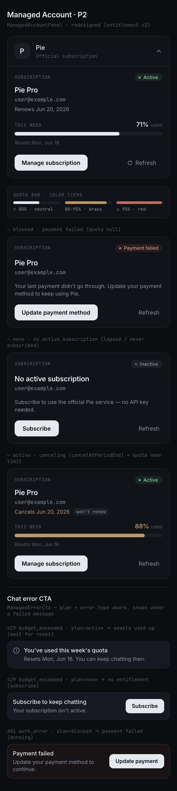

# Managed Account · P2 侧栏 UX — Design Spec

> 二期 P2(客户端侧栏 UX）。后端 P1 已上线 entitlement v2，本期把客户端订阅面板从旧形状迁到 v2 并重做视觉：单条周额度进度条 + 订阅到期/续费/取消态显示 + 错误 CTA 按 plan 区分。纯 `pie-ai-agent` 改动，无后端改动。

**Goal:** 让用户在侧栏直观看到「我订的什么、本周额度用了多少、何时重置/续费/到期」，并在聊天报错时给出与权益状态匹配的下一步动作。

**Status:** 设计定稿（brainstorming + 交互式 grill 已收敛全部决策）。Paper 原型见下。

**Date:** 2026-06-13

---

## 1. 范围

### In scope（P2）
- 客户端 `Entitlement` 类型从旧形状 `{plan, email, budgetRemainingUsd}` 迁到 **entitlement v2** `{plan, email, subscription, quota, models}`。
- `ManagedAccountPanel` 原地重做：状态 pill + 套餐名 + email + 续费/到期日 + **单条周额度进度条** + 动作按钮，覆盖 active / canceling / blocked / none 全状态。
- `ManagedErrorCta` 改为 **plan + error.type 共同判定**：周额度耗尽（active）/ 无权益（none）/ 欠费（blocked）三态给不同文案与动作。
- 新增 `success`（语义绿）CSS 变量 token；周额度告警黄铜档复用已存在的 `pending` token。
- 全部相关单测 fixture 迁到 v2。

### Out of scope（明确推迟）
- 多模型切换器、兑换码、新订阅首月半价 → **P3**。
- 多套餐抽象、管理端、全员重置额度 → **P4**。
- 把订阅/额度摘要常驻到聊天顶部等更显眼处 → 本期只「原地增强」设置内面板（用户已选最小改动面）。
- entitlement 全局缓存 / Context → 维持现有「每组件按需 fetch」（YAGNI）。
- 5h 额度双进度条 → 已于 P1 砍掉（ADR 0001），只做周额度单条。

---

## 2. 设计决策（锁定）

| 决策 | 选择 | 理由 |
|---|---|---|
| 位置/显眼度 | 原地增强 `ManagedAccountPanel`（仍在 Settings→Configs→展开 managed instance） | 改动面最小；显眼化留后续打磨 |
| 文案语言 | **英文** | 与现有 managed 面板（Sign in with Google / Manage subscription）一致 |
| 错误 CTA | P2 一并修，按 plan+error.type 区分 | 契约（ADR 0002）要求客户端 plan+error.type 共同区分，现状会误导用户 |
| 模型显示 | P2 不展示 | 单模型价值低，P3 做切换器时一并 |
| 状态色 | 保留语义色（active=绿 / 欠费=红 / 未订阅=灰） | 状态一眼可辨；绿足够克制不抢戏 |
| 进度条告警 | 三档：`<80%` 中性 / `80–95%` 黄铜 / `≥95%` 红 | 提前预警，留缓冲 |

---

## 3. Paper 原型

- Paper 文件 “Pie Frontend”，artboard **`P2 — Managed Account · States (Modern A)`**：<https://app.paper.design/file/01KQH5T49RW8RTNMMSTKD1EQEZ/1-0>
- 导出快照：`docs/specs/assets/2026-06-13-managed-account-p2-states.png`



原型严格沿用既有 “Modern A” 深色设计语言（与 `35R-0` 配置编辑表单同体系）。

---

## 4. entitlement v2（客户端视角）

后端 `/me/entitlement` 与 `/auth/exchange` 返回（权威契约 `pie-managed-backend/docs/contract.md`）：

```jsonc
{
  "plan": "none|active|blocked",
  "email": "user@example.com",
  "subscription": {                 // plan==none 时为 null；blocked 时非 null
    "planName": "Pie Pro",
    "currentPeriodEnd": 1750000000, // 下次续费/到期 unix sec；新激活边缘可能短暂为 null
    "cancelAtPeriodEnd": false       // true → 「将于 X 到期，won't renew」
  },
  "quota": {                         // plan!=active 时为 null；具名窗口 map
    "weekly": { "usedFraction": 0.71, "resetAt": 1750400000 }
  },
  "models": [ { "id": "default", "name": "标准" } ]  // 仅 active 非空
}
```

客户端必须容忍的边缘：
- `plan:"active"` 且 `subscription.currentPeriodEnd:null`（两个 webhook 事件到达无序）→ **省略续费/到期那一行**，其余照常。
- `quota` 只透分数不透美元 → UI 只显示百分比/进度，永不显示金额。

---

## 5. 视觉规格

### 5.1 容器与排版（沿用 Modern A）

- 面板嵌在展开行下方，承袭表单容器：纵向 flex、`padding 16`、块间 `gap 18`、块内 `gap 9`。
- 卡片/输入圆角 `rounded-[14px]`（外层）/ `rounded-[10px]`（内件）；pill `rounded-full`。
- 字体：UI = `font-sans`(Inter)，key/meta/caps = `font-mono`(JetBrains Mono)。
- caps 小标题用既有 `.caps` 工具类（10px / 500 / 0.16em / uppercase / mono）。

### 5.2 颜色 token 映射（全部走语义 Tailwind class，自动明暗适配）

| 用途 | Tailwind class | 说明 |
|---|---|---|
| 画布/面 | `bg-canvas` / `bg-surface` / `bg-field` | field 作进度条 track |
| 描边 | `border-line` | |
| 文本 | `text-fg-1`(主) / `text-fg-2`(次) / `text-fg-3`(弱) | |
| 主按钮 | `bg-fg-1 text-canvas`（600） | 与 Modern A「保存」一致（**不**用 `bg-accent`） |
| 次/幽灵按钮 | `text-fg-2`（无底） | Refresh |
| 进度条 中性档 | `bg-fg-1` | `<80%` |
| 进度条 黄铜档 | `bg-pending` / `text-pending` | `80–95%`；token 已存在（#B89968 dark / #8A6D2E light） |
| 进度条 红档 + 欠费 | `bg-warning` / `text-warning` / `bg-warning-tint` / `border-warning-line` | `≥95%` 与 dunning |
| active 状态色 | **`bg-success` / `text-success` / `bg-success-tint`**（**新增 token**） | sage green |
| 未订阅 pill | `bg-field text-fg-2` + `bg-fg-3` 圆点 | 中性灰 |

**新增 token（唯一新增）：** 在 `src/sidepanel/index.css` 的四个块（`:root` 默认、`@media dark`、`[data-theme="light"]`、`[data-theme="dark"]`）各加 `--c-success` 与 `--c-success-tint`，并在 `@theme` 加 `--color-success: var(--c-success);` `--color-success-tint: var(--c-success-tint);`。建议值：
- light：`--c-success:#3E8E63;` `--c-success-tint:rgba(62,142,99,0.10);`
- dark：`--c-success:#5FA37D;` `--c-success-tint:rgba(95,163,125,0.14);`

### 5.3 状态机（`ManagedAccountPanel`）

| plan / 条件 | 状态 pill | 主体 | 周额度条 | 主按钮 |
|---|---|---|---|---|
| `active`，未取消 | `Active`(success) | planName + email + `Renews {date}` | 显示 | Manage subscription |
| `active`，`cancelAtPeriodEnd` | `Active`(success) | planName + email + `Cancels {date}` + `won't renew` 小标签(`bg-field text-fg-2`) | 显示 | Manage subscription |
| `active`，`currentPeriodEnd:null` | `Active` | planName + email（**省略日期行**） | 显示 | Manage subscription |
| `blocked` | `Payment failed`(warning) | planName + email + 说明文案，**无周额度条**（quota=null） | — | Update payment method |
| `none` | `Inactive`(neutral) | `No active subscription` + email + 说明文案，无周额度条 | — | Subscribe |
| 加载中 | — | `Loading…`(fg-3) | — | — |

每个非加载态右侧恒有幽灵 `Refresh`（手动重拉 entitlement）。挂载时自动拉一次（沿用现状）。
错误（fetch 失败）沿用现状底部 warning 条。

### 5.4 周额度条（`QuotaBar` 子组件）

输入：`usedFraction: number`、`resetAt: number`。渲染：
1. 头行：左 caps `THIS WEEK`；右 `{round(usedFraction*100)}%` + `used`(fg-3)，百分比按档着色。
2. 进度条：track `bg-field` 高 8px 圆角全；fill 宽 `usedFraction`（clamp 0–100%）、按档着色、圆角全。
3. 脚行：`Resets {formatResetDate(resetAt)}`（fg-3，11px），如 `Resets Mon, Jun 16`。

档位函数（`managed-format.ts`）：
```ts
export type QuotaTier = "neutral" | "caution" | "critical";
export const quotaTier = (f: number): QuotaTier =>
  f >= 0.95 ? "critical" : f >= 0.80 ? "caution" : "neutral";
// fill class:   neutral→bg-fg-1   caution→bg-pending   critical→bg-warning
// pct class:    neutral→text-fg-1 caution→text-pending critical→text-warning
```

### 5.5 文案（英文，最终）

- 状态 pill：`Active` / `Payment failed` / `Inactive`
- 续费/到期：`Renews Jun 20, 2026` ／ 取消态 `Cancels Jun 20, 2026` + tag `won't renew`
- 周额度：caps `THIS WEEK`、`71% used`、`Resets Mon, Jun 16`
- blocked 说明：`Your last payment didn't go through. Update your payment method to keep using Pie.`
- none 说明：`Subscribe to use the official Pie service — no API key needed.`
- 按钮：`Manage subscription` / `Update payment method` / `Subscribe` / `Refresh`

### 5.6 日期格式（`managed-format.ts`，`en-US`）

- `formatDate(unixSec)` → `Jun 20, 2026`（`{month:'short', day:'numeric', year:'numeric'}`）
- `formatResetDate(unixSec)` → `Mon, Jun 16`（`{weekday:'short', month:'short', day:'numeric'}`）
- 输入是秒，需 `*1000`。`null`/非有限值 → 返回 `null`，调用方据此省略整行。

---

## 6. 错误 CTA 矩阵（`ManagedErrorCta`）

现状：只拉 managed key；`auth`→「session expired，去重登」；`budget`→按钮「Manage subscription」开 portal。两者都与契约不符。

改为：`kind ∈ {budget, auth}` 时拉 key **并** `getEntitlement(key)` 拿 `plan` 与 `quota.weekly.resetAt`，按下表渲染（出现在失败消息下方，紧凑内联卡）：

| kind | plan | 渲染 | 动作 |
|---|---|---|---|
| `auth` | `blocked` | warning-tint 卡：`Payment failed` + `Update your payment method to continue.` | 按钮 `Update payment` → `openPortal` |
| `auth` | 其它 | 文案 `Your session expired — sign in again from Settings → Configs.`（保留现状兜底） | 无 |
| `budget` | `active` | 信息卡（**无 portal 按钮**）：`You've used this week's quota` + `Resets {formatResetDate(resetAt)}. You can keep chatting then.` | 无 |
| `budget` | `none` | 卡：`Subscribe to keep chatting` + `Your subscription isn't active.` | 按钮 `Subscribe` → `openCheckout` |
| `budget` | `blocked` | 同 `auth/blocked`（防御） | `openPortal` |
| `ratelimit`/`http`/`network` | — | `null`（不变） | — |

实现要点：
- 沿用现有 deps 注入（`getManagedKey` / `portal`），新增 `checkout?` 与 `getEnt?`（缺省 `getEntitlement`），便于单测。
- entitlement 未就绪前渲染 `null`（避免闪烁）；fetch 失败 → 降级为旧的纯文案兜底，不抛。
- 按钮点击 swallow rejection（沿用现状注释的理由）。

---

## 7. 文件结构（改动单元）

| 文件 | 动作 | 责任 |
|---|---|---|
| `src/sidepanel/index.css` | 改 | 加 `--c-success`/`--c-success-tint`（4 块）+ `@theme` 两行 wiring |
| `src/lib/managed-auth.ts` | 改 | `Entitlement` → v2；导出 `QuotaWindow`/`SubscriptionInfo`/`ModelInfo` |
| `src/lib/managed-account.ts` | 改 | `getEntitlement` 加 `normalizeEntitlement`（容忍缺字段/边缘，给安全默认） |
| `src/lib/managed-format.ts` | 新建 | `formatDate`/`formatResetDate`/`quotaTier` + 档位 class 映射（纯函数） |
| `src/sidepanel/components/QuotaBar.tsx` | 新建 | 周额度条呈现组件 |
| `src/sidepanel/components/ManagedAccountPanel.tsx` | 改 | v2 + 全状态重做（用 `QuotaBar`、`managed-format`） |
| `src/sidepanel/components/ManagedErrorCta.tsx` | 改 | plan+kind 矩阵；拉 entitlement |
| 测试 fixtures | 改 | 见 §8 |

`ManagedSubscribePanel.tsx` 只读 `plan`/`email`，逻辑不变，但其测试 fixture 需迁 v2（见 §8）。

### v2 类型（`managed-auth.ts`）
```ts
export interface QuotaWindow { usedFraction: number; resetAt: number; }
export interface SubscriptionInfo { planName: string; currentPeriodEnd: number | null; cancelAtPeriodEnd: boolean; }
export interface ModelInfo { id: string; name: string; }
export interface Entitlement {
  plan: "none" | "active" | "blocked";
  email: string;
  subscription: SubscriptionInfo | null;
  quota: { weekly?: QuotaWindow } | null;
  models: ModelInfo[];
}
```

---

## 8. 测试

现有相关单测（均靠 deps 注入 fake，无需真实网络）：
- `src/lib/managed-auth.test.ts`、`src/lib/managed-account.test.ts`
- `src/sidepanel/components/ManagedAccountPanel.test.tsx`、`ManagedErrorCta.test.tsx`、`ManagedSubscribePanel.test.tsx`、`NewConfigWizard.managed.test.tsx`

改动：
- 所有 `budgetRemainingUsd` fixture（共 ~12 处，跨 6 文件）→ 迁 v2 形状（`subscription`/`quota`/`models`）。
- `ManagedAccountPanel.test.tsx`：补 active / canceling / blocked / none / `currentPeriodEnd:null` 渲染断言（关键文案与 pill）。
- `ManagedErrorCta.test.tsx`：补 §6 矩阵 5 条分支。
- 新增 `src/lib/managed-format.test.ts`：`quotaTier` 边界（0.79/0.80/0.94/0.95）、`formatDate`/`formatResetDate`（含 null）。
- 新增 `QuotaBar` 的渲染测试（三档 fill class、百分比取整、resetAt 文案）可选并入 panel 测试。

门禁（提交前，pie-ai-agent 约定）：`pnpm test`、`pnpm typecheck`、`pnpm build` 全绿。

---

## 9. 验收标准

1. 订阅用户在 Settings→Configs 展开 managed instance，看到：套餐名、邮箱、续费日、**本周额度进度条 + 百分比 + 重置日**；额度≥80% 条变黄铜、≥95% 变红。
2. 取消续费（Portal 里 cancel）后，刷新显示 `Cancels {date}` + `won't renew`，计费不受影响。
3. 欠费（blocked）显示 `Payment failed` + `Update payment method`；未订阅（none）显示 `Subscribe`。
4. 聊天报错：周额度耗尽提示等重置（无 portal 按钮）；无权益引导订阅；欠费引导更新支付。
5. `plan:"active"` 且 `currentPeriodEnd:null` 不报错、优雅省略日期行。
6. 明暗主题下颜色均正确（语义 token 自动适配）。
7. `pnpm test`/`typecheck`/`build` 全绿，仓内无 `budgetRemainingUsd` 残留。
